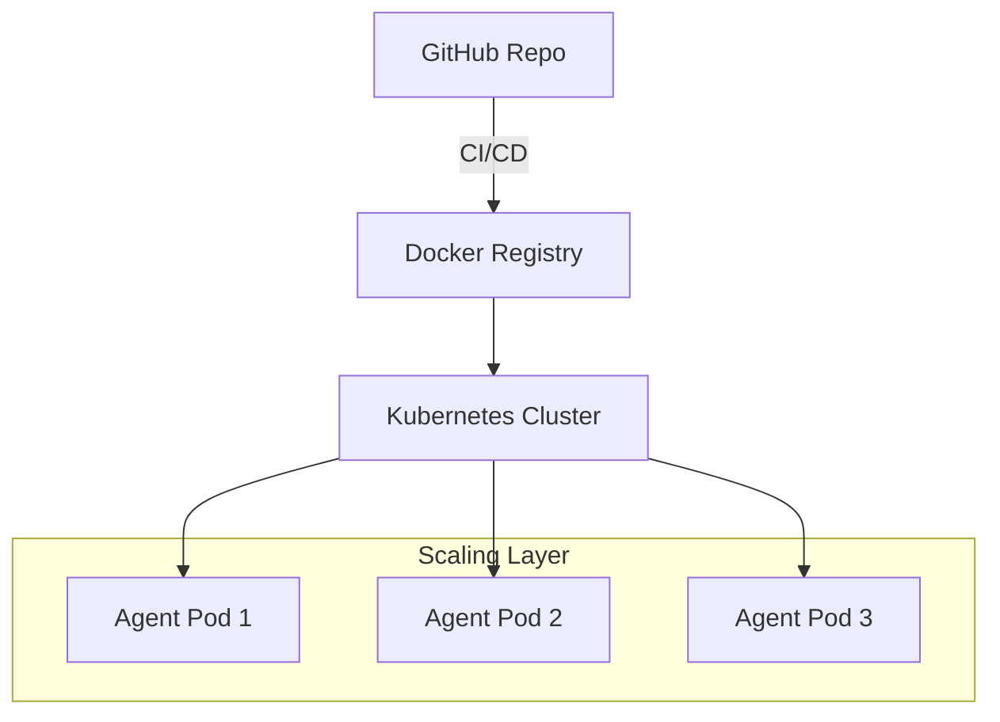

# 🚢 Deployment & Scaling — Going Global
> **Level:** Advanced | **Language:** Hinglish | **Goal:** Agents ko cloud (AWS, Azure, GCP) par deploy karne aur global traffic handle karne ke liye scale karne ke tools aur workflows ko master karein.

---

## 🧭 1. Beginner-Friendly Hinglish Explanation
Deployment aur Scaling ka matlab hai **"AI ko live karna aur bada banana"**. 

- **Deployment:** Aapka code Github se nikal kar ek real server (like AWS) par chal raha hai jahan koi bhi use access kar sakta hai.
- **Scaling:** Jab 10 users se 10,000 users ho jate hain, toh server ko kaise "Double" ya "Triple" karna hai bina system crash kiye.

Jaise ek dukaan se puri chain (Franchise) banayi jati hai, scaling wahi process hai agentic apps ke liye.

---

## 🧠 2. Deep Technical Explanation
Agents ko deploy karna normal web apps se different hai kyunki isme **GPU dependencies** aur **Long-running requests** hote hain.
1. **Dockerization:** Apne agent, dependencies, aur environment variables ko ek "Container" mein package karna jo kahin bhi run ho sake.
2. **Kubernetes (K8s):** Multiple containers ko orchestrate karna. Ye high traffic ke dauran automatically "Dead" agents ko replace karta hai aur naye start karta hai.
3. **GPU Clouds:** Local models (Llama/Mistral) host karne ke liye **Lambda Labs**, **CoreWeave**, ya **RunPod** jaise specialized providers ka use karna.
4. **CI/CD Pipelines:** Har baar jab aap GitHub par push karte hain, toh automatically naye "Prompts" ya "Code" ko test aur deploy karna.
5. **Horizontal Pod Autoscaling (HPA):** "Pending Tasks" ya "GPU Memory" jaise custom metrics ke basis par agents scale karna.

---

## 🏗️ 3. Architecture Diagrams


```mermaid
graph TD
    GH[GitHub Repo] -->|CI/CD| D[Docker Registry]
    D --> K[Kubernetes Cluster]
    K --> P1[Agent Pod 1]
    K --> P2[Agent Pod 2]
    K --> P3[Agent Pod 3]
    
    subgraph "Scaling Layer"
    P1
    P2
    P3
    end
```

---

## 💻 4. Production-Ready Code Example (Simple Dockerfile)

```dockerfile
# Hinglish Logic: Ye file batati hai ki agent ko container mein kaise pack karein
FROM python:3.11-slim

WORKDIR /app
COPY requirements.txt .
RUN pip install -r requirements.txt

COPY . .

# Start the agent API
CMD ["uvicorn", "main:app", "--host", "0.0.0.0", "--port", "8000"]
```

---

## 🌍 5. Real-World Use Cases
- **Global SaaS Apps:** USA, India, aur Europe ke users ko low latency ke sath serve karne wale agents.
- **Retail Holiday Sales:** "Black Friday" ya "Diwali Sale" ke dauran 5 agents se 500 agents tak scale up karna.
- **Medical AI:** Hospital ke private cloud ke andar secure, isolated agents deploy karna.

---

## ❌ 6. Failure Cases
- **OOM (Out of Memory):** Model ne itni RAM kha li ki server crash ho gaya.
- **Cold Start Delay:** Naya agent start hone mein itna time lag raha hai ki user ne app band kar di.
- **Configuration Drift:** Dev server aur Prod server ki settings alag hona.

---

## 🛠️ 7. Debugging Guide
- **Container Logs:** `docker logs -f [container_id]` karke real-time errors dekhein.
- **K8s Dashboard:** Pods ka health aur resource usage visualize karein.

---

## ⚖️ 8. Tradeoffs
- **Managed Deployment (Vercel/Heroku):** Bahut easy hai par limited control aur high cost.
- **Self-Managed (K8s on AWS):** Full control aur scale par cheaper hai, par ek DevOps expert ki zaroorat hoti hai.

---

## ✅ 9. Best Practices
- **Health Checks:** `/health` endpoint banayein taaki server ko pata chale agent "Zinda" hai ya nahi.
- **Zero Downtime:** Naya version launch karte waqt purana version tab tak band na karein jab tak naya "Ready" na ho.

---

## 🛡️ 10. Security Concerns
- **Exposed API Keys:** Galti se Docker image mein `.env` file bhej dena. Humesha "Secrets Manager" use karein.

---

## 📈 11. Scaling Challenges
- **Stateful Scaling:** Agar agent memory RAM mein hai, toh naya pod user ko "Pehchanta" nahi. Humesha memory database (Redis) mein rakhein.

---

## 💰 12. Cost Considerations
- **Reserved Instances:** 1 saal ka server advance book karne par 70% tak bachat ho sakti hai.

---

## 📝 13. Interview Questions
1. **"Agent deployment mein Docker kyu zaruri hai?"**
2. **"Kubernetes agents ko scale karne mein kaise help karta hai?"**
3. **"Stateful vs Stateless scaling kya hota hai?"**

---

## ⚠️ 14. Common Mistakes
- **No Resource Limits:** Ek agent ko poore CPU ka access de dena, jisse baaki services band ho jayein.
- **Ignoring Logs:** Purane logs delete na karna, jisse disk full ho jaye.

---

## 🚀 15. Latest 2026 Industry Patterns
- **Edge Deployment:** Latency ko <10ms tak reduce karne ke liye agents ko "Edge" (jaise Cloudflare Workers) par run karna.
- **Serverless GPU:** "Spot Instances" par models run karna jo 90% less cost karte hain par kisi bhi time wapas liye ja sakte hain.

---

> **Expert Tip:** Scaling is not just about "More Servers". It's about **Efficiency**. The best deployment is the one that uses the least resources for the most work.
