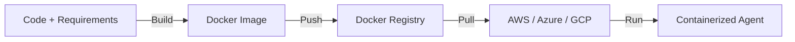

# 🐳 Docker for Agents — Packaging the Brain
> **Level:** Advanced | **Language:** Hinglish | **Goal:** Master the art of containerizing AI agents and their dependencies for consistent deployment across different environments.

---

## 🧭 1. Beginner-Friendly Hinglish Explanation
Docker ka matlab hai **"AI ka portable box"**. 

Imagine aapne ek agent banaya apne computer par. Wo wahan toh chal raha hai, par jab aapne use server par dala, toh wo fail ho gaya kyunki server par "Python version alag hai" ya "Dependencies missing hain". 
**Docker** ek aisa container banata hai jisme aapka agent, Python, libraries, aur environment variables sab pack ho jate hain.
- "Once build, run anywhere."
- Chahe aapka computer ho ya AWS, Docker mein agent hamesha same behave karega.

---

## 🧠 2. Deep Technical Explanation
Containerizing agents requires careful management of large dependencies and secrets.
1. **The Dockerfile:** A script that defines the environment (OS, Python, dependencies).
2. **Multi-stage Builds:** Keeping the final image small by separating the "Build" environment from the "Run" environment.
3. **Environment Variables:** Passing API keys (OpenAI, Tavily) securely at runtime using `.env` files or Secret Managers.
4. **Volumes:** Persisting data (like local vector stores or logs) outside the container so they don't disappear when the container restarts.
5. **Networking:** Exposing the agent's API port (e.g. 8000) so the outside world can talk to it.

---

## 🏗️ 3. Architecture Diagrams



---

## 💻 4. Production-Ready Code Example (Optimized Dockerfile)

```dockerfile
# 1. Build Stage
FROM python:3.11-slim as builder
WORKDIR /app
COPY requirements.txt .
RUN pip install --user -r requirements.txt

# 2. Run Stage (Final image is lightweight)
FROM python:3.11-slim
WORKDIR /app
COPY --from=builder /root/.local /root/.local
COPY . .

# Hinglish Logic: PATH set karo taaki installed binaries mil sakein
ENV PATH=/root/.local/bin:$PATH

EXPOSE 8000
CMD ["uvicorn", "main:app", "--host", "0.0.0.0", "--port", "8000"]
```

---

## 🌍 5. Real-World Use Cases
- **CI/CD Pipelines:** Automatically building a new Docker image every time you push code to GitHub.
- **Local Testing:** Running a complex multi-agent system (LangGraph + Redis + Postgres) using a single `docker-compose up` command.
- **Microservices:** Each agent (Researcher, Writer, Editor) running in its own isolated Docker container.

---

## ❌ 6. Failure Cases
- **Image Bloat:** Docker image 5GB ki ho gayi kyunki aapne heavy libraries (like PyTorch) galat tarike se install ki.
- **Zombie Processes:** Container stop hone par agent ke background tasks band nahi huye.
- **Missing Secrets:** Container start hua par use OpenAI API key nahi mili.

---

## 🛠️ 7. Debugging Guide
- **Interactive Shell:** `docker exec -it [container_id] /bin/bash` karke container ke andar ja kar check karein.
- **Logs:** `docker logs -f [container_id]` for real-time error tracking.

---

## ⚖️ 8. Tradeoffs
- **Docker:** Consistent and scalable but adds a learning curve and disk space overhead.
- **Bare Metal (venv):** Fast and lightweight but "Works on my machine" syndrome is a big risk.

---

## ✅ 9. Best Practices
- **Use .dockerignore:** Faltu files (like `.venv`, `__pycache__`, `.git`) ko image mein na bhejien.
- **Lightweight Base Images:** Always use `-slim` or `alpine` versions of Python to save space.

---

## 🛡️ 10. Security Concerns
- **Hardcoded Keys:** Kabhi bhi Dockerfile mein API keys na likhein.
- **Root User:** Docker container ko `root` ki jagah ek limited `user` ke taur par run karein.

---

## 📈 11. Scaling Challenges
- **Startup Time:** 5GB ki image pull karne aur start karne mein 2-3 minute lag sakte hain, jo auto-scaling ke liye bura hai.

---

## 💰 12. Cost Considerations
- **Image Storage:** Storing hundreds of versions of large Docker images in AWS ECR can cost money. Use a lifecycle policy to delete old images.

---

## 📝 13. Interview Questions
1. **"Docker multi-stage builds kya hain aur kyu zaruri hain?"**
2. **"Agent context mein Docker volumes ka kya use hai?"**
3. **"Dockerfile mein secrets kaise handle karenge?"**

---

## 🚀 15. Latest 2026 Industry Patterns
- **Wasm Containers:** Using WebAssembly for even smaller and faster agent containers (100x faster startup than Docker).
- **GPU-Ready Containers:** Specialized images (Nvidia-Docker) that let agents access the host GPU for local inference.

---

> **Expert Tip:** A Docker image is a **Snapshot of Reality**. If it works in Docker, it works in the cloud.
