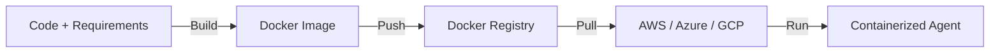

# 🐳 Docker for Agents — Packaging the Brain
> **Level:** Advanced | **Language:** Hinglish | **Goal:** Alag-alag environments mein consistent deployment ke liye AI agents aur unki dependencies ko containerize karne ki art ko master karein.

---

## 🧭 1. Beginner-Friendly Hinglish Explanation
Docker ka matlab hai **"AI ka portable box"**. 

Imagine aapne ek agent banaya apne computer par. Wo wahan toh chal raha hai, par jab aapne use server par dala, toh wo fail ho gaya kyunki server par "Python version alag hai" ya "Dependencies missing hain". 
**Docker** ek aisa container banata hai jisme aapka agent, Python, libraries, aur environment variables sab pack ho jate hain.
- "Once build, run anywhere."
- Chahe aapka computer ho ya AWS, Docker mein agent hamesha same behave karega.

---

## 🧠 2. Deep Technical Explanation
Agents ko containerize karne ke liye large dependencies aur secrets ke careful management ki zaroorat hoti hai.
1. **The Dockerfile:** Ek script jo environment (OS, Python, dependencies) ko define karti hai.
2. **Multi-stage Builds:** Final image ko small rakhne ke liye "Build" environment ko "Run" environment se separate karna.
3. **Environment Variables:** Runtime par API keys (OpenAI, Tavily) ko secure tarike se pass karne ke liye `.env` files ya Secret Managers ka use karna.
4. **Volumes:** Container ke bahar data (jaise local vector stores ya logs) persist karna taaki container restart hone par wo gayab na hon.
5. **Networking:** Agent ke API port (e.g. 8000) ko expose karna taaki outside world usse baat kar sake.

---

## 🏗️ 3. Architecture Diagrams


```mermaid
graph LR
    C[Code + Requirements] -->|Build| I[Docker Image]
    I -->|Push| R[Docker Registry]
    R -->|Pull| S[AWS / Azure / GCP]
    S -->|Run| CON[Containerized Agent]
```

---

## 💻 4. Production-Ready Code Example (Optimized Dockerfile)

```dockerfile
# 1. Build Stage
FROM python:3.11-slim as builder
WORKDIR /app
COPY requirements.txt .
RUN pip install --user -r requirements.txt

# 2. Run Stage (Final image is lightweight)
FROM python:3.11-slim
WORKDIR /app
COPY --from=builder /root/.local /root/.local
COPY . .

# Hinglish Logic: PATH set karo taaki installed binaries mil sakein
ENV PATH=/root/.local/bin:$PATH

EXPOSE 8000
CMD ["uvicorn", "main:app", "--host", "0.0.0.0", "--port", "8000"]
```

---

## 🌍 5. Real-World Use Cases
- **CI/CD Pipelines:** Har baar jab aap GitHub par code push karte hain, toh automatically naya Docker image build karna.
- **Local Testing:** Single `docker-compose up` command ka use karke complex multi-agent system (LangGraph + Redis + Postgres) run karna.
- **Microservices:** Har agent (Researcher, Writer, Editor) ka apne isolated Docker container mein run hona.

---

## ❌ 6. Failure Cases
- **Image Bloat:** Docker image 5GB ki ho gayi kyunki aapne heavy libraries (like PyTorch) galat tarike se install ki.
- **Zombie Processes:** Container stop hone par agent ke background tasks band nahi huye.
- **Missing Secrets:** Container start hua par use OpenAI API key nahi mili.

---

## 🛠️ 7. Debugging Guide
- **Interactive Shell:** `docker exec -it [container_id] /bin/bash` karke container ke andar ja kar check karein.
- **Logs:** Real-time error tracking ke liye `docker logs -f [container_id]` ka use karein.

---

## ⚖️ 8. Tradeoffs
- **Docker:** Consistent aur scalable hai par ek learning curve aur disk space overhead add karta hai.
- **Bare Metal (venv):** Fast aur lightweight hai par "Works on my machine" syndrome ka high risk hai.

---

## ✅ 9. Best Practices
- **Use .dockerignore:** Faltu files (like `.venv`, `__pycache__`, `.git`) ko image mein na bhejien.
- **Lightweight Base Images:** Space bachane ke liye humesha Python ke `-slim` ya `alpine` versions use karein.

---

## 🛡️ 10. Security Concerns
- **Hardcoded Keys:** Kabhi bhi Dockerfile mein API keys na likhein.
- **Root User:** Docker container ko `root` ki jagah ek limited `user` ke taur par run karein.

---

## 📈 11. Scaling Challenges
- **Startup Time:** 5GB ki image pull karne aur start karne mein 2-3 minute lag sakte hain, jo auto-scaling ke liye bura hai.

---

## 💰 12. Cost Considerations
- **Image Storage:** AWS ECR mein large Docker images ke hundreds of versions store karne mein paise kharch ho sakte hain. Old images delete karne ke liye lifecycle policy use karein.

---

## 📝 13. Interview Questions
1. **"Docker multi-stage builds kya hain aur kyu zaruri hain?"**
2. **"Agent context mein Docker volumes ka kya use hai?"**
3. **"Dockerfile mein secrets kaise handle karenge?"**

---

## 🚀 15. Latest 2026 Industry Patterns
- **Wasm Containers:** Aur bhi chote aur fast agent containers ke liye WebAssembly ka use karna (Docker se 100x faster startup).
- **GPU-Ready Containers:** Specialized images (Nvidia-Docker) jo agents ko local inference ke liye host GPU access karne dete hain.

---

> **Expert Tip:** A Docker image is a **Snapshot of Reality**. If it works in Docker, it works in the cloud.
