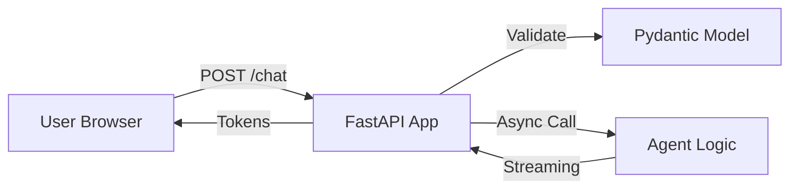

# ⚡ FastAPI for Agents — The High-Speed Gateway
> **Level:** Advanced | **Language:** Hinglish | **Goal:** Master the use of FastAPI to build high-performance, asynchronous APIs for serving AI agents to web and mobile applications.

---

## 🧭 1. Beginner-Friendly Hinglish Explanation
FastAPI ka matlab hai **"AI ki Bullet Train"**. 

Jab aap ek AI agent banate ho, toh use logo tak pahunchane ke liye ek "API" chahiye hoti hai. 
- **Purana tarika (Flask):** Thoda slow tha aur "Asynchronous" (ek saath bahut saare kaam) handle karne mein dikkat hoti thi.
- **Naya tarika (FastAPI):** Ye Python ki sabse fast frameworks mein se ek hai. Ye AI ke liye perfect hai kyunki AI response dene mein time leta hai, aur FastAPI us waqt server ko "Free" rakhti hai taaki doosre users wait na karein.

Isse aapka agent 10,000 users ko ek saath handle kar sakta hai bina hang huye.

---

## 🧠 2. Deep Technical Explanation
FastAPI is built on **Starlette** (for web) and **Pydantic** (for data validation).
1. **Async/Await:** Leveraging Python's `asyncio` to handle long-running LLM calls without blocking the main event loop.
2. **Pydantic Validation:** Automatically checking if the user's input (JSON) matches the required format (e.g. `query` must be a string).
3. **Auto-Generated Docs:** Every FastAPI app comes with built-in Swagger UI (`/docs`) to test your agent.
4. **Streaming Responses:** Sending the LLM's output token-by-token (Streaming) to the frontend using `StreamingResponse`.
5. **Background Tasks:** Finishing a request and then running a heavy task (like saving to a DB) in the background.

---

## 🏗️ 3. Architecture Diagrams



---

## 💻 4. Production-Ready Code Example (Streaming Agent Response)

```python
from fastapi import FastAPI
from fastapi.responses import StreamingResponse

app = FastAPI()

# Hinglish Logic: Response ko 'Stream' karo taaki user ko wait na karna pade
@app.get("/chat")
async def chat(query: str):
    async def generate():
        # Simulated agent streaming logic
        for token in ["Hello", " user", " how", " are", " you?"]:
            yield token + " "
    
    return StreamingResponse(generate(), media_type="text/plain")
```

---

## 🌍 5. Real-World Use Cases
- **Real-time Chatbots:** Where users expect to see characters appearing one-by-one.
- **Enterprise Middleware:** A central API that takes requests and routes them to different specialized agents.
- **Mobile Apps:** Serving AI features to iOS/Android apps with low overhead.

---

## ❌ 6. Failure Cases
- **Blocking the Event Loop:** Galti se `time.sleep()` ya koi heavy "Sync" function use karna jisse poora server ruk jaye.
- **Memory Leaks:** Long-running connections (WebSockets) close na karna.
- **No Rate Limiting:** Ek user ne millions of requests bhej kar server crash kar diya.

---

## 🛠️ 7. Debugging Guide
- **Uvicorn Logs:** Check karein "Worker restarts" or "Timeouts".
- **Swagger UI:** Use `http://localhost:8000/docs` to verify your API inputs and outputs.

---

## ⚖️ 8. Tradeoffs
- **FastAPI:** Extreme performance and modern features, but requires understanding of `async/await`.
- **Flask:** Very simple to learn but not suitable for high-performance streaming or long-running AI tasks.

---

## ✅ 9. Best Practices
- **Use Dependency Injection:** Manage database sessions and API keys cleanly.
- **Error Handling:** Use `HTTPException` to return clear error messages like "Invalid API Key" or "Agent Timeout".

---

## 🛡️ 10. Security Concerns
- **CORS:** Ensure only your frontend website can talk to your API.
- **Input Sanitization:** Preventing malicious code or prompts from being injected via the API body.

---

## 📈 11. Scaling Challenges
- **Worker Processes:** Use `gunicorn` with `uvicorn` workers to utilize all CPU cores of your server.

---

## 💰 12. Cost Considerations
- **Small Footprint:** FastAPI uses very little RAM, meaning you can run it on the cheapest $5/month cloud servers.

---

## 📝 13. Interview Questions
1. **"FastAPI mein async/await kyu zaruri hai agents ke liye?"**
2. **"StreamingResponse kaise kaam karta hai?"**
3. **"Pydantic validation ke fayde kya hain?"**

---

## 🚀 15. Latest 2026 Industry Patterns
- **FastAPI + WebSockets:** For high-speed, two-way voice and text agents.
- **Automatic SDK Generation:** Using the FastAPI schema to automatically generate a TypeScript client for your frontend.

---

> **Expert Tip:** In 2026, **Speed is a Feature**. If your API is slow, users will leave before the AI can even think.
