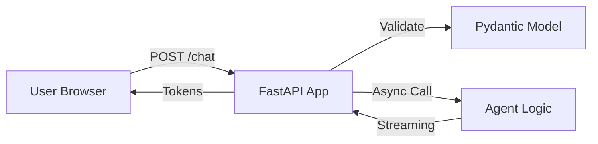

# ⚡ FastAPI for Agents — The High-Speed Gateway
> **Level:** Advanced | **Language:** Hinglish | **Goal:** Web aur mobile applications ke liye AI agents serve karne ke liye high-performance, asynchronous APIs build karne ke liye FastAPI ke use ko master karein.

---

## 🧭 1. Beginner-Friendly Hinglish Explanation
FastAPI ka matlab hai **"AI ki Bullet Train"**. 

Jab aap ek AI agent banate ho, toh use logo tak pahunchane ke liye ek "API" chahiye hoti hai. 
- **Purana tarika (Flask):** Thoda slow tha aur "Asynchronous" (ek saath bahut saare kaam) handle karne mein dikkat hoti thi.
- **Naya tarika (FastAPI):** Ye Python ki sabse fast frameworks mein se ek hai. Ye AI ke liye perfect hai kyunki AI response dene mein time leta hai, aur FastAPI us waqt server ko "Free" rakhti hai taaki doosre users wait na karein.

Isse aapka agent 10,000 users ko ek saath handle kar sakta hai bina hang huye.

---

## 🧠 2. Deep Technical Explanation
FastAPI **Starlette** (web ke liye) aur **Pydantic** (data validation ke liye) par built hai.
1. **Async/Await:** Main event loop ko block kiye bina long-running LLM calls ko handle karne ke liye Python ke `asyncio` ka fayda uthana.
2. **Pydantic Validation:** User input (JSON) required format (e.g. `query` string hona chahiye) se match karta hai ya nahi ye automatically check karna.
3. **Auto-Generated Docs:** Har FastAPI app ke sath built-in Swagger UI (`/docs`) aata hai taaki aap apne agent ko test kar sakein.
4. **Streaming Responses:** `StreamingResponse` ka use karke LLM ke output ko token-by-token (Streaming) frontend par bhejna.
5. **Background Tasks:** Request finish karna aur fir background mein ek heavy task (jaise DB mein save karna) run karna.

---

## 🏗️ 3. Architecture Diagrams


```mermaid
graph LR
    U[User Browser] -->|POST /chat| F[FastAPI App]
    F -->|Validate| P[Pydantic Model]
    F -->|Async Call| A[Agent Logic]
    A -->|Streaming| F
    F -->|Tokens| U
```

---

## 💻 4. Production-Ready Code Example (Streaming Agent Response)

```python
from fastapi import FastAPI
from fastapi.responses import StreamingResponse

app = FastAPI()

# Hinglish Logic: Response ko 'Stream' karo taaki user ko wait na karna pade
@app.get("/chat")
async def chat(query: str):
    async def generate():
        # Simulated agent streaming logic
        for token in ["Hello", " user", " how", " are", " you?"]:
            yield token + " "
    
    return StreamingResponse(generate(), media_type="text/plain")
```

---

## 🌍 5. Real-World Use Cases
- **Real-time Chatbots:** Jahan users expect karte hain ki characters ek-ek karke appear hon.
- **Enterprise Middleware:** Ek central API jo requests leta hai aur unhe different specialized agents par route karta hai.
- **Mobile Apps:** Low overhead ke sath iOS/Android apps ko AI features serve karna.

---

## ❌ 6. Failure Cases
- **Blocking the Event Loop:** Galti se `time.sleep()` ya koi heavy "Sync" function use karna jisse poora server ruk jaye.
- **Memory Leaks:** Long-running connections (WebSockets) close na karna.
- **No Rate Limiting:** Ek user ne millions of requests bhej kar server crash kar diya.

---

## 🛠️ 7. Debugging Guide
- **Uvicorn Logs:** Check karein "Worker restarts" or "Timeouts".
- **Swagger UI:** Apne API inputs aur outputs verify karne ke liye `http://localhost:8000/docs` use karein.

---

## ⚖️ 8. Tradeoffs
- **FastAPI:** Extreme performance aur modern features, par iske liye `async/await` ki samajh zaroorat hoti hai.
- **Flask:** Seekhna bahut simple hai par high-performance streaming ya long-running AI tasks ke liye suitable nahi hai.

---

## ✅ 9. Best Practices
- **Use Dependency Injection:** Database sessions aur API keys ko cleanly manage karein.
- **Error Handling:** "Invalid API Key" ya "Agent Timeout" jaise clear error messages return karne ke liye `HTTPException` use karein.

---

## 🛡️ 10. Security Concerns
- **CORS:** Ensure karein ki sirf aapki frontend website hi aapki API se baat kar sake.
- **Input Sanitization:** API body ke through malicious code ya prompts inject hone se rokna.

---

## 📈 11. Scaling Challenges
- **Worker Processes:** Apne server ke sabhi CPU cores utilize karne ke liye `gunicorn` with `uvicorn` workers use karein.

---

## 💰 12. Cost Considerations
- **Small Footprint:** FastAPI bahut kam RAM use karta hai, jiska matlab hai ki aap ise sabse saste $5/month cloud servers par bhi run kar sakte hain.

---

## 📝 13. Interview Questions
1. **"FastAPI mein async/await kyu zaruri hai agents ke liye?"**
2. **"StreamingResponse kaise kaam karta hai?"**
3. **"Pydantic validation ke fayde kya hain?"**

---

## 🚀 15. Latest 2026 Industry Patterns
- **FastAPI + WebSockets:** High-speed, two-way voice aur text agents ke liye.
- **Automatic SDK Generation:** Frontend ke liye automatically TypeScript client generate karne ke liye FastAPI schema ka use karna.

---

> **Expert Tip:** In 2026, **Speed is a Feature**. If your API is slow, users will leave before the AI can even think.
