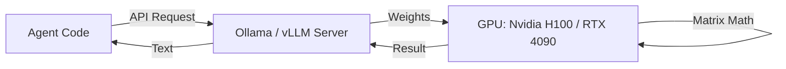

# 🧠 GPU Inference Basics — Running Local Models
> **Level:** Advanced | **Language:** Hinglish | **Goal:** Master the fundamentals of GPU acceleration, VRAM management, and serving local LLMs (Llama, Mistral) for agentic systems.

---

## 🧭 1. Beginner-Friendly Hinglish Explanation
GPU Inference ka matlab hai **"Apne khud ke server par AI chalana"**. 

Abhi tak hum OpenAI ko paise de rahe hain. Lekin agar humein:
- Data secure rakhna hai.
- Bill zero karna hai (long term).
- Model ko customize (Fine-tune) karna hai.
Toh humein apne khud ke server mein ek **GPU (Graphics Card)** lagana padega. GPU isliye chahiye kyunki AI ke "Mathematics" ko normal CPU bahut slow karta hai. 

GPU aapke AI ko "Pankh" deta hai taaki wo local machine par bhi "Super-fast" chale.

---

## 🧠 2. Deep Technical Explanation
GPU inference is all about **VRAM (Video RAM)** and **Parallelism**.
1. **VRAM Constraints:** A 7B model (like Llama-3) in 4-bit quantization needs ~5GB of VRAM. A 70B model needs ~40GB. If your GPU has only 8GB, you can't run the big models.
2. **Quantization:** Reducing the "Precision" of model weights (e.g., from 16-bit to 4-bit) to make it 4x smaller without losing much intelligence.
3. **Inference Engines:** Tools like **vLLM**, **Ollama**, or **TGI (Text Generation Inference)** that optimize how the GPU processes requests.
4. **CUDA:** The software layer (by Nvidia) that lets Python talk to the GPU hardware.
5. **Batching:** Running multiple requests at the same time on one GPU to maximize efficiency.

---

## 🏗️ 3. Architecture Diagrams



---

## 💻 4. Production-Ready Code Example (Using Ollama)

```bash
# Hinglish Logic: Local model start karne ka sabse asaan tarika
# 1. Install Ollama
# 2. Run your model
ollama run llama3

# Now your agent can talk to it at http://localhost:11434
```

---

## 🌍 5. Real-World Use Cases
- **Privacy-First Agents:** Companies that cannot send their sensitive legal or medical data to OpenAI.
- **Offline Agents:** AI that needs to work in a factory or a ship with no internet connection.
- **Cost-Saving Pipelines:** Using a small local model (Gemma/Phi-3) to "Filter" or "Classify" data before sending only the important bits to expensive GPT-4.

---

## ❌ 6. Failure Cases
- **OOM (Out of Memory):** Model load karte waqt ya bada context bhejte waqt GPU memory full ho jana aur system crash hona.
- **High Latency:** Sasta GPU use karne se AI itna slow ho jana ki wo usable na rahe.
- **Driver Mismatch:** Nvidia drivers aur CUDA version ka match na hona (Hinglish: Sabse bada headache).

---

## 🛠️ 7. Debugging Guide
- **`nvidia-smi`:** The gold standard command to check: "How much VRAM is left?" and "What is the GPU temperature?"
- **Logs:** Check if the model is being loaded into RAM (Slow) or VRAM (Fast).

---

## ⚖️ 8. Tradeoffs
- **Local GPU:** 100% Privacy and Zero API cost, but high upfront hardware cost ($1000 - $30,000) and maintenance.
- **Cloud API:** Zero setup and Pay-as-you-go, but higher long-term cost and Data Privacy risks.

---

## ✅ 9. Best Practices
- **Use Quantization:** Humesha GGUF or AWQ formats use karein memory bachane ke liye.
- **Monitoring:** Track GPU usage to know when you need to upgrade or add more GPUs.

---

## 🛡️ 10. Security Concerns
- **Model Poisoning:** Downloading weights from untrusted sources (use Hugging Face).
- **Physical Security:** Since the data is on your server, physical access must be restricted.

---

## 📈 11. Scaling Challenges
- **Multi-GPU Setup:** Distributing a single model across 2 or 4 GPUs (Model Parallelism).

---

## 💰 12. Cost Considerations
- **Electricity Bill:** High-end GPUs consume a lot of power (300W - 700W). Calculate your monthly bill!

---

## 📝 13. Interview Questions
1. **"VRAM aur RAM mein kya fark hai inference mein?"**
2. **"Quantization kyu zaruri hai?"**
3. **"Nvidia-smi command kya dikhati hai?"**

---

## 🚀 15. Latest 2026 Industry Patterns
- **Unified Memory:** Apple's M3/M4 chips sharing RAM between CPU and GPU, making them surprisingly good for running local agents.
- **Speculative Decoding:** Using a small model to "Guess" tokens and a big model to "Verify" them, making local inference 2x faster.

---

> **Expert Tip:** If you want to be a top 1% AI Engineer, learn to manage **Infrastructure**, not just Prompts.
