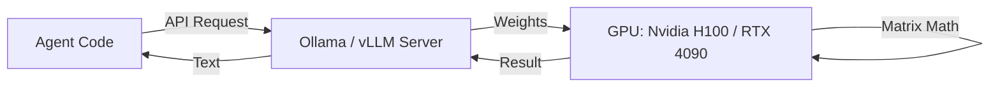

# 🧠 GPU Inference Basics — Running Local Models
> **Level:** Advanced | **Language:** Hinglish | **Goal:** Agentic systems ke liye GPU acceleration, VRAM management, aur local LLMs (Llama, Mistral) serve karne ke fundamentals ko master karein.

---

## 🧭 1. Beginner-Friendly Hinglish Explanation
GPU Inference ka matlab hai **"Apne khud ke server par AI chalana"**. 

Abhi tak hum OpenAI ko paise de rahe hain. Lekin agar humein:
- Data secure rakhna hai.
- Bill zero karna hai (long term).
- Model ko customize (Fine-tune) karna hai.
Toh humein apne khud ke server mein ek **GPU (Graphics Card)** lagana padega. GPU isliye chahiye kyunki AI ke "Mathematics" ko normal CPU bahut slow karta hai. 

GPU aapke AI ko "Pankh" deta hai taaki wo local machine par bhi "Super-fast" chale.

---

## 🧠 2. Deep Technical Explanation
GPU inference poori tarah se **VRAM (Video RAM)** aur **Parallelism** ke baare mein hai.
1. **VRAM Constraints:** 4-bit quantization mein ek 7B model (jaise Llama-3) ko ~5GB VRAM ki zaroorat hoti hai. 70B model ko ~40GB ki zaroorat hoti hai. Agar aapke GPU mein sirf 8GB hai, toh aap bade models run nahi kar sakte.
2. **Quantization:** Intelligence ko bina lose kiye model weights ki "Precision" ko reduce karna (e.g., 16-bit se 4-bit) taaki ye 4x chota ho sake.
3. **Inference Engines:** **vLLM**, **Ollama**, ya **TGI (Text Generation Inference)** jaise tools jo optimize karte hain ki GPU requests ko kaise process karta hai.
4. **CUDA:** Nvidia dwara banayi gayi software layer jo Python ko GPU hardware se baat karne deti hai.
5. **Batching:** Efficiency ko maximize karne ke liye ek hi GPU par ek sath multiple requests run karna.

---

## 🏗️ 3. Architecture Diagrams


```mermaid
graph LR
    A[Agent Code] -->|API Request| O[Ollama / vLLM Server]
    O -->|Weights| G[GPU: Nvidia H100 / RTX 4090]
    G -->|Matrix Math| G
    G -->|Result| O
    O -->|Text| A
```

---

## 💻 4. Production-Ready Code Example (Using Ollama)

```bash
# Hinglish Logic: Local model start karne ka sabse asaan tarika
# 1. Install Ollama
# 2. Run your model
ollama run llama3

# Now your agent can talk to it at http://localhost:11434
```

---

## 🌍 5. Real-World Use Cases
- **Privacy-First Agents:** Aise companies jo apna sensitive legal ya medical data OpenAI ko nahi bhej sakti.
- **Offline Agents:** AI jise bina internet connection ke factory ya ship mein kaam karne ki zaroorat ho.
- **Cost-Saving Pipelines:** Expensive GPT-4 par sirf important data bhejne se pehle data ko "Filter" ya "Classify" karne ke liye small local model (Gemma/Phi-3) ka use karna.

---

## ❌ 6. Failure Cases
- **OOM (Out of Memory):** Model load karte waqt ya bada context bhejte waqt GPU memory full ho jana aur system crash hona.
- **High Latency:** Sasta GPU use karne se AI itna slow ho jana ki wo usable na rahe.
- **Driver Mismatch:** Nvidia drivers aur CUDA version ka match na hona (Hinglish: Sabse bada headache).

---

## 🛠️ 7. Debugging Guide
- **`nvidia-smi`:** Check karne ke liye gold standard command: "Kitni VRAM bachi hai?" aur "GPU temperature kya hai?"
- **Logs:** Check karein ki model RAM (Slow) mein load ho raha hai ya VRAM (Fast) mein.

---

## ⚖️ 8. Tradeoffs
- **Local GPU:** 100% Privacy aur Zero API cost hai, par high upfront hardware cost ($1000 - $30,000) aur maintenance hai.
- **Cloud API:** Zero setup aur Pay-as-you-go hai, par higher long-term cost aur Data Privacy risks hain.

---

## ✅ 9. Best Practices
- **Use Quantization:** Humesha GGUF or AWQ formats use karein memory bachane ke liye.
- **Monitoring:** Track karein GPU usage taaki pata chale ki kab upgrade karne ya aur GPUs add karne ki zaroorat hai.

---

## 🛡️ 10. Security Concerns
- **Model Poisoning:** Untrusted sources se weights download karna (Hugging Face use karein).
- **Physical Security:** Kyunki data aapke server par hai, isliye physical access restricted hona chahiye.

---

## 📈 11. Scaling Challenges
- **Multi-GPU Setup:** Single model ko 2 ya 4 GPUs ke across distribute karna (Model Parallelism).

---

## 💰 12. Cost Considerations
- **Electricity Bill:** High-end GPUs bahut power consume karte hain (300W - 700W). Apne monthly bill ko calculate karein!

---

## 📝 13. Interview Questions
1. **"VRAM aur RAM mein kya fark hai inference mein?"**
2. **"Quantization kyu zaruri hai?"**
3. **"Nvidia-smi command kya dikhati hai?"**

---

## 🚀 15. Latest 2026 Industry Patterns
- **Unified Memory:** Apple ke M3/M4 chips jo CPU aur GPU ke beech RAM share karte hain, jo local agents chalane ke liye surprisingly acche hain.
- **Speculative Decoding:** Tokens ko "Guess" karne ke liye ek small model aur unhe "Verify" karne ke liye big model ka use karna, jisse local inference 2x faster ho jata hai.

---

> **Expert Tip:** If you want to be a top 1% AI Engineer, learn to manage **Infrastructure**, not just Prompts.
