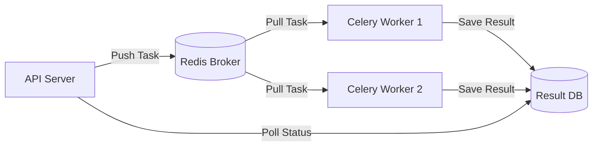

# 🐎 Redis & Celery — The Asynchronous Powerhouse
> **Level:** Advanced | **Language:** Hinglish | **Goal:** Master the use of Redis as a broker and Celery as a worker to handle heavy, multi-step agentic workflows in the background.

---

## 🧭 1. Beginner-Friendly Hinglish Explanation
Redis aur Celery ka matlab hai **"AI ka Helper Team"**. 

Socho ek user ne bola: "Internet se 50 news articles padho aur unka analysis karo."
Is kaam mein 5 minute lag sakte hain. Agar aapka "Main Server" ye karega, toh wo 5 minute tak kisi aur user se baat nahi kar payega.
- **Redis:** Ek storage (Broker) hai jahan hum tasks "Write" kar dete hain: "Hey, ye 50 articles padhne ka kaam hai."
- **Celery:** Ek worker hai jo background mein Redis se task uthata hai aur use chup-chaap pura karta rehta hai.

Jab kaam ho jata hai, Celery user ko notification bhej deta hai. Isse aapka main app hamesha "Fast" rehta hai.

---

## 🧠 2. Deep Technical Explanation
This architecture is the industry standard for **Decoupling** compute-heavy tasks from the API.
1. **Redis (The Broker):** An in-memory data store that acts as a message transport. It holds the "List of things to do".
2. **Celery (The Worker):** A task queue that executes code asynchronously. It can run on separate servers from your API.
3. **Serialization:** Converting Python objects (like Agent state) into JSON or Pickle to send them over the network to the worker.
4. **Retry Logic:** Celery can automatically retry a task if the LLM API fails or if there is a network glitch.
5. **Result Backend:** Using Redis or Postgres to store the "Final Answer" so the API can fetch it when the user asks "Is it done?".

---

## 🏗️ 3. Architecture Diagrams



---

## 💻 4. Production-Ready Code Example (Defining a Task)

```python
from celery import Celery

# Hinglish Logic: Redis se connect karo aur task define karo
app = Celery('my_agent', broker='redis://localhost:6379/0')

@app.task(bind=True, max_retries=3)
def research_task(self, query):
    try:
        # result = agent.run(query)
        return "Research Completed"
    except Exception as exc:
        # Failure logic: 10 second baad dobara koshish karo
        raise self.retry(exc=exc, countdown=10)
```

---

## 🌍 5. Real-World Use Cases
- **Bulk PDF Processing:** Summarizing 1000 resumes for an HR team.
- **Scheduled Agents:** A bot that runs every morning at 8 AM to summarize your calendar.
- **Email Campaigns:** An agent that generates and sends 500 personalized sales emails.

---

## ❌ 6. Failure Cases
- **Task Lost:** Worker crash ho gaya aur task "Lost" ho gaya (Use `acks_late=True` to prevent this).
- **Infinite Loops:** Agent ek aisi task mein phansa hai jo kabhi khatam nahi hoti (Use `time_limit`).
- **Broker Downtime:** Agar Redis band hua, toh poora background processing system ruk jayega.

---

## 🛠️ 7. Debugging Guide
- **Flower:** A web UI to monitor Celery workers and tasks in real-time.
- **Worker Logs:** Run workers in "Debug" mode to see exactly where the agent logic is failing.

---

## ⚖️ 8. Tradeoffs
- **Redis/Celery:** Extremely powerful and reliable, but adds infrastructure complexity (needs Redis server + Worker processes).
- **BackgroundTasks (FastAPI):** Very simple to use but doesn't scale across multiple servers and tasks are lost if the server restarts.

---

## ✅ 9. Best Practices
- **Separate Queues:** Use different queues for "Fast tasks" (1s) and "Slow tasks" (5 min) so slow tasks don't block everything.
- **Idempotency:** Ensure that running the same task twice doesn't cause bugs (like sending an email twice).

---

## 🛡️ 10. Security Concerns
- **Pickle Vulnerability:** Use `json` as the task serializer instead of `pickle` to prevent remote code execution attacks.

---

## 📈 11. Scaling Challenges
- **Concurrency:** Finding the right balance—kitne workers start karein bina RAM khatam huye? (usually `1 worker per CPU core`).

---

## 💰 12. Cost Considerations
- **Memory Cost:** Redis stores everything in RAM. For millions of pending tasks, this can become expensive.

---

## 📝 13. Interview Questions
1. **"Broker aur Worker mein kya fark hai?"**
2. **"Celery mein task retry logic kaise implement karte hain?"**
3. **"Result backend kyu zaruri hai?"**

---

## 🚀 15. Latest 2026 Industry Patterns
- **Serverless Celery:** Running Celery workers on AWS Lambda or Google Cloud Run for zero-idle cost.
- **Redis Streams:** Using modern Redis Streams instead of simple lists for even higher performance and reliability.

---

> **Expert Tip:** Celery is the **Backbone** of industrial AI. If your agent does anything that takes >2 seconds, it belongs in a background task.
