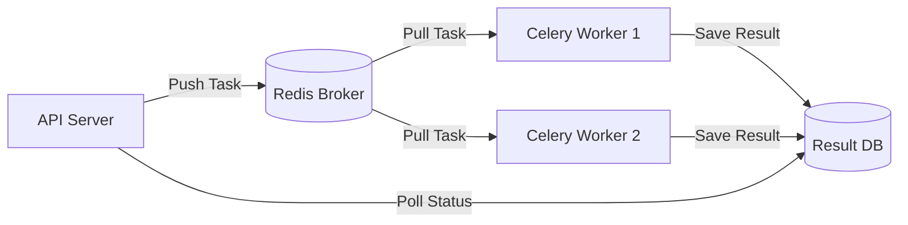

# 🐎 Redis & Celery — The Asynchronous Powerhouse
> **Level:** Advanced | **Language:** Hinglish | **Goal:** Background mein heavy, multi-step agentic workflows ko handle karne ke liye Redis ko broker aur Celery ko worker ke roop mein use karna master karein.

---

## 🧭 1. Beginner-Friendly Hinglish Explanation
Redis aur Celery ka matlab hai **"AI ka Helper Team"**. 

Socho ek user ne bola: "Internet se 50 news articles padho aur unka analysis karo."
Is kaam mein 5 minute lag sakte hain. Agar aapka "Main Server" ye karega, toh wo 5 minute tak kisi aur user se baat nahi kar payega.
- **Redis:** Ek storage (Broker) hai jahan hum tasks "Write" kar dete hain: "Hey, ye 50 articles padhne ka kaam hai."
- **Celery:** Ek worker hai jo background mein Redis se task uthata hai aur use chup-chaap pura karta rehta hai.

Jab kaam ho jata hai, Celery user ko notification bhej deta hai. Isse aapka main app hamesha "Fast" rehta hai.

---

## 🧠 2. Deep Technical Explanation
Ye architecture compute-heavy tasks ko API se **Decouple** karne ke liye industry standard hai.
1. **Redis (The Broker):** Ek in-memory data store jo message transport ki tarah act karta hai. Ye "List of things to do" hold karta hai.
2. **Celery (The Worker):** Ek task queue jo asynchronously code execute karta hai. Ye aapki API se separate servers par run ho sakta hai.
3. **Serialization:** Agent state jaise Python objects ko JSON ya Pickle mein convert karna taaki unhe network ke through worker ko bheja ja sake.
4. **Retry Logic:** Agar LLM API fail ho ya network glitch ho, toh Celery automatically task retry kar sakta hai.
5. **Result Backend:** "Final Answer" ko store karne ke liye Redis ya Postgres ka use karna taaki jab user poochhe "Is it done?", toh API use fetch kar sake.

---

## 🏗️ 3. Architecture Diagrams


```mermaid
graph LR
    A[API Server] -->|Push Task| R[(Redis Broker)]
    R -->|Pull Task| W1[Celery Worker 1]
    R -->|Pull Task| W2[Celery Worker 2]
    W1 & W2 -->|Save Result| DB[(Result DB)]
    A -->|Poll Status| DB
```

---

## 💻 4. Production-Ready Code Example (Defining a Task)

```python
from celery import Celery

# Hinglish Logic: Redis se connect karo aur task define karo
app = Celery('my_agent', broker='redis://localhost:6379/0')

@app.task(bind=True, max_retries=3)
def research_task(self, query):
    try:
        # result = agent.run(query)
        return "Research Completed"
    except Exception as exc:
        # Failure logic: 10 second baad dobara koshish karo
        raise self.retry(exc=exc, countdown=10)
```

---

## 🌍 5. Real-World Use Cases
- **Bulk PDF Processing:** HR team ke liye 1000 resumes ko summarize karna.
- **Scheduled Agents:** Ek bot jo har morning 8 AM par aapke calendar ko summarize karne ke liye run hota hai.
- **Email Campaigns:** Ek agent jo 500 personalized sales emails generate aur send karta hai.

---

## ❌ 6. Failure Cases
- **Task Lost:** Worker crash ho gaya aur task "Lost" ho gaya (Use `acks_late=True` to prevent this).
- **Infinite Loops:** Agent ek aisi task mein phansa hai jo kabhi khatam nahi hoti (Use `time_limit`).
- **Broker Downtime:** Agar Redis band hua, toh poora background processing system ruk jayega.

---

## 🛠️ 7. Debugging Guide
- **Flower:** Real-time mein Celery workers aur tasks ko monitor karne ke liye ek web UI.
- **Worker Logs:** Run karein workers ko "Debug" mode mein taaki dekh sakein ki agent logic kahan fail ho raha hai.

---

## ⚖️ 8. Tradeoffs
- **Redis/Celery:** Extremely powerful aur reliable hai, par infrastructure complexity add karta hai (needs Redis server + Worker processes).
- **BackgroundTasks (FastAPI):** Use karne mein bahut simple hai par multiple servers ke across scale nahi karta aur server restart hone par tasks lost ho jate hain.

---

## ✅ 9. Best Practices
- **Separate Queues:** "Fast tasks" (1s) aur "Slow tasks" (5 min) ke liye different queues use karein taaki slow tasks sab kuch block na karein.
- **Idempotency:** Ensure karein ki same task ko do baar run karne se bugs na hon (jaise email do baar send hona).

---

## 🛡️ 10. Security Concerns
- **Pickle Vulnerability:** Remote code execution attacks ko rokne ke liye `pickle` ke bajaye `json` ko task serializer ke roop mein use karein.

---

## 📈 11. Scaling Challenges
- **Concurrency:** Right balance dhoondhna—kitne workers start karein bina RAM khatam huye? (usually `1 worker per CPU core`).

---

## 💰 12. Cost Considerations
- **Memory Cost:** Redis sab kuch RAM mein store karta hai. Millions of pending tasks ke liye, ye expensive ho sakta hai.

---

## 📝 13. Interview Questions
1. **"Broker aur Worker mein kya fark hai?"**
2. **"Celery mein task retry logic kaise implement karte hain?"**
3. **"Result backend kyu zaruri hai?"**

---

## 🚀 15. Latest 2026 Industry Patterns
- **Serverless Celery:** Zero-idle cost ke liye Celery workers ko AWS Lambda ya Google Cloud Run par run karna.
- **Redis Streams:** Aur bhi high performance aur reliability ke liye simple lists ke bajaye modern Redis Streams ka use karna.

---

> **Expert Tip:** Celery is the **Backbone** of industrial AI. If your agent does anything that takes >2 seconds, it belongs in a background task.
