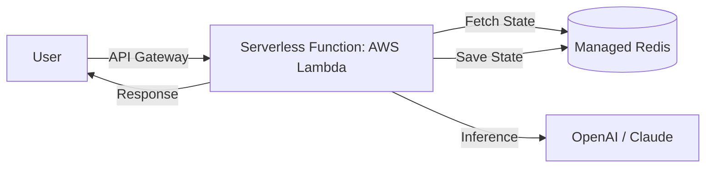

# ☁️ Serverless Agents — Zero-Idle Infrastructure
> **Level:** Advanced | **Language:** Hinglish | **Goal:** Master the deployment of AI agents using serverless functions like AWS Lambda, Vercel, and Cloudflare Workers to minimize costs and maximize scalability.

---

## 🧭 1. Beginner-Friendly Hinglish Explanation
Serverless ka matlab hai **"Server ki chinta mat karo"**. 

Normal server (VPS) mein aap 24 ghante paise dete ho, chahe koi use kare ya na kare. 
**Serverless** mein:
- Jab koi agent ko request bhejta hai, tabhi "Pankha chalta hai" (Server start hota hai).
- Kaam khatam? Server turant band.
- Paise sirf us waqt ke lagte hain jab AI kaam kar raha tha.

Ye un apps ke liye best hai jahan traffic unpredictable hai (kabhi kam, kabhi bahut zyada).

---

## 🧠 2. Deep Technical Explanation
Serverless deployment for agents involves managing **Cold Starts** and **Statelessness**.
1. **Event-Driven Execution:** The agent is triggered by an HTTP request, a file upload (S3), or a message in a queue.
2. **Cold Starts:** The delay when a function starts from scratch. Since agents have heavy dependencies (LangChain, Pydantic), cold starts can be 2-5 seconds.
3. **Stateless Nature:** Serverless functions don't "Remember" anything. You *must* store agent state in an external DB (Redis/Postgres) every time.
4. **Timeouts:** Most serverless platforms have a limit (e.g., AWS Lambda is 15 mins). Long-running agent tasks (research, scraping) might hit this limit.
5. **Edge Functions:** Running agents on the "Edge" (Cloudflare Workers) to reduce latency by being geographically closer to the user.

---

## 🏗️ 3. Architecture Diagrams



---

## 💻 4. Production-Ready Code Example (Vercel Serverless Function)

```python
# Hinglish Logic: Ye code tabhi chalega jab /api/agent par request aayegi
def handler(request):
    query = request.args.get('q')
    # 1. Fetch memory from external DB
    # 2. Call LLM
    # 3. Return response
    return {"response": "Hi, I am your serverless agent!"}
```

---

## 🌍 5. Real-World Use Cases
- **Low-Traffic Startups:** Where you don't want to pay $50/month for a server that nobody uses at night.
- **Micro-tasks:** A serverless agent that only "Categorizes" incoming support tickets.
- **Webhook Handlers:** An agent that triggers every time you get a new lead in Salesforce.

---

## ❌ 6. Failure Cases
- **Connection Pooling:** Har request par naya DB connection kholne se Database crash ho jana (Use **Prisma Accelerate** or **Supabase**).
- **Timeouts:** Agent lamba research kar raha hai aur function beech mein hi "Force Close" ho gaya.
- **Large Packages:** Docker image ya ZIP file itni badi hona ki serverless platform use reject kar de.

---

## 🛠️ 7. Debugging Guide
- **CloudWatch / Vercel Logs:** Check for "Execution Timed Out" or "Out of Memory" errors.
- **Warm-up Requests:** Sending a "Dummy" request every 5 mins to keep the function "Warm" and avoid cold starts.

---

## ⚖️ 8. Tradeoffs
- **Serverless:** $0 cost when idle, infinite scaling, but high latency (cold starts) and timeout limits.
- **Persistent Server:** zero latency, no timeouts, but you pay even when nobody is using it.

---

## ✅ 9. Best Practices
- **Lean Dependencies:** Sirf wahi libraries use karein jo zaruri hon taaki function fast start ho.
- **Async calls:** Use `asyncio` for model calls to finish as quickly as possible.

---

## 🛡️ 10. Security Concerns
- **Exposed Secrets:** Ensuring environment variables are encrypted and not visible in logs.

---

## 📈 11. Scaling Challenges
- **Database Bottleneck:** Lambda 1000 instances tak scale ho sakti hai, par kya aapka database 1000 concurrent connections handle kar sakta hai?

---

## 💰 12. Cost Considerations
- **Pay-per-Execution:** Calculate if your traffic is high enough that a persistent server might actually be cheaper (The "Serverless Wall").

---

## 📝 13. Interview Questions
1. **"Cold Start kya hota hai aur ise kaise kam karenge?"**
2. **"Serverless agents mein 'State' kaise manage hoti hai?"**
3. **"AWS Lambda vs EC2 for agents?"**

---

## 🚀 15. Latest 2026 Industry Patterns
- **Wasm on Edge:** Running agents in under 10ms on the edge using WebAssembly.
- **GPU Serverless:** Platforms like **Modal** or **RunPod** that provide serverless GPUs—you only pay for the seconds the GPU was running your model.

---

> **Expert Tip:** Serverless is for **Efficiency**. Don't use it for long-running "Thinker" agents; use it for fast "Action" agents.
