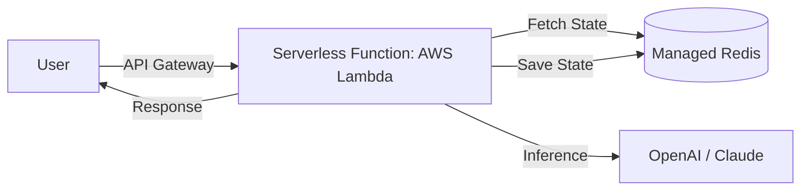

# ☁️ Serverless Agents — Zero-Idle Infrastructure
> **Level:** Advanced | **Language:** Hinglish | **Goal:** Costs ko minimize aur scalability ko maximize karne ke liye AWS Lambda, Vercel, aur Cloudflare Workers jaise serverless functions ka use karke AI agents ke deployment ko master karein.

---

## 🧭 1. Beginner-Friendly Hinglish Explanation
Serverless ka matlab hai **"Server ki chinta mat karo"**. 

Normal server (VPS) mein aap 24 ghante paise dete ho, chahe koi use kare ya na kare. 
**Serverless** mein:
- Jab koi agent ko request bhejta hai, tabhi "Pankha chalta hai" (Server start hota hai).
- Kaam khatam? Server turant band.
- Paise sirf us waqt ke lagte hain jab AI kaam kar raha tha.

Ye un apps ke liye best hai jahan traffic unpredictable hai (kabhi kam, kabhi bahut zyada).

---

## 🧠 2. Deep Technical Explanation
Agents ke liye serverless deployment mein **Cold Starts** aur **Statelessness** ko manage karna shamil hota hai.
1. **Event-Driven Execution:** Agent ek HTTP request, file upload (S3), ya queue mein message dwara trigger hota hai.
2. **Cold Starts:** Jab koi function scratch se start hota hai toh hone wala delay. Kyunki agents ke paas heavy dependencies (LangChain, Pydantic) hoti hain, isliye cold starts 2-5 seconds ho sakte hain.
3. **Stateless Nature:** Serverless functions kuch bhi "Yaad" nahi rakhte. Aapko har baar agent state ko external DB (Redis/Postgres) mein store *must* karna hoga.
4. **Timeouts:** Zyadatar serverless platforms ki ek limit hoti hai (e.g., AWS Lambda is 15 mins). Long-running agent tasks (research, scraping) is limit ko hit kar sakte hain.
5. **Edge Functions:** Latency ko reduce karne ke liye agents ko "Edge" (Cloudflare Workers) par run karna taaki wo user ke geographically closer ho sakein.

---

## 🏗️ 3. Architecture Diagrams


```mermaid
graph LR
    U[User] -->|API Gateway| L[Serverless Function: AWS Lambda]
    L -->|Fetch State| R[(Managed Redis)]
    L -->|Inference| O[OpenAI / Claude]
    L -->|Save State| R
    L -->|Response| U
```

---

## 💻 4. Production-Ready Code Example (Vercel Serverless Function)

```python
# Hinglish Logic: Ye code tabhi chalega jab /api/agent par request aayegi
def handler(request):
    query = request.args.get('q')
    # 1. Fetch memory from external DB
    # 2. Call LLM
    # 3. Return response
    return {"response": "Hi, I am your serverless agent!"}
```

---

## 🌍 5. Real-World Use Cases
- **Low-Traffic Startups:** Jahan aap kisi aise server ke liye $50/month pay nahi karna chahte jise raat mein koi use na karta ho.
- **Micro-tasks:** Ek serverless agent jo incoming support tickets ko sirf "Categorize" karta hai.
- **Webhook Handlers:** Ek agent jo har baar Salesforce mein new lead milne par trigger hota hai.

---

## ❌ 6. Failure Cases
- **Connection Pooling:** Har request par naya DB connection kholne se Database crash ho jana (Use **Prisma Accelerate** or **Supabase**).
- **Timeouts:** Agent lamba research kar raha hai aur function beech mein hi "Force Close" ho gaya.
- **Large Packages:** Docker image ya ZIP file itni badi hona ki serverless platform use reject kar de.

---

## 🛠️ 7. Debugging Guide
- **CloudWatch / Vercel Logs:** Check karein "Execution Timed Out" or "Out of Memory" errors.
- **Warm-up Requests:** Function ko "Warm" rakhne aur cold starts se bachne ke liye har 5 mins mein ek "Dummy" request bhejna.

---

## ⚖️ 8. Tradeoffs
- **Serverless:** Idle hone par $0 cost, infinite scaling, par high latency (cold starts) aur timeout limits.
- **Persistent Server:** zero latency, no timeouts, par aap tab bhi pay karte hain jab use koi nahi kar raha hota.

---

## ✅ 9. Best Practices
- **Lean Dependencies:** Sirf wahi libraries use karein jo zaruri hon taaki function fast start ho.
- **Async calls:** Jitni jaldi ho sake finish karne ke liye model calls ke liye `asyncio` use karein.

---

## 🛡️ 10. Security Concerns
- **Exposed Secrets:** Ensure karna ki environment variables encrypted hon aur logs mein visible na hon.

---

## 📈 11. Scaling Challenges
- **Database Bottleneck:** Lambda 1000 instances tak scale ho sakti hai, par kya aapka database 1000 concurrent connections handle kar sakta hai?

---

## 💰 12. Cost Considerations
- **Pay-per-Execution:** Calculate karein ki kya aapka traffic itna high hai ki ek persistent server actually cheaper padega (The "Serverless Wall").

---

## 📝 13. Interview Questions
1. **"Cold Start kya hota hai aur ise kaise kam karenge?"**
2. **"Serverless agents mein 'State' kaise manage hoti hai?"**
3. **"AWS Lambda vs EC2 for agents?"**

---

## 🚀 15. Latest 2026 Industry Patterns
- **Wasm on Edge:** WebAssembly ka use karke edge par 10ms se kam samay mein agents run karna.
- **GPU Serverless:** **Modal** ya **RunPod** jaise platforms jo serverless GPUs provide karte hain—aap sirf un seconds ke liye pay karte hain jab GPU aapka model run kar raha tha.

---

> **Expert Tip:** Serverless is for **Efficiency**. Don't use it for long-running "Thinker" agents; use it for fast "Action" agents.
