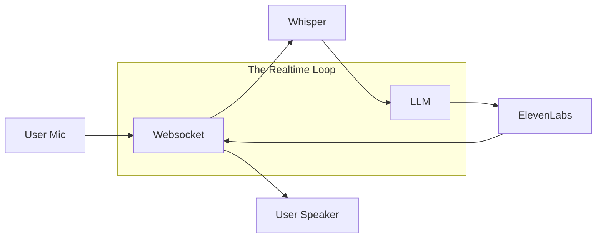

# 🎙️ Real-Time & Voice Agents — AI that Talks
> **Level:** Advanced | **Language:** Hinglish | **Goal:** WebSockets, Realtime APIs, aur specialized STT/TTS models ka use karke low-latency voice agents ke development ko master karein.

---

## 🧭 1. Beginner-Friendly Hinglish Explanation
Real-Time aur Voice Agents ka matlab hai **"AI jisse aap baat kar sakein"**. 

Imagine aap ek agent ko phone karte hain. 
- Wo aapki awaz sunta hai (**Speech-to-Text**).
- Wo dimaag lagata hai (**LLM Reasoning**).
- Wo wapas bolta hai (**Text-to-Speech**).

Challenge ye hai ki ye sab "Real-time" (sub-second) mein hona chahiye. Agar AI jawab dene mein 5 second lega, toh wo "Natural" nahi lagega. Hum WebSockets ka use karte hain taaki AI bina ruke "Stream" kar sake.

---

## 🧠 2. Deep Technical Explanation
Voice agents ke liye ek **Low-Latency Pipeline** ki zaroorat hoti hai.
1. **STT (Speech-to-Text):** **Whisper (Groq)** ya **Deepgram** jaise models ka use karna jo audio chunks aate hi unhe transcribe kar sakein.
2. **Realtime API (OpenAI/Gemini):** Faster reasoning ke liye audio tokens ko directly model par bhejkar text-conversion step ko bypass karna.
3. **VAD (Voice Activity Detection):** Automatically detect karna ki user ne kab bolna start aur stop kiya.
4. **TTS (Text-to-Speech):** Human-like audio generate karne ke liye **ElevenLabs** ya **Cartesia** jaise high-speed providers ka use karna.
5. **Full-Duplex WebSockets:** Ek connection jo user aur agent ko ek hi time par bolne deta hai (Interrupt handling).

---

## 🏗️ 3. Architecture Diagrams


```mermaid
graph LR
    U[User Mic] --> WS[Websocket]
    WS --> STT[Whisper]
    STT --> LLM[LLM]
    LLM --> TTS[ElevenLabs]
    TTS --> WS
    WS --> UA[User Speaker]
    
    subgraph "The Realtime Loop"
    WS
    LLM
    end
```

---

## 💻 4. Production-Ready Code Example (Basic WS Concept)

```python
# Hinglish Logic: Ek baar connection kholo aur audio bhejte raho
import websockets
import json

async def voice_agent_loop():
    async with websockets.connect("wss://api.openai.com/v1/realtime") as ws:
        # 1. Initialize session
        await ws.send(json.dumps({"type": "session.update", "session": {"modalities": ["audio", "text"]}}))
        
        # 2. Listen and Speak (Streaming)
        print("Agent is ready to talk!")
```

---

## 🌍 5. Real-World Use Cases
- **Customer Call Centers:** Phone par support tickets handle karne wale AI agents.
- **Language Tutors:** AI jo real-time mein aapki pronunciation ko correct karti hai.
- **Voice Assistants:** Smart home devices jo complex commands par instantly respond karte hain.

---

## ❌ 6. Failure Cases
- **High Latency:** Internet slow hone ki wajah se AI 3-5 second baad jawab deta hai (Awkward silence).
- **Echo Interference:** AI apni hi awaz sunkar confuse ho jata hai.
- **Interruption Fail:** User beech mein bolta hai par AI "Chup" nahi hota.

---

## 🛠️ 7. Debugging Guide
- **Trace the Pipeline:** Time measure karein: `STT (200ms) + LLM (400ms) + TTS (200ms) = 800ms Total`.
- **Packet Loss:** Check karein ki audio packets drop kyu ho rahe hain.

---

## ⚖️ 8. Tradeoffs
- **Cascaded Pipeline (STT + LLM + TTS):** Highly customizable hai par higher latency hoti hai.
- **Native Realtime API:** Extremely fast aur natural hai par bahut expensive aur limited control hai.

---

## ✅ 9. Best Practices
- **VAD Sensitivity:** VAD ko aisa set karein ki wo "Khaansi" (Cough) aur "Baat" mein fark samajh sake.
- **Filler Words:** AI ko "Umm", "Hmm" bolna sikhaein taaki wait time natural lage.

---

## 🛡️ 10. Security Concerns
- **Voice Cloning:** Attacker kisi ki awaz clone karke agent ko secure commands de sakta hai.
- **Eavesdropping:** Agent background noise record karke private info leak kar sakta hai.

---

## 📈 11. Scaling Challenges
- **Concurrent Audio Streams:** 1000 active voice calls handle karne ke liye heavy networking aur bandwidth chahiye.

---

## 💰 12. Cost Considerations
- **Per-Minute Billing:** Voice APIs aksar "Per Minute" charge karti hain ($0.05 - $0.20 per min), jo bahut jaldi mehnga ho sakta hai.

---

## 📝 13. Interview Questions
1. **"Voice agents mein latency kaise minimize karenge?"**
2. **"Interruption handling kaise implement hoti hai?"**
3. **"VAD (Voice Activity Detection) ka role kya hai?"**

---

## ⚠️ 14. Common Mistakes
- **No Noise Cancellation:** Background noise ki wajah se transcription kharab hona.
- **Waiting for full sentence:** Puray sentence ke khatam hone ka wait karna TTS start karne ke liye.

---

## 🚀 15. Latest 2026 Industry Patterns
- **Emotional Voice Models:** AI jo user ke voice tone se unka stress level detect karti hai aur uske according apna tone change karti hai.
- **Sub-100ms Responses:** New specialized hardware jo AI talking ko human talking se bilkul indistinguishable bana deta hai.

---

> **Expert Tip:** In voice, **Speed is Empathy**. If the agent is slow, it doesn't matter how smart it is.
