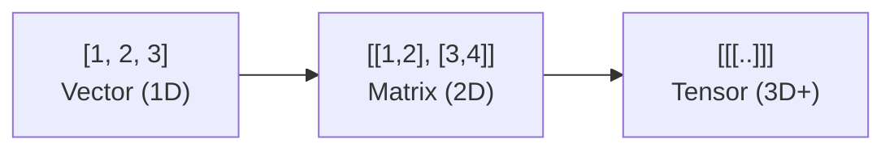
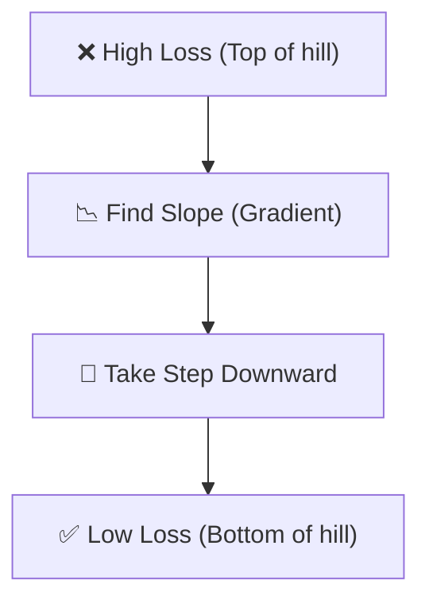

# 🧮 AI Math Primer — The Brain Behind the Magic
> **Level:** Beginner → Intermediate | **Language:** Hinglish | **Goal:** AI ki algorithms ka math samajhna (Simplified)

---

## 📋 Is Guide Se Kya Seekhoge

| Topic | Status |
|-------|--------|
| Tensors & Matrices | ✅ Covered |
| Dot Products & Similarities | ✅ Covered |
| Calculus & Gradients (Optimizers) | ✅ Covered |
| Probability (Softmax) | ✅ Covered |
| Distribution & Normalization | ✅ Covered |
| Math for LLMs | ✅ Covered |

---

## 1. 🔢 Tensors & Matrices (LLM Data)

AI mein sab kuch **Vector** (1D list) ya **Matrix** (2D table) ya **Tensor** (3D+ box) hai.



**Key Operation: Matrix Multiplication**
Model layer ka connection matrix multiplication se hi hota hai. 
`Output = Input (X) * Weights (W) + Bias (b)`

---

## 2. 📏 Dot Product (The Reason for Similarity Search)

AI mein "Similarity" ka matlab dot product hota hai.

```python
# Dot Product Formula (Simplified)
# Vec1 = [1, 2], Vec2 = [3, 4]
# Result = (1*3) + (2*4) = 3 + 8 = 11
```

| Similarity | Dot Product Result | Significance |
|------------|---------------------|--------------|
| High | Positive & Large | Vectors "Same direction" mein hain (Similar). |
| Low | Zero | Vectors "Orthogonal" (90 deg) hain (Unrelated). |
| Opposite | Negative | Vectors "Opposite direction" mein hain. |

> 🧩 **Dot Product hi decide karta hai ki 'King' aur 'Queen' similar kyu hain.**

---

## 3. 📉 Calculus & Gradients (Training)

AI seekhta kaisa hai? **Gradient Descent** se.



- **Gradient:** Ye slope (dhalaan) batata hai ki kis direction mein change karna hai weights ko.
- **Learning Rate:** Batata hai ki kitna bada step lena hai.
- **Backpropagation:** Output ki galti ko peeche (reverse) bhej kar saare weights ko theek karna.

---

## 4. 🎲 Probability (Softmax)

LLMs hamesha "Next Token" choose karte hain probability ke base par. Use **Softmax** kahte hain.

```python
# Example: Next word probabilities
# [Apple: 0.1, Banana: 0.8, Orange: 0.1]
# Softmax function raw scores ko sum=1 (Probability) mein badalta hai.
```

---

## 5. 📏 Normalization (Stable Training)

Training ko stable rakhne ke liye hum values ko **scale** karte hain (RMSNorm, LayerNorm).

```python
# Values: [100, 5, 2] -> Bohot bada gap hai
# Normalized: [0.95, 0.04, 0.01] -> Model easily handle kar sakta hai
```

---

## 6. 🧠 Attention Math (GQA/MHA)

LLMs mein attention score aise banta hai:
`Attention(Q, K, V) = Softmax( (Q * K^T) / sqrt(d_k) ) * V`

- **Q (Query):** Main kya dhund raha hoon?
- **K (Key):** Baaki tokens ke paas kya "knowledge" hai?
- **V (Value):** Actual content jo carry forward hoga.

---

## 7. 🧪 Exercises — Practice Karo!

### Exercise 1: Dot Product Calculation ⭐
**Question:** Vector 1 `[1, 0]` aur Vector 2 `[0, 1]`. Inka dot product kya hoga?
<details><summary>Answer</summary>$(1\times0) + (0\times1) = 0$. Inka dot product 0 hai, matlab ye bilkul unrelated hain. ✅</details>

---

### Exercise 2: Learning Rate Scenario ⭐⭐
**Scenario:** Aapka model ka loss bohot fast jump kar raha hai (Zameen pe tik nahi raha). Learning rate 1.0 hai. Aap kya karoge?
<details><summary>Answer</summary>Learning rate **kam** karoge (e.g., 0.001) taki tiny steps le kar model stable ho. ✅</details>

---

## 🏆 Final Summary

> **AI Engineer ko math PhD nahi chahiye, bas common sense aur vectors ka idea chahiye.** 
> Sab kuch tensors aur matrices ki physics hai.

```
Data = Tensors
Similarity = Dot Product
Learning = Gradients
Decision = Probability
```

---

## 🔗 Resources
- [3Blue1Brown: Linear Algebra (Best!)](https://www.youtube.com/playlist?list=PLZHQObOWTQDPD3Mne0B6Fe7jnwQ56VnUe)
- [3Blue1Brown: Calculus](https://www.youtube.com/playlist?list=PLZHQObOWTQDMsr9K-rj53DwVRMYO3t5Yr)
- [Neural Networks: Zero to Hero (Andrej Karpathy)](https://karpathy.ai/zero-to-hero.html)
