# 🧩 Agentic AI Guide
> **Level:** Beginner → Intermediate | **Language:** Hinglish | **Goal:** Agentic AI ko practically samajhna

---

## 📋 Is Guide Se Kya Seekhoge

| Topic | Status |
|-------|--------|
| Agentic AI kya hota hai | ✅ Covered |
| Generative AI vs Agentic AI | ✅ Covered |
| Core Loop aur Architecture | ✅ Covered |
| Planning, Reflection, Memory | ✅ Covered |
| Real-World Working Example | ✅ Covered |
| Exercises + Tests | ✅ Covered |

---

## 1. 🤖 Agentic AI Kya Hota Hai

Agentic AI ka matlab hota hai aise AI systems jo:

- **Goals ke saath kaam karte hain** — sirf output generate nahi karte
- **Multi-step decisions lete hain** — ek jawab me khatam nahi hote
- **Tools use karte hain** — real-world se interact karte hain
- **Results dekhkar next step choose karte hain** — adaptive hote hain
- **Kuch autonomous behavior dikhate hain** — human ko har step pe nahi puchchte

> 💡 **Simple Line:**
> `Generative AI content banata hai, Agentic AI kaam complete karne ki koshish karta hai.`

---

## 2. 🆚 Generative AI vs Agentic AI

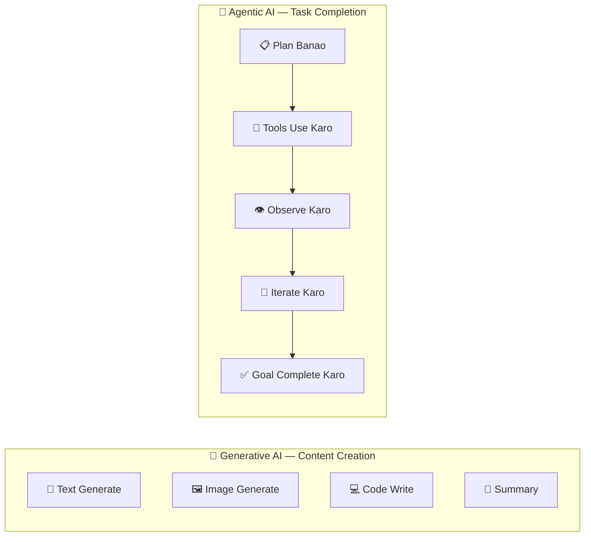

| Feature | Generative AI | Agentic AI |
|---------|--------------|-----------|
| Main Kaam | Content banana | Goal achieve karna |
| Steps | Usually 1 | Multiple |
| Tools | Usually nahi | Haan, zaruri |
| Memory | Limited | Extended |
| Autonomy | Low | Medium to High |
| Example | "Essay likho" | "Research karo aur report complete karo" |

---

## 3. 🔑 Agentic AI Ka Core Formula

```
Agentic AI = Model + Tools + Memory + Planning + Feedback Loop + Goal
```

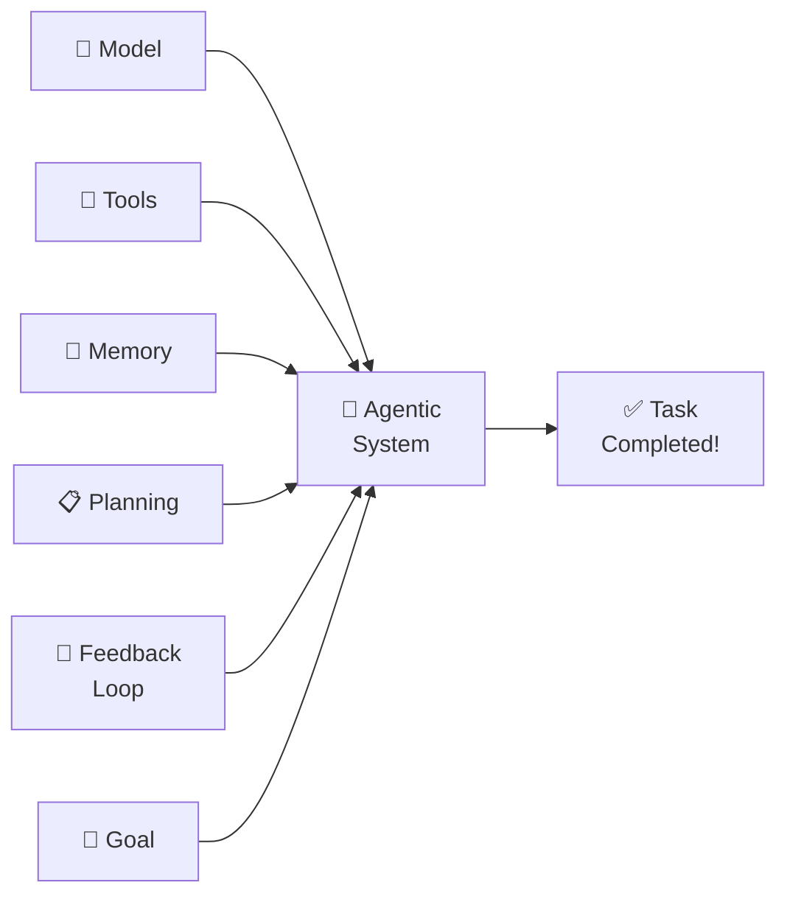

---

## 4. 🗺️ Agentic AI Ka Big Picture

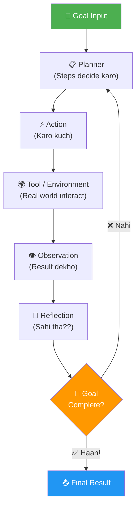

**Ye Agentic Loop ka heart hai. System:**
1. Goal leta hai
2. Action choose karta hai
3. Result dekhta hai
4. Reflect karta hai
5. Repeat karta hai jab tak complete na ho

---

## 5. 🎛️ Agentic AI Me Autonomy Levels

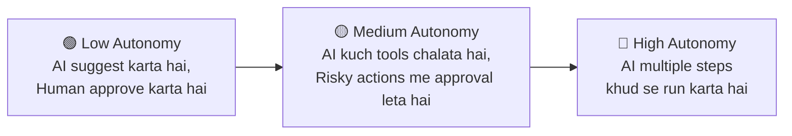

| Autonomy Level | Kab Use Karein | Risk Level |
|---------------|---------------|-----------|
| 🟢 Low | Important decisions wale tasks | Low |
| 🟡 Medium | Semi-automated workflows | Medium |
| 🔴 High | Well-tested, controlled environments | High |

> ⚠️ **Important:**
> High autonomy hamesha better nahi hoti.
> **Safe aur controllable autonomy** zyada important hoti hai.

---

## 6. 🔄 Agentic AI Ka Decision Loop

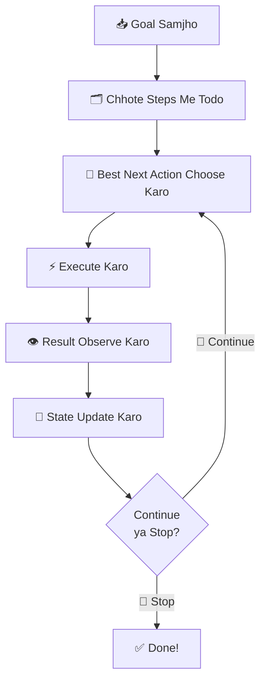

> 💡 **Key Insight:**
> Agentic AI **one-shot system nahi** hota — ye **iterative** hota hai.
> Har step ke baad system refine karta rehta hai.

---

## 7. 🤔 Reflection Kya Hota Hai

Reflection = jo result mila, usse dekhkar sochna

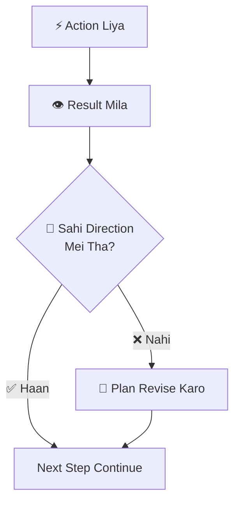

**Reflection ki wajah se system:**
- Apni mistakes khud pakad sakta hai
- Galat direction se wapas aa sakta hai
- Better next steps choose kar sakta hai

---

## 8. 📋 Planning Kya Hota Hai

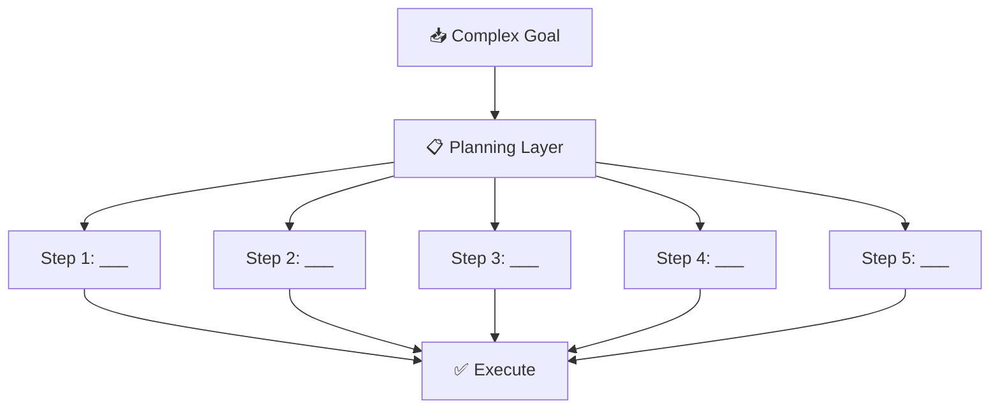

**Real Example:**

**Goal:** `Startup ke liye competitor research report banao`

```
📋 Plan:
  Step 1 → Competitors ki list identify karo
  Step 2 → Har competitor ka web data gather karo
  Step 3 → Features compare karo
  Step 4 → Market positioning analyze karo
  Step 5 → Report draft likho
  Step 6 → Summary + recommendations do
```

---

## 9. 💾 Memory Kya Karti Hai

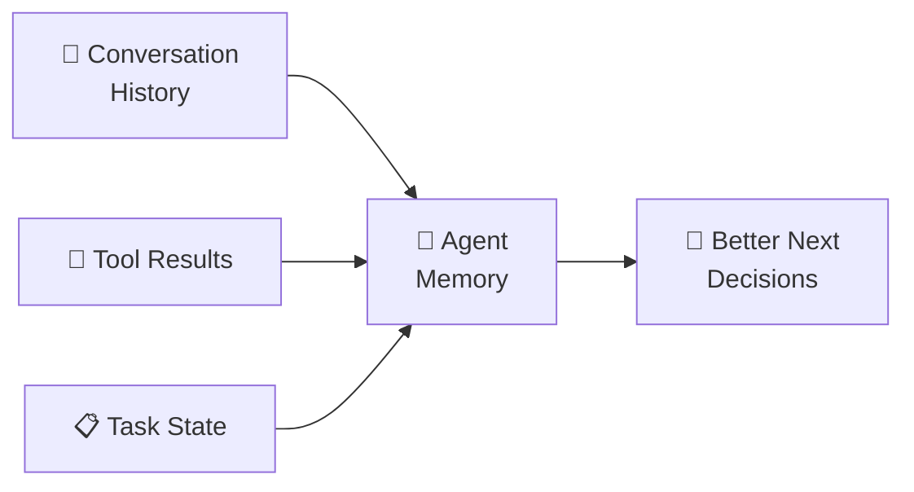

**Memory Types:**

| Type | Kya Hai | Example |
|------|---------|---------|
| 📝 Short-term | Current session | Is conversation ka context |
| 💾 Long-term | Persistent storage | User preferences, past tasks |
| 📊 Episodic | Past experiences | "Pichli baar ye kaam aisa kiya tha" |

---

## 10. 🔧 Tool Use Kyu Zaruri Hai

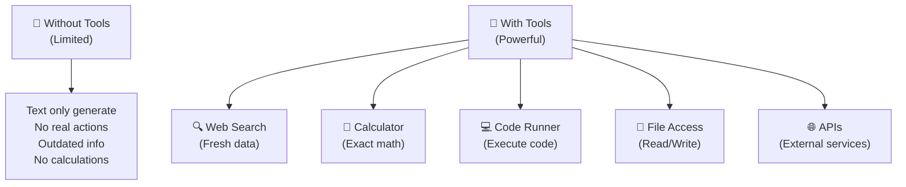

---

## 11. 🌍 Agentic AI Aur Environment

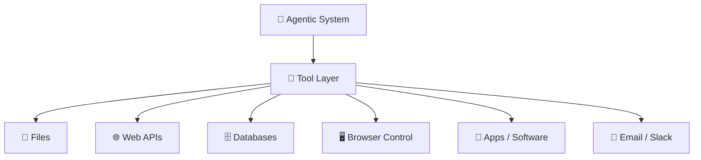

**Environments jahan Agentic AI kaam karta hai:**
- File system (code read/write)
- Web browser (search, scrape)
- Enterprise software (CRM, helpdesk)
- Cloud APIs (weather, maps, payments)
- Coding repositories (GitHub, GitLab)

---

## 12. 🏗️ Agentic AI Architecture Layers

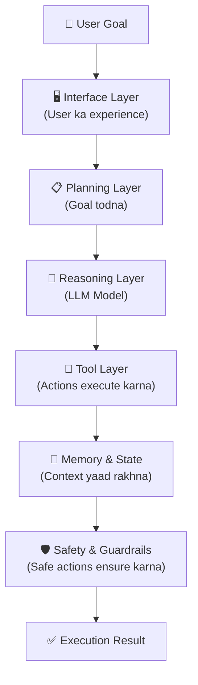

---

## 13. 🔴 Real-World Working Example — Competitor Research Agent

> **Task:** "Python ka ek simplified agentic system banao jo competitor research kare"

```python
import time

# ===== Simulated Tools =====
def web_search(query):
    """Web se data fetch karta hai (simulated)"""
    # Real me ye requests + BeautifulSoup use karta
    fake_data = {
        "OpenAI": {"product": "ChatGPT", "users": "100M+", "pricing": "$20/month"},
        "Anthropic": {"product": "Claude", "users": "50M+", "pricing": "$15/month"},
        "Google": {"product": "Gemini", "users": "200M+", "pricing": "Free + Pro"},
    }
    for company, data in fake_data.items():
        if company.lower() in query.lower():
            return data
    return {"error": "Data not found"}

def analyze_data(raw_data):
    """Data analyze karta hai"""
    if "error" in raw_data:
        return "Analysis failed"
    return {
        "market_position": "Strong" if raw_data["users"].endswith("M+") else "Growing",
        "pricing_model": "Subscription" if "/month" in raw_data.get("pricing","") else "Freemium",
        "key_insight": f"Product: {raw_data['product']}, Users: {raw_data['users']}"
    }

def generate_report_section(company, analysis):
    """Report section likhta hai"""
    return f"""
    ## {company}
    - Market Position: {analysis['market_position']}
    - Pricing Model: {analysis['pricing_model']}
    - Key Insight: {analysis['key_insight']}
    """

# ===== Agentic Loop =====
class CompetitorResearchAgent:
    def __init__(self):
        self.state = {}
        self.steps_taken = []

    def run(self, goal):
        print(f"🎯 Goal: {goal}\n")
        competitors = ["OpenAI", "Anthropic", "Google"]
        report_sections = []

        # LOOP - har competitor ke liye
        for company in competitors:
            # THINK
            print(f"🤔 Step: {company} ke baare me research karna hai")

            # ACT - Tool 1: Search
            print(f"  🔍 Searching: {company} AI products...")
            raw_data = web_search(company)
            self.steps_taken.append(f"Searched: {company}")

            # OBSERVE
            print(f"  👁️ Data mila: {raw_data}")

            # ACT - Tool 2: Analyze
            print(f"  📊 Analyzing data...")
            analysis = analyze_data(raw_data)

            # ACT - Tool 3: Write
            section = generate_report_section(company, analysis)
            report_sections.append(section)
            print(f"  ✅ Section complete!\n")
            time.sleep(0.5)

        # FINAL OUTPUT
        full_report = "# 📊 Competitor Research Report\n" + "\n".join(report_sections)
        print("="*50)
        print(full_report)
        print("="*50)
        print(f"\n✅ Total steps taken: {len(self.steps_taken)}")
        return full_report

# Chalao!
agent = CompetitorResearchAgent()
agent.run("AI industry me top 3 competitors ka research karo")
```

**Expected Output:**
```
🎯 Goal: AI industry me top 3 competitors ka research karo

🤔 Step: OpenAI ke baare me research karna hai
  🔍 Searching: OpenAI AI products...
  👁️ Data mila: {'product': 'ChatGPT', 'users': '100M+', 'pricing': '$20/month'}
  📊 Analyzing data...
  ✅ Section complete!

... (har competitor ke liye)

==================================================
# 📊 Competitor Research Report

    ## OpenAI
    - Market Position: Strong
    - Pricing Model: Subscription
    - Key Insight: Product: ChatGPT, Users: 100M+

    ## Anthropic
    - Market Position: Strong
    - Pricing Model: Subscription
    - Key Insight: Product: Claude, Users: 50M+

    ## Google
    - Market Position: Strong
    - Pricing Model: Freemium
    - Key Insight: Product: Gemini, Users: 200M+

==================================================
✅ Total steps taken: 3
```

---

## 14. ⚠️ Agentic AI Me Failure Kahan Hota Hai

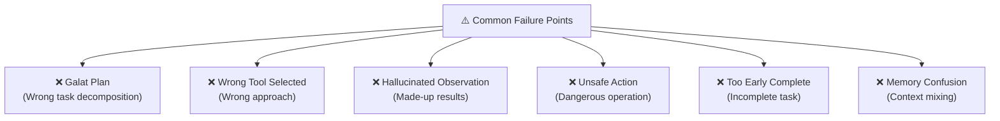

**Isliye testing aur evaluation bahut important hai!**

---

## 15. 📊 Agentic AI Evaluation

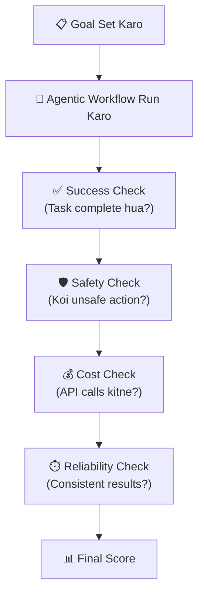

| Metric | Ideal Value | Warning Sign |
|--------|-------------|-------------|
| Task Success | >80% | <50% |
| Safety Violations | 0 | Any violation |
| Cost per Task | Low | Runaway API calls |
| Consistency | >90% | Unpredictable results |

---

## 16. ⚖️ Agentic AI vs Workflow Automation

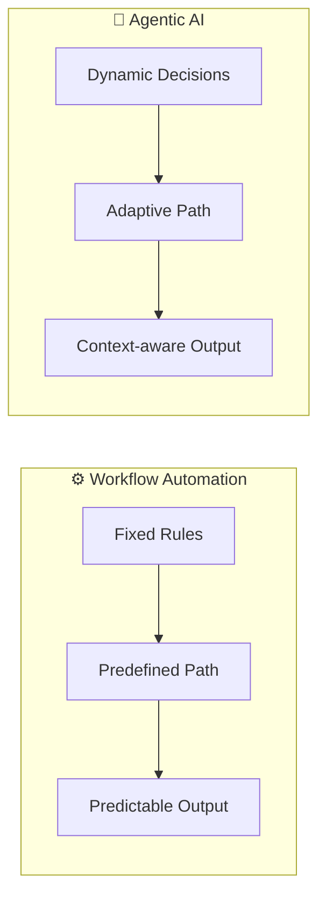

| Feature | Workflow Automation | Agentic AI |
|---------|---------------------|-----------|
| Rules | Fixed/Hardcoded | Dynamic/Learned |
| Unexpected Cases | Fails | Adapts |
| Paths | One path | Multiple possible |
| Flexibility | Low | High |
| Use Case | Repetitive tasks | Complex, variable tasks |

---

## 17. 🤔 Kya Har Jagah Agentic AI Chahiye?

**Nahi!** Kabhi simple solution better hota hai:

```
✅ Use Agentic AI when:          ❌ Don't use for:
- Multi-step task ho             - Simple Q&A
- Dynamic environment ho         - Fixed automation
- Tool orchestration chahiye     - One-time scripts
- Decision-making chahiye        - Simple search
- Complex workflow ho            - Static forms
```

---

## 📚 Student Build Path

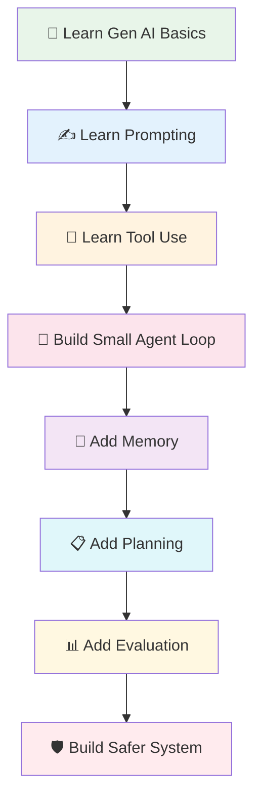

**Recommended Order:**
1. Generative AI basics samjho
2. Prompting seekho
3. Tools ka idea lo
4. Simple agent loop banao (Think → Act → Observe)
5. Memory add karo
6. Planning add karo
7. Evaluate karo
8. Safety add karo

---

## 🧪 Exercises — Practice Karo!

### Exercise 1: Identify Autonomy Level ⭐

**Scenario dekhkar autonomy level identify karo:**

```
A) Email agent: Har email bhejne se pehle user se confirm karta hai
B) Research agent: Automatically 10 websites search karta hai, user ko nahi poochta
C) Shopping agent: Cart me add karta hai, lekin payment ke liye wait karta hai
```

<details>
<summary>✅ Answers Dekho</summary>

- **A) Low Autonomy** — Har action pe approval leta hai
- **B) High Autonomy** — User ko poochhe bina multiple actions leta hai
- **C) Medium Autonomy** — Kuch actions khud leta hai, risky action (payment) ke liye ruka

</details>

---

### Exercise 2: Agentic Loop Trace Karo ⭐⭐

**Goal:** "Mujhe aaj ka news digest banao — sirf technology news"

**Task:** Neeche ka incomplete loop complete karo:

```
Think 1: ___________________________
Act 1:   news_search("technology news today")
Observe 1: [10 articles mili]

Think 2: ___________________________
Act 2:   filter_articles(articles, category="tech")
Observe 2: [5 relevant articles mili]

Think 3: ___________________________
Act 3:   ___________________________
Observe 3: Summary generated

Think 4: Goal complete?
Result: ___________________________
```

<details>
<summary>✅ Answer Dekho</summary>

```
Think 1: "Pehle aaj ki technology news search karni chahiye"
Act 1:   news_search("technology news today")
Observe 1: [10 articles mili]

Think 2: "10 articles bahut hain, sirf tech wale filter karo"
Act 2:   filter_articles(articles, category="tech")
Observe 2: [5 relevant articles mili]

Think 3: "Ab in 5 articles ka digest banana hai"
Act 3:   summarize_articles(filtered_articles)
Observe 3: Summary generated

Think 4: Goal complete!
Result: "Aaj ki top 5 Technology News:\n1. ..."
```

</details>

---

### Exercise 3: Design Your Own Agent ⭐⭐⭐

**Task:** Ek "Fitness Tracker Agent" design karo jo:
- User ka daily nutrition track kare
- Workout suggest kare
- Progress measure kare

Likho: Tools kya honge? Loop kaise chalega? Memory kya store karegi?

<details>
<summary>✅ Sample Design Dekho</summary>

```
Tools:
  - nutrition_lookup(food_name) → calories, protein, carbs
  - exercise_database(goal, fitness_level) → workout plan
  - calculate_progress(current, target) → % complete
  - store_daily_log(date, nutrition, exercise) → saved!

Memory:
  - User ka fitness goal (weight loss / muscle gain)
  - Daily nutrition logs (last 30 days)
  - Exercise history
  - Progress metrics

Agent Loop:
  Morning:
    Think: "User ka aaj ka breakfast log karna hai"
    Act: nutrition_lookup("oatmeal with banana")
    Observe: 350 calories, 12g protein
    Think: "Log store karo"
    Act: store_daily_log(today, nutrition_data)

  Evening:
    Think: "Workout suggest karna hai"
    Act: exercise_database("weight_loss", "intermediate")
    Observe: 30min cardio + strength training
    Think: "Progress check karo"
    Act: calculate_progress(current_weight, target_weight)
    Final: Report + Tomorrow's plan
```

</details>

---

## 📝 Quick Test — Samajh Check Karo!

**Q1:** Agentic AI aur Generative AI me main difference kya hai?

```
A) Agentic AI zyada text generate karta hai
B) Agentic AI goals pursue karta hai, tools use karta hai, iterative hota hai
C) Generative AI sirf code generate karta hai
D) Koi fark nahi
```

<details><summary>Answer</summary>**B** ✅</details>

---

**Q2:** Reflection ka kya matlab hai agentic systems me?

```
A) Mirror me dekhna 😄
B) Model ka restart karna
C) Action ke result ko evaluate karna aur next steps adjust karna
D) Memory clear karna
```

<details><summary>Answer</summary>**C** ✅</details>

---

**Q3:** High autonomy kab risky hoti hai?

```
A) Jab task simple ho
B) Jab system well-tested na ho aur unsafe actions ho sakein
C) Jab fast results chahiye hoon
D) Jab tool use karna ho
```

<details><summary>Answer</summary>**B** ✅ — Untested high-autonomy systems dangerous hote hain</details>

---

## 🔗 Resources

| Resource | Link |
|----------|------|
| OpenAI Agents Overview | [platform.openai.com](https://platform.openai.com/docs/guides/agents-sdk/) |
| OpenAI In-house Data Agent | [openai.com](https://openai.com/index/inside-our-in-house-data-agent/) |
| Anthropic Agents Article | [alignment.anthropic.com](https://alignment.anthropic.com/2025/automated-auditing/) |
| Building Effective Agents | [Anthropic PDF](https://resources.anthropic.com/hubfs/Building%20Effective%20AI%20Agents-%20Architecture%20Patterns%20and%20Implementation%20Frameworks.pdf?hsLang=en) |

---

## 🏆 Final Summary

> **Agentic AI aise AI systems ka idea hai jo sirf generate nahi karte, balki goals ko pursue karte hain, tools use karte hain, results observe karte hain aur multi-step flow me kaam karte hain.**

```
    Goal
      ↓
   Planning
      ↓
    Action  ←──────────┐
      ↓                │
  Observation          │
      ↓                │
  Reflection           │
      ↓                │
  Complete? ─── No ────┘
      │
     Yes
      ↓
   Final Result!
```

> 💪 **Student ke liye:**
> Ye topic bahut powerful hai, kyunki isse AI ko ek **real working system** ke roop me dekhna aata hai, na ki sirf ek text generator ke roop me.
