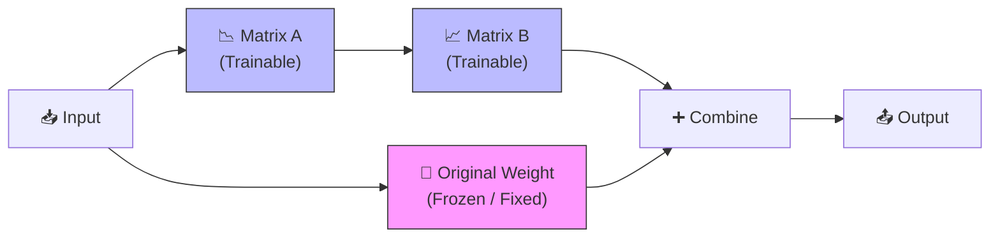

# 🧪 LLM Fine-Tuning & RLHF Mastery — Advanced Alignment (Executive Edition)
> **Level:** Intermediate → Advanced | **Language:** Hinglish | **Goal:** Master SFT, PEFT (LoRA/QLoRA), RLHF, and DPO for production-grade models.

---

## 📋 Table of Contents: The Journey from Base to Aligned Model

| Section | Topic | Why? |
|---------|-------|------|
| **1. Fine-tuning Basics** | SFT (Supervised Fine-tuning) | Instruction following seekhana. |
| **2. PEFT & LoRA** | Efficiency (Low Rank Adaptation) | 100x kam VRAM mein training. |
| **3. QLoRA Depth** | 4-bit Quantized Fine-tuning | Laptop par 7B models train karna. |
| **4. RLHF Foundations** | Reward Modeling (RM) | Insaano ki pasand (Preference) seekhana. |
| **5. RL Logic (PPO)** | Loop optimization | Model ko "Helpful & Safe" banana. |
| **6. The Modern Way (DPO)** | Direct Preference Optimization | Simpler modern alternative to RLHF. |

---

## 1. 🎯 Supervised Fine-Tuning (SFT)

Base models (Llama-3, Mistral) sirf "Text completion" karte hain. Wo "Chat" nahi samajhte. 
**SFT** mein hum model ko dataset dete hain: `{"prompt": "Write a poem", "completion": "The stars shine..."}`.

> 💡 **Mnemonic:** **SFT** is like **S**chooling **F**or **T**ext. Pehle model ko tameez (Instructions) seekhao.

---

## 2. ⚡ Efficiency: PEFT, LoRA & QLoRA

Pure model ke saare billions weights update karna bohot mehnga hai (Full Fine-tuning). Hum **PEFT** (Parameter-Efficient Fine-Tuning) use karte hain.

### A. LoRA (Low-Rank Adaptation)
Hum model ke original weights change nahi karte, balki side mein do choti choti matrices ($A$ and $B$) laga dete hain jo update hoti hain.



- **VRAM Saving:** LoRA weights sirf 1-2% hote hain pure model ka.
- **Formula:** $Output = Wx + (B * A)x$

---

## 3. 💎 QLoRA — 4-bit Quantization Magic

QLoRA = Quantization + LoRA. Ye model ko **4-bit** mein compress kar deta hai training ke waqt.
- **Result:** Aap 30GB VRAM wala model 12GB VRAM mein train kar sakte ho.
- **NF4 (Normal Float 4):** Ye specialized 4-bit format hai jo information loss ko minimize karta hai.

| Feature | LoRA | QLoRA |
|---------|------|-------|
| Weight Precision | 16-bit / 32-bit | **4-bit (NF4)** |
| 7B Model GPU | 24GB VRAM | **8GB - 12GB VRAM** |

---

## 4. 🛡️ RLHF: Human-Aligned AI (The Heart of ChatGPT)

Normal SFT hamesha harmful answers rok nahi pata. **RLHF** (Reinforcement Learning from Human Feedback) use train karta hai "Helpful, Harmless, and Honest" (3H) answers dene ke liye.

### The 3 Stages of RLHF:
1. **SFT:** Model ko instruction following seekhana.
2. **Reward Model (RM):** Humans se dataset banwana: `Prompt -> Answer A or B?`. Answer A better hai? Toh RM ko train karo to give high points to A.
3. **PPO (RL Optimization):** Model answer generate karega -> RM use points dega -> PPO model ko update karega to get MORE points.

---

## 5. 🚀 DPO (Direct Preference Optimization): The Modern Alternative

DPO ek single loss function mein preferences ko capture karta hai. 
- **Advantage:** Stability aur faster training. No separate Reward Model needed!
- **Dataset Format:** `[{"prompt": "...", "chosen": "...", "rejected": "..."}]`

---

## 🏗️ Python Code: LoRA Setup with PEFT

```python
from peft import LoraConfig, get_peft_model, prepare_model_for_kbit_training

# LoRA Configuration
lora_config = LoraConfig(
    r=16, # Rank
    lora_alpha=32, 
    target_modules=["q_proj", "v_proj"], # Attention layers
    lora_dropout=0.05,
    task_type="CAUSAL_LM"
)

# Apply to model
# model = prepare_model_for_kbit_training(model)
# model = get_peft_model(model, lora_config)
# model.print_trainable_parameters()
```

---

## 📝 Practice Problems (Step-by-Step)

### Q1: Parameters Calculate Karo ⭐⭐
**Scenario:** Ek weight matrix $W$ hai $4096 \times 4096$. LoRA (Rank $R=8$) ke params calculate karo.
**Answer:** $(4096 \times 8) + (8 \times 4096) = 32,768 + 32,768 = 65,536$ params only! 
Comparison: **16.7M vs 65K**. LoRA is ~255x more efficient!

### Q2: Forgetting Problem (Catastrophic Forgetting)
Fine-tuning ke waqt agar hum bohot zyada naya data daalte hain, toh model purani common sense bhool jata hai. **Solution:** SFT loss mein thoda original pretrained data mix kar do.

---

## 🔗 Resources
- [LoRA Paper (Hu et al.)](https://arxiv.org/abs/2106.09685)
- [DPO Paper (Rafailov et al.)](https://arxiv.org/abs/2305.18290)
- [Hugging Face PEFT Library Documentation](https://huggingface.co/docs/peft/index)

---

## 🏆 Final Summary Checklist
- [ ] Understand the difference between SFT and RLHF.
- [ ] Implement LoRA adapter on a 7B model.
- [ ] Compare PPO vs DPO workflow.
- [ ] Understand why 4-bit QLoRA is a game changer for local LLMs.

> **Final Note:** Fine-tuning AI is not just about code; it's about **Data Quality**. "Garbage in, Garbage out" rule applies here 100%.
