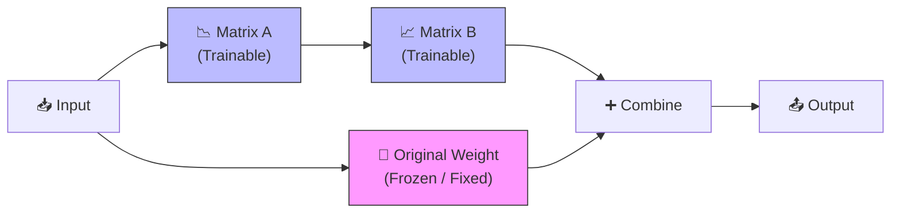
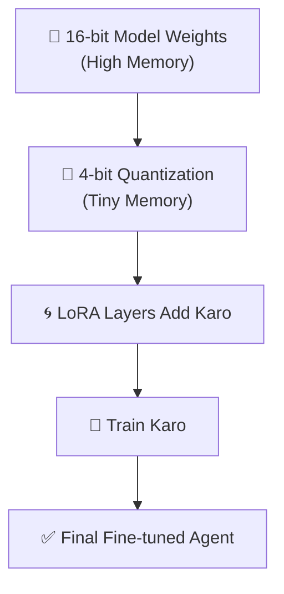

# 🛠️ LoRA & QLoRA — Efficient Fine-tuning Guide
> **Level:** Intermediate → Advanced | **Language:** Hinglish | **Goal:** Bina bade GPUs ke bade models ko train karna seekhna

---

## 📋 Is Guide Se Kya Seekhoge

| Topic | Status |
|-------|--------|
| Fine-Tuning vs PEFT | ✅ Covered |
| LoRA (Low-Rank Adaptation) | ✅ Covered |
| QLoRA (Quantized LoRA) | ✅ Covered |
| Mathematically Kaise Kaam Karta Hai | ✅ Covered |
| Hands-on Python Example | ✅ Covered |
| Training Checklist | ✅ Covered |

---

## 1. 🤔 Fine-tuning Ki Problem

**Traditional Fine-tuning:**
Jab hum ek model (e.g., Llama-3-8B) ko fine-tune karte hain, humein uske **saare parameters** (8 Billion!) update karne padte hain.
- **Problem 1:** Bohat zyada GPU memory (VRAM) chahiye.
- **Problem 2:** Bohot zyada storage chahiye (har checkpoint GBs mein hota hai).
- **Problem 3:** Training bohot slow hoti hai.

**PEFT (Parameter-Efficient Fine-Tuning):**
Hum saare parameters update nahi karte, balki sirf ek **chhota sa fraction (1% se bhi kam)** update karte hain.

---

## 2. 🌀 LoRA (Low-Rank Adaptation) Kya Hai?

LoRA ka idea bohot clever hai. Imagine karo ek matrix jisme model ki learning hai. LoRA kehta hai ki humein original matrix `W` ko chhedne ki zaroorat nahi hai. Hum do chhote matrices `A` aur `B` add karenge.



**Formula:** `Output = Wx + (B * A)x`
- `W` (Frozen): Iske weights kabhi change nahi honge.
- `A` & `B` (Trainable): Sirf ye sikh rahe hain.

> 💡 **Simple Example:**
> Maano ek badi book (W) hai jo pehle se likhi hai. Aap usse change nahi kar sakte, par aap side mein ek chhota pocket-diary (A & B) rakh lete ho jisme aap sirf apne extra notes likhte ho. Jawab dete waqt aap dono ko dekhte ho.

---

## 3. 💎 QLoRA — Agla Level

QLoRA = Quantization + LoRA. 
Ye technique 2023 mein aayi aur isne game change kar diya. Ye model ko **4-bit** mein compress kar deta hai training ke waqt.

| Feature | LoRA | QLoRA |
|---------|------|-------|
| Weight Precision | 16-bit / 32-bit | **4-bit (NF4)** |
| Memory Usage | Kam | **Bohot Kam (70% reduction)** |
| 7B Model GPU | 24GB VRAM | **8GB - 12GB VRAM** (Normal PC!) |



---

## 4. 📝 Code Example (Conceptual)

Hugging Face `peft` library iske liye best hai:

```python
from transformers import AutoModelForCausalLM, AutoTokenizer, BitsAndBytesConfig
from peft import LoraConfig, get_peft_model, prepare_model_for_kbit_training

# 1. QLoRA Config (4-bit mein model load karne ke liye)
quant_config = BitsAndBytesConfig(
    load_in_4bit=True,
    bnb_4bit_quant_type="nf4",
    bnb_4bit_compute_dtype="float16"
)

# 2. Base Model Load Karo
model_id = "meta-llama/Llama-2-7b-hf"
model = AutoModelForCausalLM.from_pretrained(model_id, quantization_config=quant_config)

# 3. LoRA Setup
lora_config = LoraConfig(
    r=8,           # Rank (kitna chhota matrix)
    lora_alpha=32, # Scaling factor
    target_modules=["q_proj", "v_proj"], # Kahan add karna hai attention mein
    lora_dropout=0.05,
    task_type="CAUSAL_LM"
)

# 4. Model Ready Karo
model = prepare_model_for_kbit_training(model)
model = get_peft_model(model, lora_config)

# 5. Training Stats Dekho
model.print_trainable_parameters()
# Output: trainable params: 4,194,304 || all params: 6,742,624,256 || trainable%: 0.0622
```

> 🧩 **Sirf 0.06% parameters!** Matlab aap 99.9% fixed rakh rahe ho, sirf 0.06% sikha rahe ho.

---

## 5. 🏗️ Rank 'R' Kya Hota Hai?

Rank decide karta hai aapka pocket-diary kitna bada hoga.
- **R = 1, 2, 4:** Bohot chhota, sirf basic tone seekhne ke liye.
- **R = 8, 16:** Standard, balance of knowledge and memory.
- **R = 32, 64:** Deep knowledge, par GPU memory badh jayegi.

---

## 6. 🧪 Exercises — Practice Karo!

### Exercise 1: Theory Check ⭐
**Question:** Agar aapke paas 8GB VRAM wala gaming laptop hai aur aap 7B model train karna chahte ho, toh aap kaunsi technique use karoge?
<details><summary>Answer</summary>**QLoRA** ✅ (Normal Fine-tuning ke liye 80GB-100GB+ VRAM chahiye hota hai Llama ke liye)</details>

---

### Exercise 2: Parameters Calculate Karo ⭐⭐
**Scenario:** Ek weight matrix `W` hai `4096 x 4096`. 
- **Traditional:** $4096 \times 4096 = 16.7$ Million params.
- **LoRA (Rank R=8):** Matrix A ($4096 \times 8$) + Matrix B ($8 \times 4096$).
**Task:** LoRA ke trainable params calculate karke batao.
<details><summary>Answer</summary>$(4096 \times 8) + (8 \times 4096) = 32,768 + 32,768 = 65,536$ params only! 
Comparison: **16.7M vs 65K**. LoRA is ~255x more efficient! ✅</details>

---

## 📺 Video Resources (Hindi/Urdu)

| Topic | Link | Language |
|-------|------|----------|
| **LoRA & QLoRA Detailed** | [Watch on YouTube](https://www.youtube.com/watch?v=vV9W-E4D7_U) | Hindi |
| **Fine-tuning LLM Simply** | [Watch on YouTube](https://www.youtube.com/watch?v=XW9_nE_X77s) | Hindi |
| **Quantization Basics** | [Watch on YouTube](https://www.youtube.com/watch?v=vYV_nE4Q77s) | Urdu/Hindi |

---

## 🏆 Final Summary

> **LoRA/QLoRA is the "AI Hacker's Way" to train models.** 
> Aapko million dollar cloud servers nahi chahiye, aap saste hardware par bhi world-class models fine-tune kar sakte ho.

```
Fine-tuning = Poori wall repaint karna
LoRA = Wall ke upar ek chhota sticker lagana jo wall ka look change kar de
```

---

## 🔗 Resources
- [LoRA Paper](https://arxiv.org/abs/2106.09685)
- [QLoRA Paper](https://arxiv.org/abs/2305.14314)
- [Hugging Face PEFT Library](https://github.com/huggingface/peft)
