# 🔌 MCP Guide — Model Context Protocol
> **Level:** Intermediate | **Language:** Hinglish | **Goal:** MCP ko practically samajhna aur build karna

---

## 📋 Is Guide Se Kya Seekhoge

| Topic | Status |
|-------|--------|
| MCP kya hota hai | ✅ Covered |
| Architecture (Host, Client, Server) | ✅ Covered |
| Tools, Resources, Prompts | ✅ Covered |
| Real Working Code Example | ✅ Covered |
| Transport Types | ✅ Covered |
| Security Best Practices | ✅ Covered |
| Exercises + Tests | ✅ Covered |

---

## 1. 🤔 MCP Kya Hota Hai

**MCP = Model Context Protocol**

Simple language me:

> MCP ek **standard bridge** hai jo AI apps ko tools, data sources, prompts aur resources se connect karta hai.

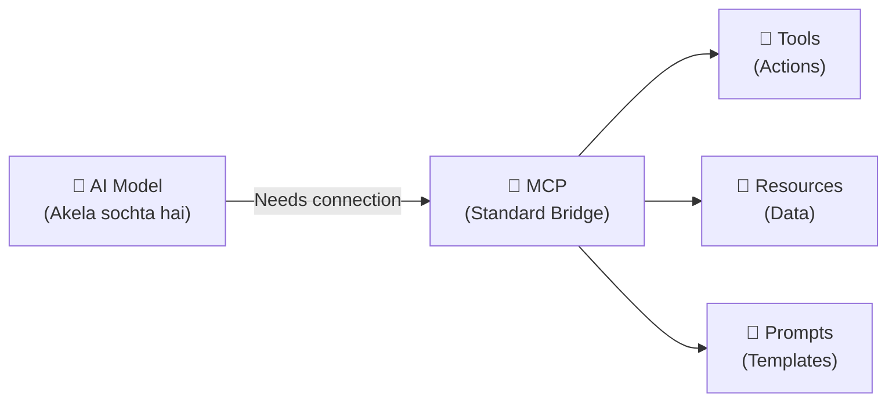

**MCP ke bina:**
- Har tool ke liye alag custom code likhna padta hai
- Every app apna ad-hoc integration banati hai
- Messy, non-reusable, inconsistent

**MCP ke saath:**
- Ek standard protocol
- Reusable integrations
- Multiple apps ek hi server use kar sakti hain

> 💡 **Analogy:**
> MCP waisa hi hai jaise USB port — ek standard connector jo har device ko connect karne deta hai.

---

## 2. 🎯 MCP Kyu Important Hai

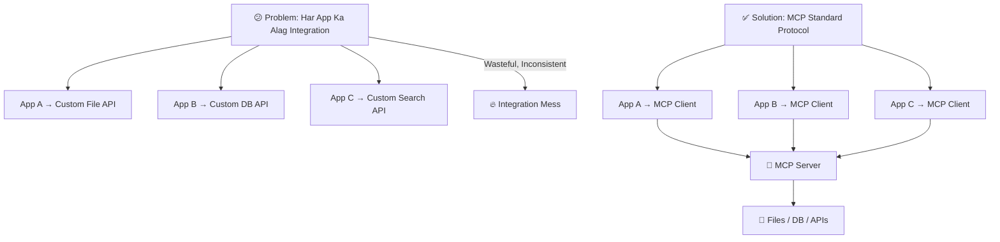

**MCP solve karta hai:**
- Tool discovery → server batata hai kaunse tools hain
- Resource discovery → kaunsa data available hai
- Prompt discovery → kaunse templates hain
- Standard request/response → sab predictable hai

---

## 3. 🏗️ MCP Ka Big Picture

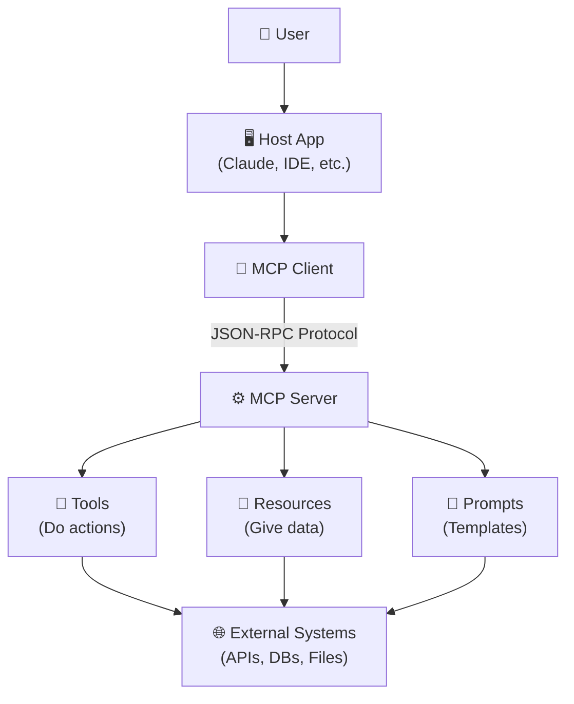

**Is diagram me:**
1. User → Host App me request deta hai
2. Host → MCP Client use karta hai
3. Client → MCP Server se connect hota hai
4. Server → Tools/Resources/Prompts expose karta hai
5. External systems se real data/action aata hai

---

## 4. 🧩 MCP Architecture Ke 3 Main Parts

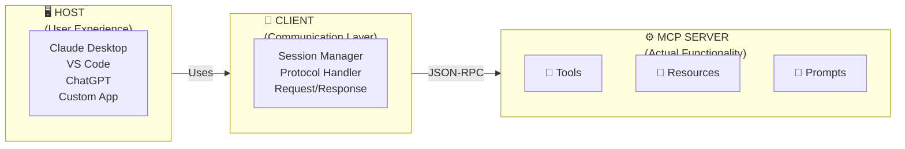

### 🖥️ Host — User Ka Experience
Host wo app hai jisme user actual kaam karta hai.

| Examples | Role |
|---------|------|
| VS Code / Cursor | Code writing + AI assistance |
| Claude Desktop | Conversational AI |
| Custom Web App | Aapka khud ka app |

**Host responsibilities:**
- User interaction handle karna
- Connections manage karna
- **Permissions control karna** (security!)
- AI model aur MCP clients ko coordinate karna

### 🔌 Client — Bridge Layer
Client host ke andar chalta hai. Ye server se baat karta hai.

- Server se session banana
- Protocol messages bhejna/receive karna
- Host aur server ke beech bridge banna

### ⚙️ Server — Actual Functionality
Server real kaam expose karta hai — tools, data, templates.

---

## 5. 🔧 Tools, Resources, Prompts — Kya Hai Ye Teeno

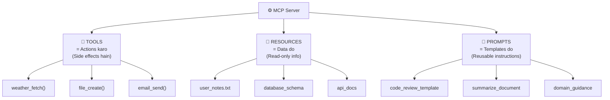

| Type | Kya Hai | Side Effects? | Example |
|------|---------|--------------|---------|
| 🔧 Tool | Action karta hai | ✅ Haan | File create, Email send |
| 📁 Resource | Data deta hai | ❌ Nahi | Files, schemas, docs |
| 📝 Prompt | Template deta hai | ❌ Nahi | Code review prompt |

---

## 6. 🔄 MCP Request Flow — Step by Step

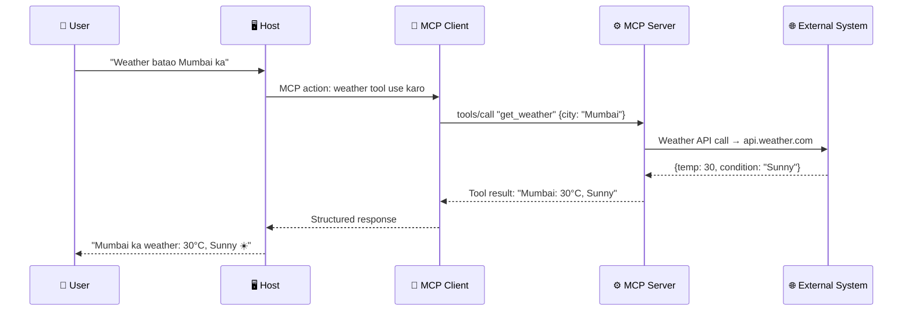

---

## 7. 📡 JSON-RPC — MCP Ka Protocol

MCP JSON-RPC style communication use karta hai.

**Request format:**

```json
{
  "jsonrpc": "2.0",
  "id": 1,
  "method": "tools/call",
  "params": {
    "name": "get_weather",
    "arguments": {
      "city": "Mumbai"
    }
  }
}
```

**Response format:**

```json
{
  "jsonrpc": "2.0",
  "id": 1,
  "result": {
    "content": [
      {
        "type": "text",
        "text": "Mumbai: 30°C, Sunny"
      }
    ]
  }
}
```

**Iska fayda:**
- Standard structure → predictable
- Errors bhi structured hain
- Multiple languages me implement ho sakta hai

---

## 8. 🔌 Transport Types — Data Kaise Jata Hai

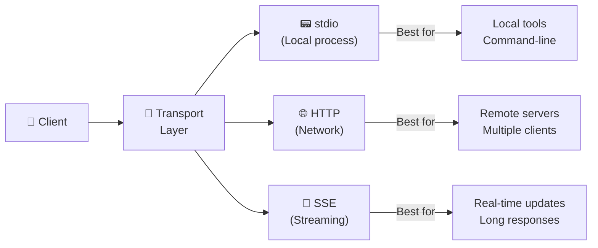

| Transport | Use Case | Example |
|-----------|---------|---------|
| `stdio` | Local process integration | Terminal tools |
| `HTTP` | Network communication | Remote MCP server |
| `SSE` | Streaming / real-time | Live data feeds |

---

## 9. 🤝 Session aur Capabilities Negotiation

Jab MCP client aur server connect hote hain, pehle negotiation hoti hai:

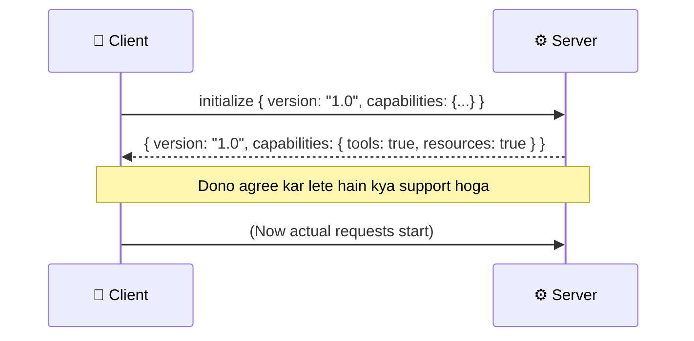

**Capabilities examples:**
- `tools: true` → Server tools expose karta hai
- `resources: true` → Resources available hain
- `prompts: true` → Prompt templates hain
- `sampling: true` → LLM sampling support hai

---

## 10. 🔴 Real Working Example — Notes MCP Server

> **Goal:** Ek simple Notes MCP Server banana jo notes create aur search kar sake

```python
# notes_mcp_server.py
# Ye ek simplified MCP server hai Python me

import json

# ===== Notes Storage (In-memory) =====
notes_db = {}

# ===== Tool Definitions =====
TOOLS = [
    {
        "name": "create_note",
        "description": "Ek nayi note create karo",
        "inputSchema": {
            "type": "object",
            "properties": {
                "title": {"type": "string", "description": "Note ka title"},
                "content": {"type": "string", "description": "Note ka content"}
            },
            "required": ["title", "content"]
        }
    },
    {
        "name": "search_notes",
        "description": "Notes me search karo",
        "inputSchema": {
            "type": "object",
            "properties": {
                "query": {"type": "string", "description": "Search kya karna hai"}
            },
            "required": ["query"]
        }
    },
    {
        "name": "list_all_notes",
        "description": "Saari notes ki list do",
        "inputSchema": {
            "type": "object",
            "properties": {}
        }
    }
]

# ===== Tool Implementations =====
def create_note(title: str, content: str) -> dict:
    """Note create karta hai"""
    note_id = f"note_{len(notes_db) + 1}"
    notes_db[note_id] = {
        "id": note_id,
        "title": title,
        "content": content,
    }
    print(f"✅ Note created: '{title}' (ID: {note_id})")
    return {"success": True, "note_id": note_id, "message": f"Note '{title}' bana diya!"}

def search_notes(query: str) -> dict:
    """Notes me query search karta hai"""
    results = []
    for note_id, note in notes_db.items():
        if query.lower() in note["title"].lower() or query.lower() in note["content"].lower():
            results.append(note)

    print(f"🔍 Search '{query}': {len(results)} results mili")
    return {"results": results, "count": len(results)}

def list_all_notes() -> dict:
    """Saari notes return karta hai"""
    notes_list = list(notes_db.values())
    return {"notes": notes_list, "total": len(notes_list)}

# ===== Request Handler =====
def handle_tool_call(tool_name: str, arguments: dict) -> str:
    """Tool call ko process karta hai"""
    if tool_name == "create_note":
        result = create_note(
            title=arguments.get("title", ""),
            content=arguments.get("content", "")
        )
    elif tool_name == "search_notes":
        result = search_notes(query=arguments.get("query", ""))
    elif tool_name == "list_all_notes":
        result = list_all_notes()
    else:
        result = {"error": f"Tool '{tool_name}' not found!"}

    return json.dumps(result, ensure_ascii=False, indent=2)

# ===== Demo: MCP Server Usage Simulate Karo =====
print("🚀 Notes MCP Server Starting...\n")
print("=" * 50)

# Simulate: Client tools discover karta hai
print("📋 Available Tools:")
for tool in TOOLS:
    print(f"  - {tool['name']}: {tool['description']}")

print("\n" + "=" * 50)
print("🔄 Tool Calls Simulate Kar Rahe Hain:\n")

# Simulate: Tool 1 - Note create karo
print("📝 Tool Call: create_note")
req1 = {"name": "create_note", "arguments": {"title": "Python Tips", "content": "List comprehensions fast hote hain"}}
result1 = handle_tool_call(req1["name"], req1["arguments"])
print(f"Result: {result1}\n")

# Simulate: Tool 2 - Aur ek note
print("📝 Tool Call: create_note")
req2 = {"name": "create_note", "arguments": {"title": "ML Notes", "content": "ReLU activation function bahut popular hai"}}
result2 = handle_tool_call(req2["name"], req2["arguments"])
print(f"Result: {result2}\n")

# Simulate: Tool 3 - Search karo
print("🔍 Tool Call: search_notes")
req3 = {"name": "search_notes", "arguments": {"query": "Python"}}
result3 = handle_tool_call(req3["name"], req3["arguments"])
print(f"Result: {result3}\n")

# Simulate: Tool 4 - All notes
print("📋 Tool Call: list_all_notes")
req4 = {"name": "list_all_notes", "arguments": {}}
result4 = handle_tool_call(req4["name"], req4["arguments"])
print(f"Result: {result4}\n")

print("=" * 50)
print("✅ MCP Server Demo Complete!")
```

**Expected Output:**
```
🚀 Notes MCP Server Starting...

==================================================
📋 Available Tools:
  - create_note: Ek nayi note create karo
  - search_notes: Notes me search karo
  - list_all_notes: Saari notes ki list do

==================================================
🔄 Tool Calls Simulate Kar Rahe Hain:

📝 Tool Call: create_note
✅ Note created: 'Python Tips' (ID: note_1)
Result: {"success": true, "note_id": "note_1", "message": "Note 'Python Tips' bana diya!"}

📝 Tool Call: create_note
✅ Note created: 'ML Notes' (ID: note_2)
Result: {"success": true, "note_id": "note_2", "message": "Note 'ML Notes' bana diya!"}

🔍 Tool Call: search_notes
🔍 Search 'Python': 1 results mili
Result: {"results": [{"id": "note_1", "title": "Python Tips", "content": "..."}], "count": 1}

📋 Tool Call: list_all_notes
Result: {"notes": [...2 notes...], "total": 2}

==================================================
✅ MCP Server Demo Complete!
```

---

## 11. 🏗️ MCP Server Build Karne Ka Flow

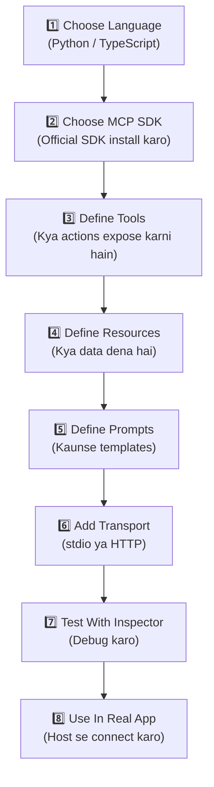

**MCP Server ka anatomy:**

```python
# Typical MCP Server Structure

server = MCPServer("my-notes-server")

# 1. Tools register karo
@server.tool("create_note")
def create_note_handler(title: str, content: str):
    ...

# 2. Resources register karo
@server.resource("notes://all")
def get_all_notes():
    ...

# 3. Prompts register karo
@server.prompt("summarize_notes")
def summarize_prompt():
    return "In notes ko summarize karo: ..."

# 4. Transport setup
server.run(transport="stdio")
```

---

## 12. 🛡️ MCP Security

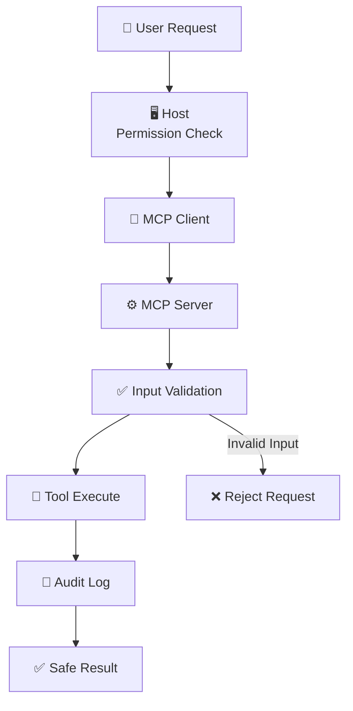

**Security Checklist:**

| Rule | Kya Karo | Kyu |
|------|---------|-----|
| 🔐 Least Privilege | Sirf zaruri permissions do | Attack surface reduce hota hai |
| ✅ Input Validation | Har input validate karo | Injection attacks se bachao |
| 📋 Allowlist Tools | Sirf approved tools expose karo | Unauthorized actions se bachao |
| 👤 User Consent | Risky actions ke liye confirm karo | Accidental damage se bachao |
| 🔑 Secret Management | API keys env variables me rakho | Credential leak se bachao |
| 📝 Logging | Har action record karo | Audit trail aur debugging ke liye |

> ⚠️ **Simple Rule:**
> Jo tool dangerous ho sakta hai, usse bina permission ke expose mat karo.

---

## 13. ⚔️ MCP vs Normal API Integration

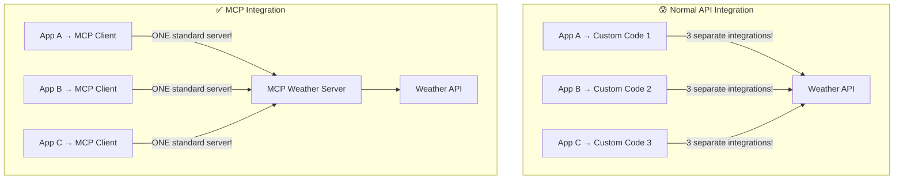

| Feature | Normal API | MCP |
|---------|-----------|-----|
| Code reuse | ❌ Low | ✅ High |
| Standardization | ❌ None | ✅ Full standard |
| Multiple apps | Separate code | One server |
| Discovery | Manual | Automatic |
| Maintainability | Hard | Easy |

---

## 14. 🎯 MCP Kahan Use Hota Hai

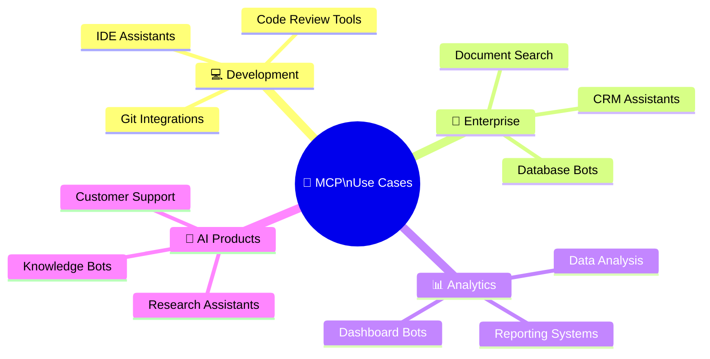

---

## 15. 📚 Student Learning Path

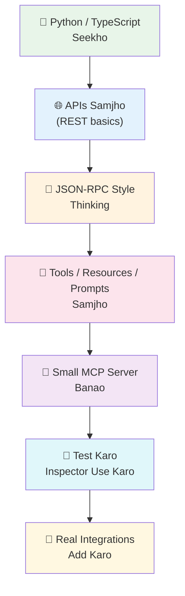

**Skills jo chahiye MCP build karne ke liye:**

| Skill | Priority |
|-------|---------|
| Python ya TypeScript | 🔴 Must |
| JSON basics | 🔴 Must |
| API fundamentals | 🔴 Must |
| Input validation | 🟡 Important |
| Authentication basics | 🟡 Important |
| Schema design | 🟢 Helpful |
| CLI development | 🟢 Helpful |

---

## 🧪 Exercises — Practice Karo!

### Exercise 1: Concept Identify Karo ⭐

**Neeche diye gaye examples me identify karo: Tool hai, Resource hai, ya Prompt hai?**

```
A) weather_get(city) → current weather return karta hai
B) user_notes.txt → file content deta hai
C) "Is code ko review karo aur bugs batao" → template
D) send_email(to, subject, body) → email bhejta hai
E) database_schema.sql → table structure batata hai
```

<details>
<summary>✅ Answers Dekho</summary>

```
A) 🔧 TOOL       — Action karta hai, weather fetch karta hai
B) 📁 RESOURCE   — Data deta hai, sirf read karta hai
C) 📝 PROMPT     — Reusable instruction template hai
D) 🔧 TOOL       — Action karta hai (email bhejta hai = side effect)
E) 📁 RESOURCE   — Schema data provide karta hai, read-only
```

</details>

---

### Exercise 2: MCP Server Design Karo ⭐⭐

**Scenario:** Ek "GitHub Assistant" MCP Server banana hai.

**Task:** Likho ki is server me kya kya hoga:

```
Server Name: github_assistant

Tools:
  1. _____________ (kya karega?)
  2. _____________ (kya karega?)
  3. _____________ (kya karega?)

Resources:
  1. _____________ (kya data dega?)
  2. _____________ (kya data dega?)

Prompts:
  1. _____________ (kya template hoga?)
```

<details>
<summary>✅ Sample Answer Dekho</summary>

```
Server Name: github_assistant

Tools:
  1. create_issue(repo, title, body) → GitHub issue banata hai
  2. list_prs(repo, status) → Pull requests list karta hai
  3. add_comment(issue_id, comment) → Comment add karta hai

Resources:
  1. repos://all → User ke saare repositories
  2. repo://README → Specific repo ka README.md

Prompts:
  1. bug_report_template → Bug report format
  2. pr_description_prompt → PR description likhne ka template
```

</details>

---

### Exercise 3: Real Code Extend Karo ⭐⭐⭐

**Task:** Upar diye gaye Notes MCP Server example me ek nayi functionality add karo:
- `delete_note(note_id)` tool add karo
- `get_note_count()` tool add karo

```python
def delete_note(note_id: str) -> dict:
    # Tumhara code yahan aayega
    pass

def get_note_count() -> dict:
    # Tumhara code yahan aayega
    pass
```

<details>
<summary>✅ Answer Dekho</summary>

```python
def delete_note(note_id: str) -> dict:
    if note_id in notes_db:
        deleted_title = notes_db[note_id]["title"]
        del notes_db[note_id]
        return {"success": True, "message": f"Note '{deleted_title}' delete ho gaya!"}
    else:
        return {"success": False, "error": f"Note ID '{note_id}' nahi mila!"}

def get_note_count() -> dict:
    count = len(notes_db)
    return {"total_notes": count, "message": f"Total {count} notes hain"}
```

</details>

---

## 📝 Quick Test — Samajh Check Karo!

**Q1:** MCP ka main purpose kya hai?

```
A) LLMs ko train karna
B) AI apps ko tools aur data sources se standardized tarike se connect karna
C) Images generate karna
D) Databases design karna
```

<details><summary>Answer</summary>**B** ✅</details>

---

**Q2:** MCP me "Tool" aur "Resource" me kya fark hai?

```
A) Koi fark nahi
B) Tool actions karta hai (side effects), Resource sirf data deta hai
C) Resource actions karta hai, Tool data deta hai
D) Tool free hai, Resource paid hai
```

<details><summary>Answer</summary>**B** ✅ — Tools have side effects, Resources are read-only</details>

---

**Q3:** MCP me stdio transport kab use karte hain?

```
A) Remote network communication ke liye
B) Streaming data ke liye
C) Local process integration ke liye (same machine)
D) Authentication ke liye
```

<details><summary>Answer</summary>**C** ✅ — stdio local processes ke liye best hai</details>

---

**Q4:** MCP security me "Least Privilege" ka matlab kya hai?

```
A) Zyada tools expose karo
B) Sirf zaruri permissions do, extra access mat do
C) No authentication use karo
D) Public tools banao
```

<details><summary>Answer</summary>**B** ✅ — Minimum required access = least privilege principle</details>

---

## 🔗 Official Resources

| Resource | Link |
|----------|------|
| MCP Official Docs | [modelcontextprotocol.io](https://modelcontextprotocol.io/docs/learn/architecture) |
| MCP Specification | [modelcontextprotocol.io/specification](https://modelcontextprotocol.io/specification/) |
| MCP Architecture Ref | [spec 2024-11-05](https://modelcontextprotocol.io/specification/2024-11-05/architecture) |
| MCP C# SDK Docs | [csharp.sdk.modelcontextprotocol.io](https://csharp.sdk.modelcontextprotocol.io/concepts/index.html) |

**Best Learning Order:**
1. Architecture docs padho
2. Specification dekho
3. Small server build karo
4. Real integrations add karo

---

## 📺 Video Resources (English - New Topic)

| Topic | Link | Language |
|-------|------|----------|
| **What is MCP? (Official Intro)** | [Watch on YouTube](https://www.youtube.com/watch?v=33K897OIn7Y) | English |
| **Building MCP Servers from Scratch** | [Watch on YouTube](https://www.youtube.com/watch?v=kCc8FmEb1nY) | English |

---

## 🏆 Final Summary

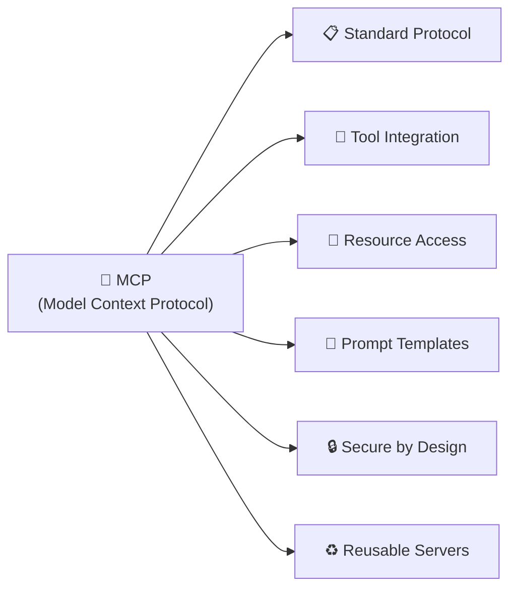

> **MCP ek aisa standard hai jo AI applications ko tools, resources aur prompts ke saath connect karne ka structured tareeka deta hai.**

> 💪 **Student ke liye:**
> MCP seekhna matlab AI apps ko real systems se jodne ki soch develop karna.
> Ye skill AI infrastructure building ke liye bahut valuable hai.
