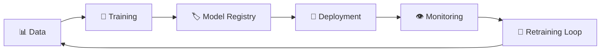
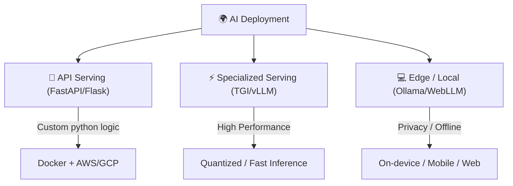

# 🚀 MLOps & Deployment — Production AI Guide
> **Level:** Intermediate → Advanced | **Language:** Hinglish | **Goal:** AI models ko laptop se cloud par le jaana aur monitor karna

---

## 📋 Is Guide Se Kya Seekhoge

| Topic | Status |
|-------|--------|
| MLOps Lifecycle | ✅ Covered |
| Model Versioning | ✅ Covered |
| Deployment Strategies | ✅ Covered |
| Monitoring & Observability | ✅ Covered |
| CI/CD for AI | ✅ Covered |
| Infrastructure (GPU/VRAM) | ✅ Covered |

---

## 1. 🤔 MLOps Kya Hai? (DevOps + ML)

**Problem:** Aapne model train kar liya `model.pt`. Phir aapne 2 hafte baad model `model_v2.pt` banaya. 
- Kaunsa model production mein hai?
- Kya v2 sach mein better hai v1 se?
- Kya model fail ho raha hai cloud par?

**MLOps Solution:**
MLOps (Machine Learning Operations) model ke lifecycle ko manage karne ka set of tools aur practices hai.



---

## 2. 🏗️ Model Registry (Versioning)

Sirf `model_final_v2_pakka_final.pt` naam rakhne se kaam nahi chalta. Tools jaise **MLflow** ya **Weights & Biases (W&B)** use hote hain.

| Tool | Kya Karta Hai? |
|------|----------------|
| **Weights & Biases** | Loss curves, accuracy aur GPU stats track karta hai. |
| **MLflow** | Model versions, parameters aur files save karta hai. |
| **Hugging Face Hub** | Model files (checkpoints) store aur version karne ke liye repository. |

---

## 3. 🚀 Deployment — Kahan Aur Kaise?

Ek AI Engineer ke paas teen main options hote hain:



### vLLM & TGI (The Pro Way)
LLMs ko simple FastAPI se serve karna slow hota hai. Industry mein **vLLM** ya **Text Generation Inference (TGI)** use hote hain.
- **Why?** Ye memory manage (KV Cache) aur throughput ko 10x-20x badha dete hain.

---

## 4. 📈 Monitoring & Feedback Loop

Model deployment ke baad uska performance monitor karna sabse bada task hai.

**Metrics to Track:**
1. **Latency:** Jawab kitne seconds mein aa raha hai? (Token per second? - TPS)
2. **Cost:** Ek user ke prompt par kitne paise kharch ho rahe hain?
3. **Accuracy Drift:** Kya model waqt ke saath galat jawab dene laga?
4. **Token Usage:** Kitne tokens consume ho rahe hain API ke through?

---

## 5. 🐳 Docker & Infrastructure

AI models ke liye context (environment) bohot complex hota hai. (CUDA versions, PyTorch, NVIDIA drivers). Isliye **Docker** अनिवार्य (Mandatory) hai.

```dockerfile
# Simplified Dockerfile for LLM
FROM pytorch/pytorch:2.0.1-cuda11.7-cudnn8-runtime

WORKDIR /app
COPY requirements.txt .
RUN pip install -r requirements.txt

COPY . .
CMD ["python", "api.py"]
```

---

## 6. 🌩️ Cloud Providers (The Big 3)

| Cloud | AI Service | Why Use? |
|-------|------------|----------|
| **AWS** | SageMaker | Enterprise solutions aur full MLOps pipeline. |
| **GCP** | Vertex AI | Google Models (Gemini) aur easy integration. |
| **Azure** | Azure OpenAI | Privacy aur enterprise-ready GPT-4 access. |
| **Hugging Face**| Spaces / Inference Endpoints | Sasta aur developer-friendly deployments. |

---

## 7. 🧪 Exercises — Practice Karo!

### Exercise 1: Scaling Scenario ⭐
**Question:** Aapka ek AI app viral ho gaya. Har minute 1000 users aa rahe hain. Aapka 1 GPU handle nahi kar paa raha. Aap kya karoge?
<details><summary>Answer</summary>1. **Horizontal Scaling** (Aur GPUs add karna). 2. **vLLM/Quantization** use karke throughput badhana. ✅</details>

---

### Exercise 2: Version Control ⭐⭐
**Scenario:** Aapka model production mein "Toxic content" filter kar raha hai, par naya model waisa nahi kar paa raha. Aap wapas purana model kaise laoge?
<details><summary>Answer</summary>**Model Registry** se purane checkpoint (version) ko simply re-deploy (Rollback) karke. ✅</details>

---

## 📺 Video Resources (Hindi/Urdu)

| Topic | Link | Language |
|-------|------|----------|
| **MLOps Roadmap 2025/26** | [Watch on YouTube](https://www.youtube.com/watch?v=H4fZ3HFv684) | Hindi |
| **End-to-End MLOps Project** | [Watch on YouTube](https://www.youtube.com/watch?v=J_0vUfXBy-I) | Hindi |
| **Model Deployment (Docker/vLLM)** | [Watch on YouTube](https://www.youtube.com/watch?v=SrYXAd4nMvQ) | Urdu/Hindi |

---

## 🏆 Final Summary

> **MLOps "Notebook" ko "Software" banata hai.** 
> Ek engineer sirf model train nahi karta, use ye bhi pata hota hai ki wo chal raha hai ya nahi aur kitna mehnga pad raha hai.

```
AI Model = Thought
MLOps = Body
```

---

## 🔗 Resources
- [Full MLOps Course (Free)](https://github.com/DataTalksClub/mlops-zoomcamp)
- [vLLM GitHub](https://github.com/vllm-project/vllm)
- [Practitioner's Guide to MLOps (Google)](https://cloud.google.com/architecture/mlops-continuous-delivery-and-automation-pipelines-in-machine-learning)
