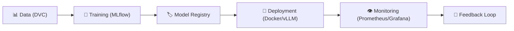

# 🚀 MLOps Lifecycle Mastery — AI Models in Production (Expert Guide)
> **Level:** Beginner → Expert | **Language:** Hinglish | **Goal:** Mastering Deployment, CI/CD, Monitoring, and Scaling for AI (Production Grade)

---

## 📋 Table of Contents: Level-wise Learning

| Level | Topic | Why? |
|-------|-------|------|
| **1. Beginner** | MLOps Fundamentals | Notebook se production tak ki journey. |
| **2. Beginner** | Model Versioning (MLflow/W&B) | Model runs aur parameters track karna. |
| **3. Intermediate** | Deployment (Docker/vLLM) | Serving high-performance APIs. |
| **4. Intermediate** | CI/CD for ML (GitHub Actions) | Har change par auto-testing and deployment. |
| **5. Advanced** | Data Versioning (DVC) | Git for datasets (Large files). |
| **6. Expert** | Feature Stores & Pipelines (Feast/Airflow) | Automated data flows and feature consistency. |
| **7. Expert** | Advanced Deployment (Canary/AB Testing) | Zero-downtime and safe updates. |

---

## 1. 🤔 MLOps Kya Hai? (DevOps for AI)

Normal DevOps mein sirf **Code** version hota hai. AI mein **Code + Data + Model Weights** teenon ka synchronization chahiye.

**Problem:** Aapne model train kiya `v1` jo great chal raha hai. Aapne `v2` deploy kiya jo galti se toxic ho gaya. MLOps iska solution deta hai.



---

## 2. 🏗️ Model Tracking & Registry (MLflow vs W&B)

Har experiment ko notebook mein likhna band karo. **MLflow** ya **Weights & Biases (W&B)** track karte hain:
- **Hyperparameters:** Learning rate, Batch size, Epochs.
- **Metrics:** Training Loss, Eval Accuracy, Token Throughput.
- **Artifacts:** Checkpoints (`.pt`, `.safetensors`).

> 💡 **Role of "Staging":** Pehle model ko staging lab mein test karo, phir hi production mein bhejo. MLflow tags (`Staging` -> `Production`) ye control karte hain.

---

## 3. 🚀 Serving & Inference (The Professional Way)

FastAPI simple hai, par LLMs ke liye slow hai. Industry standards:
- **vLLM (High Throughput):** Memory optimization (KV Cache Paging) se performance 10x badha deta hai.
- **TGI (Text Generation Inference):** Optimized for Hugging Face models.
- **Dockerization:** NVIDIA drivers aur PyTorch dependency management ke liye mandatory hai.

```dockerfile
# Simple Dockerfile logic for LLM
FROM pytorch/pytorch:2.0.1-cuda11.7-runtime
WORKDIR /app
COPY requirements.txt .
RUN pip install -r requirements.txt
COPY . .
CMD ["python", "serve_vllm.py"]
```

---

## 4. 📂 Data Version Control (DVC): Git for Datasets

Large dataset (1GB+) Git mein nahi aa sakte. **DVC** metadata local git mein rakhta hai aur actual data (S3/GCP) mein.
- `dvc add training_data.zip`
- `git add training_data.zip.dvc`
- `git commit -m "Dataset V1"`

---

## 5. ⚙️ CI/CD for LLMs: Automation magic

Har Git Push par tests chalne chahiye:
1. **Unit Tests:** Kya API response format sahi de rahi hai?
2. **Evaluation Tests:** Kya model benchmark score niche toh nahi gira?
3. **Docker Build:** Naya image auto-build karke Hub par push ho jaye.

---

## 6. 🚦 Production Safety: Canary & A/B Testing

Kayi baar naya model naye data par fail hota hai.
- **Canary:** Naya model sirf 5% users ko dikhao.
- **A/B Test:** Model A (Purana) aur Model B (Naya) ki accuracy users ke behavior se compare karo.
- **Rollback:** Agar naya model fail ho, toh instantly switch back to purana version.

---

## 7. 🔄 Orchestration: Airflow & DAGs

Inke bina full automation impossible hai. **Airflow** ek scheduled workflow manager hai.
- **DAG (Directed Acyclic Graph):** Step 1 (Download Data) -> Step 2 (Preprocess) -> Step 3 (Train) -> Step 4 (Evaluate).
- Har point par "Trigger" lag sakta hai.

---

## 📝 High-Level Exercises (Knowledge Check)

### Q1: Model Drift kya hai?
**Scenario:** Aapka model deploy hone ke 1 mahine baad galat results dene laga kyunki "Real-world data" change ho gaya. Isse **Model Drift** kahte hain aur iska solution regular "Retraining" hai.

### Q2: Inference Optimization
Agar latency (response time) zada ho, toh kya karoge?
- 1. **Quantization** (FP32 -> FP8/INT4).
- 2. **Batching** (Multiple user prompts ek saath process karo).
- 3. **vLLM** implementation.

---

## 📺 Video Resources (Hindi/Urdu)

| Topic | Link | Context |
|-------|------|---------|
| **vLLM Deployment** | [Learn on YouTube](https://www.youtube.com/watch?v=SrYXAd4nMvQ) | LLM Production Serving. |
| **MLOps End-to-End** | [Complete Playlist](https://www.youtube.com/playlist?list=PLKnIA16_RmvbYFaaeLY28cWeqV-3vADST) | Project building. |

---

## 🏆 Final Summary

> **MLOps "Notebooks" ko "Products" mein badalta hai.**
> Notebook training ek hobby hai, par automatic deployments aur monitoring ek standard job hai.

- [ ] Model versions tracked.
- [ ] Datasets versioned with DVC.
- [ ] Docker image auto-built.
- [ ] Monitoring for Latency & Accuracy active.
