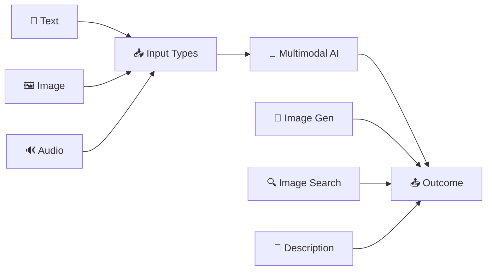
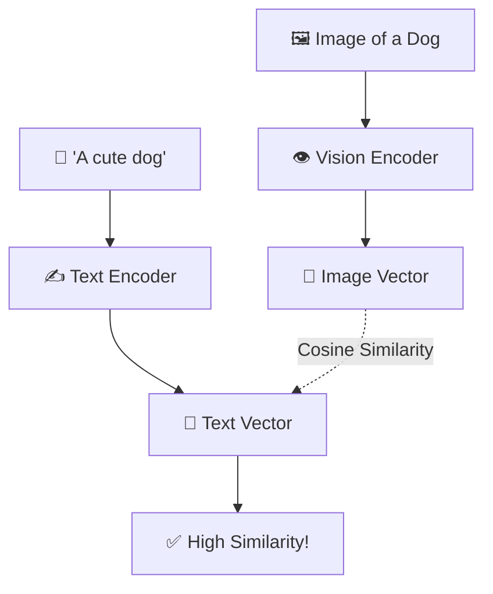

# 🖼️ Multimodal AI — Beyond Text Guide
> **Level:** Intermediate → Advanced | **Language:** Hinglish | **Goal:** AI ko "dekhna" aur "sunna" sikhana (Vision + Audio + Video)

---

## 📋 Is Guide Se Kya Seekhoge

| Topic | Status |
|-------|--------|
| Multimodal AI Kya Hai? | ✅ Covered |
| CLIP & Vision Transformers (ViT) | ✅ Covered |
| Image Generation (Diffusion Models) | ✅ Covered |
| Speech-to-Text (Whisper) | ✅ Covered |
| Multi-modal LLMs (GPT-4V, Gemini) | ✅ Covered |
| Vector Search for Images | ✅ Covered |

---

## 1. 🤔 Multimodal AI Kya Hai?

Ab tak hum sirf **Text In -> Text Out** ki baat kar rahe the. Multimodal AI mein multi types ke data (Modality) process hote hain.



> 💡 **Simple Line:**
> `AI jo sirf 'padhta' nahi, 'dekhta' aur 'sunta' bhi hai.`

---

## 2. 👁️ AI Kaise Dekhta Hai? (Computer Vision)

Pehle hum pixels ko manual filters se check karte the (CNNs). Aaj hum **Vision Transformers (ViT)** aur **CLIP** use karte hain.

### CLIP — The Bridge (Text-Image Connection)
OpenAI ka **CLIP** (Contrastive Language-Image Pre-training) magic karta hai. Ye text aur images ko **same vector space** mein la deta hai.



---

## 3. 🎨 AI Kaise "Banata" Hai? (Diffusion Models)

Stable Diffusion aur Midjourney jaise models text se images banate hain. Inka process thoda alag hota hai.

**Noise process:**
1. Pehle image mein **dhundhla-pan (Noise)** add hota hai.
2. AI ko sikhaya jata hai ki noise ko kaise hatana hai (**Denoising**).
3. Phir model seekh jata hai ki text prompt (e.g., "Astronaut on Mars") ke hisaab se noise se image kaise banani hai.

---

## 4. 🔊 Audio & Speech (The Voice Revolution)

AI Engineering mein audio handling ke do main parts hain:

| Modality | Model | Kya Karta Hai? |
|----------|-------|----------------|
| **Speech-to-Text (STT)**| **Whisper** | Audio ko accurately English/Hindi/100+ languages mein likhta hai. |
| **Text-to-Speech (TTS)**| **ElevenLabs/Piper**| Likhe hue text ko real human voice mein badalta hai. |

---

## 5. 🏗️ Multimodal LLMs (GPT-4V, LLaVA, Gemini)

Ye modern LLMs hain jo images ko direct "padh" sakte hain.

```python
# LLaVA Example (Conceptual)
image_path = "invoice.png"
prompt = "Is invoice mein se 'Total Amount' aur 'Due Date' extract karo."

# Output:
# Total Amount: Rs 15,400
# Due Date: 25th March 2026
```

---

## 6. 🖼️ Vector Search for Images (Image RAG)

RAG sirf text ke liye nahi, images ke liye bhi hota hai. Agar aapke paas million images hain, toh aap search kaise karoge?

1. **CLIP** use karke saari images ko vectors mein convert karo.
2. Unhe **Vector Database** (Chroma/Pinecone) mein store karo.
3. User jab image upload kare, ya text type kare ("Red shirt with stripes"), uska embedding nikaalo.
4. **Vector Search** karo aur images return karo.

---

## 7. 🧪 Exercises — Practice Karo!

### Exercise 1: Modality Check ⭐
**Question:** Aap ek YouTube Video Summarizer app bana rahe hain. Aapko kaunsi 3 types ki processing (modalities) use karni hogi?
<details><summary>Answer</summary>1. **Audio** (Speech-to-Text). 2. **Vision** (Video frames analysis). 3. **Text** (Final summary generation). ✅</details>

---

### Exercise 2: CLIP Similarity ⭐⭐
**Scenario:** Aapke paas teen images (Cat, Bike, Pizza) hain. User search karta hai "Fast transport". Aapka model kis image ko high similarity score dega?
<details><summary>Answer</summary>**Bike** ✅ (Kyunki CLIP ko pata hai ki "Transport" bikes aur cars se related concept hai). ✅</details>

---

## 🏆 Final Summary

> **Multimodal AI hi real intelligent behavior hai.** 
> Duniya sirf text nahi hai. Ek full AI Engineer ko pata hona chahiye ki modalities ko kaise fuse (combine) kiya jata hai.

```
Vision = Eyes
Audio = Ears
LLM = Brain
Multimodal = Functional Human!
```

---

## 🔗 Resources
- [OpenAI Whisper Guide](https://github.com/openai/whisper)
- [Stable Diffusion Explained](https://stable-diffusion-art.com/how-stable-diffusion-work/)
- [ViT Paper (Vision Transformer)](https://arxiv.org/abs/2010.11929)
