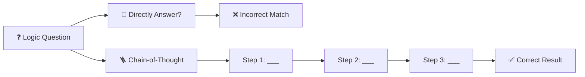
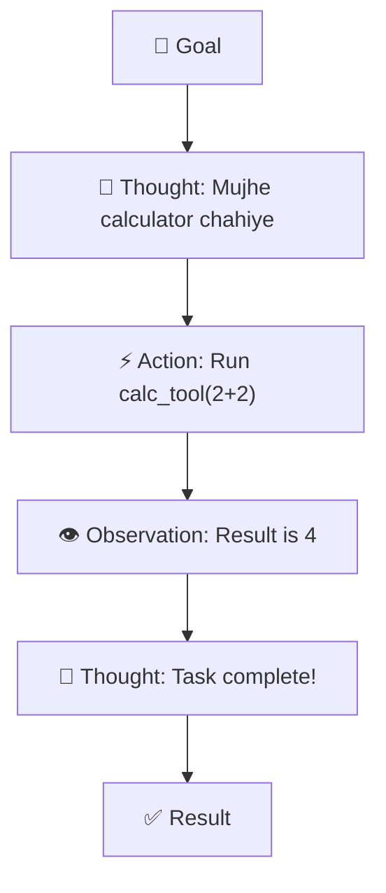

# ✍️ Prompt Engineering — Advanced LLM Apps Guide
> **Level:** Beginner → Intermediate | **Language:** Hinglish | **Goal:** LLM se har baar sahi aur consistent output nikalna

---

## 📋 Is Guide Se Kya Seekhoge

| Topic | Status |
|-------|--------|
| Zero-shot vs Few-shot | ✅ Covered |
| Chain-of-Thought (CoT) | ✅ Covered |
| ReAct Pattern | ✅ Covered |
| Self-Correction & Reflection | ✅ Covered |
| JSON Output Handling | ✅ Covered |
| Tools (LangChain, LangGraph) | ✅ Covered |

---

## 1. 🤔 Prompting Sirf "Chatting" Nahi Hai

Ek AI Engineer ke liye prompting ek **software engineering problem** hai. Hum chahte hain ki:
- **Consistent Results:** Har baar JSON mile, ya har baar same format.
- **Accuracy:** Model galat na bole (avoid hallucination).
- **Control:** Model boundary se bahar na jaye.

**Prompt Ka Dhancha (Framework):**
1. **Persona:** Model kaun hai? (e.g., "Aap Senior Python Engineer ho")
2. **Task:** Kya karna hai? (e.g., "Is code ka bug fix karo")
3. **Context:** Kya data use karein? (e.g., "Ye context chunks hain")
4. **Format:** Output kaisa chahiye? (e.g., "Sirf JSON return karo")
5. **Constraints:** Kya NAI karna? (e.g., "Long explaination mat do")

---

## 2. 🪜 Few-Shot Prompting

**Zero-Shot:** Bina koi example diye sawaal puchna.
**Few-Shot:** Kuch examples dena taki model pattern seekh jaye.

```
Example:
Input: Sentiment nikalna hai.

Text: "Product bohot bura tha." -> Output: Negative
Text: "Delivery fast thi." -> Output: Positive
Text: "Packaging thik-thak thi." -> Output: Neutral
Text: "Mazaa aa gaya dekh kar!" -> Output: 
```

**Few-shot se accuracy 2x-3x badh sakti hai!**

---

## 3. 🧠 Chain-of-Thought (CoT)

Model ko ek saath jawab dene ki jagah bolna ki **"Dhire dhire step-by-step socho"**.



**Prompt Trick:** "Let's think step by step." (Ye 4 shabd model ki reasoning ko dramatically improve kar dete hain).

---

## 4. 🔄 ReAct Pattern (Reason + Act)

Ye AI Agents mein sabse zyada use hota hai. Model pehle sochta hai, phir action leta hai, phir outcome dekhta hai.



---

## 5. 🛠️ Practical Code Example (Pydantic / Structured Output)

Har LLM App ka goal hota hai ki use **JSON data** mile taki code usse process kar sake.

```python
from pydantic import BaseModel
from typing import List

# 1. Output ka logic define karo
class MovieRecommendation(BaseModel):
    title: str
    year: int
    rating: float
    genres: List[str]
    why_recommended: str

# 2. Prompt mein system ko constrain karo
SYSTEM_PROMPT = """
Aap ek personalized movie recommender ho. 
Hamesha movie details JSON format mein return karo.
Valid JSON structure: {"title": "...", "year": ..., "rating": ..., "genres": [...], "why_recommended": "..."}
"""

USER_PROMPT = "Mujhe ek sci-fi movie suggest karo jo space ke baare mein ho."

# 3. Model call (OpenAI/Gemini style)
# model.generate(prompt=..., response_format={"type": "json_object"})
# Output:
# {
#   "title": "Interstellar",
#   "year": 2014,
#   "rating": 8.7,
#   "genres": ["Sci-Fi", "Drama"],
#   "why_recommended": "Kyuki isme space exploration aur time dilation bohot deeply dikhaya hai."
# }
```

---

## 6. 🌐 LLM Frameworks (The Real Tools)

| Tool | Kya Hai? | Kyu Use Karein? |
|------|----------|-----------------|
| **LangChain** | Swiss-army knife | RAG chains aur simple scripts jaldi banane ke liye. |
| **LangGraph** | Advanced Engine | Loop aur multi-agent patterns (stateful systems) ke liye. |
| **DSPy** | Optimizer | Ye prompts likhna band karta hai aur automatically optimize karta hai! |
| **LlamaIndex** | RAG Expert | Sirf data retrieval and indexing ke liye best hai. |

---

## 7. 🧪 Exercises — Practice Karo!

### Exercise 1: Format Fix Karo ⭐
**Question:** Aapne model ko bola "Summary do", aur usne 10 sentence likh diye. Aapko sirf 3 bullet points chahiye. Sahi prompt likho.
<details><summary>Answer</summary>"Is paragraph ki summary do 3 concise bullet points mein. Sirf bullets return karo, koi greeting mat do." ✅</details>

---

### Exercise 2: Chain-of-Thought Apply Karo ⭐⭐
**Scenario:** Ek math question "Agar 5 seb Rs 100 ke hain, aur 1 seb kharab hai, toh baki seb Rs 30 ke profit par kitne ke bikne chahiye?".
**Task:** Prompt banao CoT use karke.
<details><summary>Answer</summary>"Is math problem ko solve karo. Pehle 1 seb ki cost nikalo, phir kharab seb hatao, phir profit add karo. Step by step explain karo." ✅</details>

---

## 🏆 Final Summary

> **Prompting magic nahi, Engineering hai.** 
> Aap model ko control karne ke liye rules, formats aur step-by-step guidance dete ho.

```
Bad Prompt: "Code likho"
Good Prompt: "Aap ek Senior Java Developer ho. Neeche diye gaye logic ke liye Unit Test likho JUnit5 use karke, edge cases handle karo aur response main sirf code blocks do."
```

---

## 🔗 Resources
- [Learn Prompting (Free Resource)](https://learnprompting.org/)
- [OpenAI Prompt Engineering Guide](https://platform.openai.com/docs/guides/prompt-engineering)
- [Anthropic Prompt Library](https://docs.anthropic.com/en/prompt-library/library)
