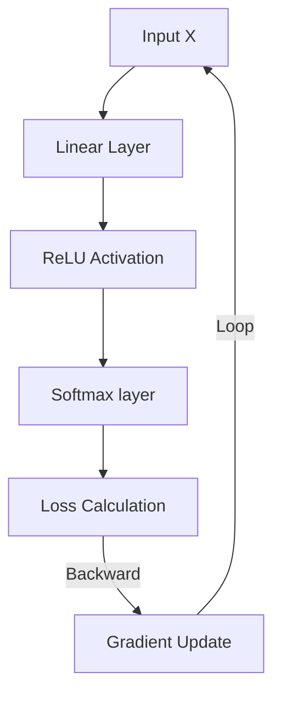

# 🔥 PyTorch: Deep Learning ka King (Expert Guide)
> **Level:** Beginner → Expert | **Language:** Hinglish | **Goal:** Master PyTorch internals & production training

---

## 📋 Is Guide Se Kya Seekhoge

| Section | Topic | Why? |
|---------|-------|------|
| 1. PyTorch Internals | Dynamic Graphs vs Static | Theory knowledge |
| 2. Tensors & Operations | GPU, CUDA, Strides | Base foundation |
| 3. Autograd Engine | Backprop magic | Model logic |
| 4. nn.Module Depth | Custom Layers & Initializers | Pro models |
| 5. Distributed Training | Multi-GPU basics | Real scale |
| 6. Mega Project | MNIST Digit Classifier from Scratch | Complete workflow |

---

## 1. 🧠 PyTorch Internals: Dynamic Graph Architecture

PyTorch **Dynamic Computational Graph (DCG)** use karta hai. Iska matlab hai ki har input ke saath ek naya graph banta hai.
- **TensorFlow (Purana):** Static Graph (Pehle design karo, phir run karo)
- **PyTorch:** Dynamic (Hamesha run-time pe decide hota hai)



---

## 2. ⚡ Tensors & GPU Mastery

Tensors hi Neural Network ka "Blood" hain. Unhe GPU pe efficiently handle karna seekho.

### A. Device Management
Model aur Tensors hamesha **same device** pe hone chahiye.

```python
import torch

# Auto device detect
device = torch.device("cuda" if torch.cuda.is_available() else "cpu")
print(f"Using device: {device}")

# Move tensor to GPU
t = torch.randn(3, 3).to(device)

# Performance tip: Hamesha dtype specify karein
t = torch.zeros(1024, 1024, dtype=torch.float32, device=device)
```

### B. Tensor Reshaping & Strides
`.view()` aur `.reshape()` mein fark hota hai. `view()` sirf window view change karta hai, `reshape()` naya tensor bhi bana sakta hai memory mein memory requirement ke according.

```python
x = torch.arange(12) # [0, 1... 11]
x_reshaped = x.view(3, 4) # 3 rows, 4 columns
x_flat = x_reshaped.view(-1) # Auto reshape (flatten)
```

---

## 3. 🔄 Autograd Engine — The Magic of Gradients

Autograd engine backpropagation manage karta hai. `grad_fn` property se pata chalta hai ki tensor kaise bana hai.

```python
a = torch.tensor([2.0, 3.0], requires_grad=True)
b = torch.tensor([6.0, 4.0], requires_grad=True)
Q = 3*a**3 - b**2 # Vector computation

external_grad = torch.tensor([1.0, 1.0])
Q.backward(gradient=external_grad)

print(a.grad) # 9*a^2 Output: [36, 81]
```

**Memory Management Trace:**
Training ke waqt memory bachane ke liye `torch.no_grad()` use karein jab gradients ki zaroorat na ho (Evaluation mode).

```python
with torch.no_grad():
    prediction = model(test_data)
```

---

## 4. 🏗️ Custom Neural Networks with `nn.Module`

`nn.Module` ek container hai har layers ke liye. `forward` override karna hota hai models design karte waqt.

```python
import torch.nn as nn
import torch.nn.functional as F

class TinyCNN(nn.Module):
    def __init__(self):
        super(TinyCNN, self).__init__()
        # Convolutional layers (Input channels, Output channels, Kernel size)
        self.conv1 = nn.Conv2d(1, 32, 3, 1)
        self.conv2 = nn.Conv2d(32, 64, 3, 1)
        self.dropout = nn.Dropout(0.25)
        self.fc = nn.Linear(9216, 10)

    def forward(self, x):
        x = self.conv1(x)
        x = F.relu(x)
        x = self.conv2(x)
        x = F.max_pool2d(x, 2)
        x = self.dropout(x)
        x = torch.flatten(x, 1)
        x = self.fc(x)
        output = F.log_softmax(x, dim=1)
        return output

model = TinyCNN().to(device)
print(model)
```

---

## 5. 📦 Dataset, DataLoader & Samplers

Large data ko memory mein load karke feeding (batches) ke liye `DataLoader` zaroori hai.

```python
from torch.utils.data import Dataset, DataLoader

class MyDataset(Dataset):
    def __init__(self, data):
        self.data = data
    def __len__(self):
        return len(self.data)
    def __getitem__(self, idx):
        return self.data[idx]

dataset = MyDataset(torch.randn(100, 10))
loader = DataLoader(dataset, batch_size=32, shuffle=True, py_num_workers=4)

for batch in loader:
    print(batch.shape) # (32, 10) batches
```

---

## 🏗️ Mega Project: MNIST Handwritten Digit Classifier

Project workflow: Download Data -> Setup Model -> Training Loop -> Evaluation.

```python
import torch.optim as optim
from torchvision import datasets, transforms

# 1. Pipeline Transformations
transform = transforms.Compose([
    transforms.ToTensor(),
    transforms.Normalize((0.1307,), (0.3081,))
])

# 2. Loading Dataset
train_set = datasets.MNIST('../data', train=True, download=True, transform=transform)
train_loader = DataLoader(train_set, batch_size=64)

# 3. Model, Optimizer, Criterion
model = TinyCNN().to(device)
optimizer = optim.Adam(model.parameters(), lr=0.01)
criterion = nn.CrossEntropyLoss()

# 4. Training Loop
for epoch in range(5):
    model.train()
    for batch_idx, (data, target) in enumerate(train_loader):
        data, target = data.to(device), target.to(device)
        
        optimizer.zero_grad() # Purana gradients clear
        output = model(data)  # Forward pass
        loss = criterion(output, target) # Loss calculate
        loss.backward()  # Backprop
        optimizer.step() # Weights update
        
        if batch_idx % 100 == 0:
            print(f'Train Epoch: {epoch} [{batch_idx*len(data)}/{len(train_loader.dataset)}] Loss: {loss.item():.6f}')
```

---

## 🧪 Quick Test — Expert Level Check!

### Q1: Gradients logic
Agar hum `optimizer.zero_grad()` skip kar dein training loop mein, toh kya hoga?
<details><summary>Answer</summary>
Gradients **accumulate** hote jayenge. Yani pichle batch ka gradient naye batch mein add ho jayega, jo model training ko destabilize (diverge) kar dega.
</details>

### Q2: CUDA Memory logic
"CUDA Runtime Error: out of memory" error ko fix kaise karein (without changing hardware)?
<details><summary>Answer</summary>
1. Batch size kam karein.
2. `torch.no_grad()` use karein evaluation ke waqt.
3. `model.half()` (FP16) use karein weights storage save karne ke liye.
</details>

---

## 🔗 Resources
- [PyTorch Hub Models](https://pytorch.org/hub/)
- [Deep Learning with PyTorch Book](https://pytorch.org/deep-learning-with-pytorch)
- [PyTorch Cheat Sheet](https://pytorch.org/tutorials/beginner/ptcheat.html)
