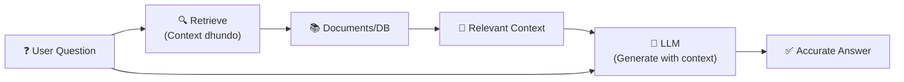
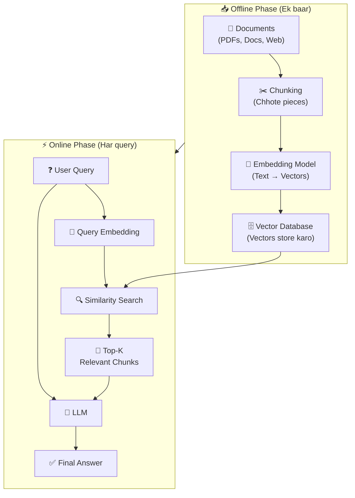
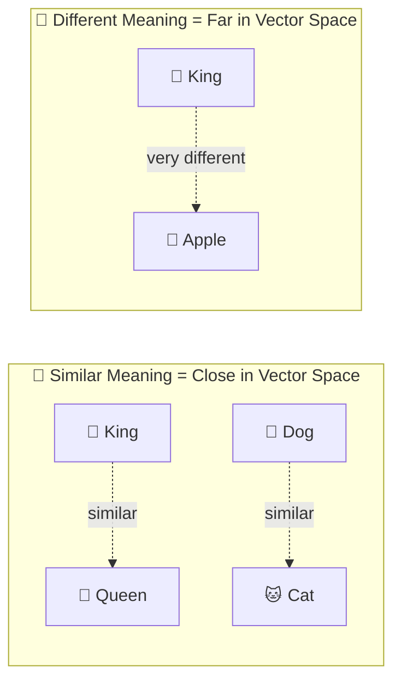
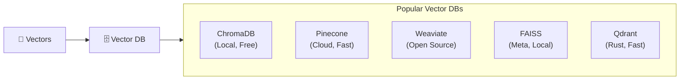
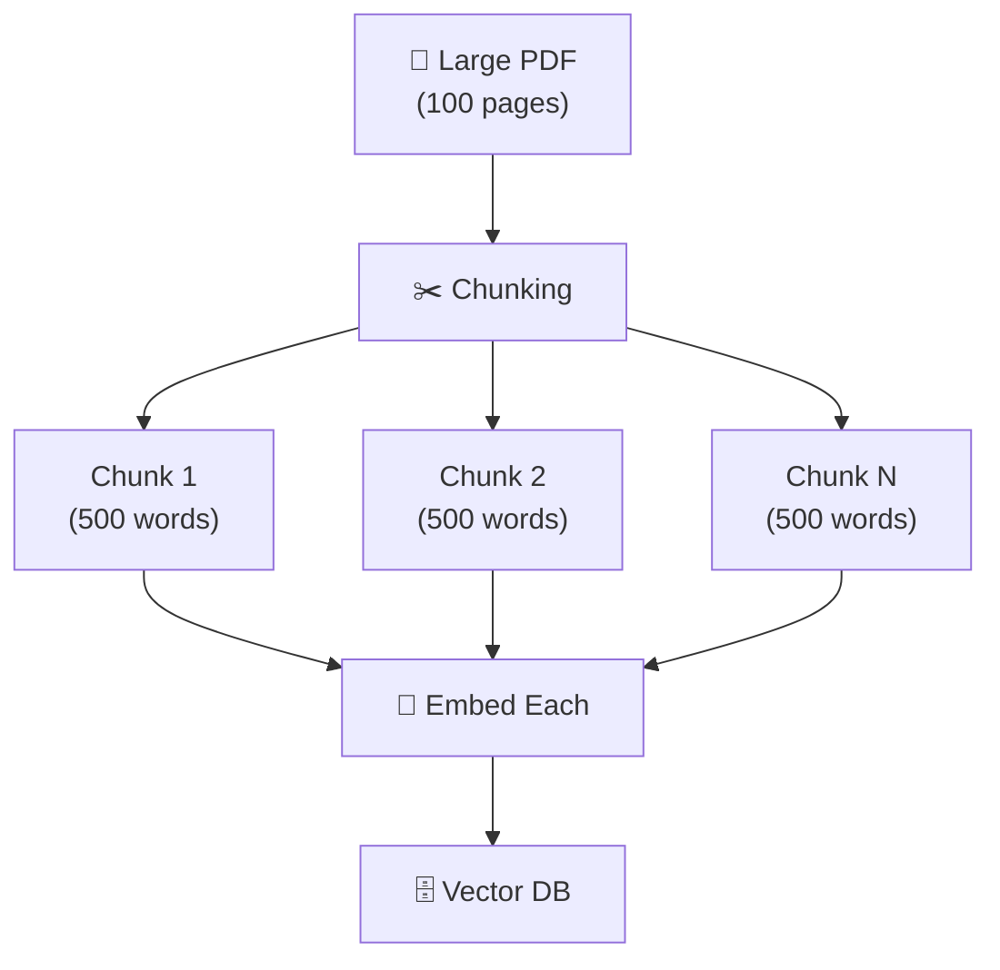
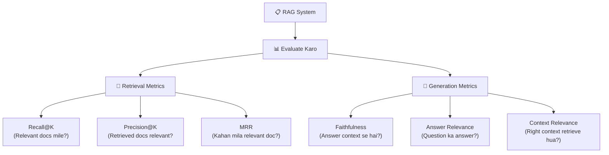

# 🔍 RAG — Retrieval Augmented Generation Guide
> **Level:** Intermediate | **Language:** Hinglish | **Goal:** RAG systems ko deeply samajhna aur banana

---

## 📋 Is Guide Se Kya Seekhoge

| Topic | Status |
|-------|--------|
| RAG kya hota hai | ✅ Covered |
| Vector Embeddings | ✅ Covered |
| Semantic Search | ✅ Covered |
| Vector Databases | ✅ Covered |
| RAG Pipeline Build Karna | ✅ Covered |
| Advanced RAG Techniques | ✅ Covered |
| Exercises + Tests | ✅ Covered |

---

## 1. 🤔 RAG Kya Hota Hai — Pehle Problem Samjho

**Problem:** LLMs ki training ek fixed date tak hoti hai (knowledge cutoff). Isliye:

```
❌ LLM Se Pucho: "Aaj ki news kya hai?"
   → Model: "Mujhe nahi pata, meri training 2023 mein roke gayi thi"

❌ LLM Se Pucho: "Hamare company ke Q3 revenue kya tha?"
   → Model: "Mujhe private company data nahi pata"

❌ LLM Se Pucho: "Is 500 page PDF ka summary do"
   → Model: Context window se zyada hai, handle nahi ho sakta
```

**RAG Solution:**



> 💡 **Simple Line:**
> `RAG = Search + Generate. Pehle dhundho, phir jawab do.`

---

## 2. 📊 RAG Ka Big Picture



---

## 3. 🔢 Vector Embeddings Kya Hote Hain

Text ko numbers mein convert karna — lekin iss tarah ki **meaning preserve** ho.

```python
# Simple example
"King"   → [0.2, 0.8, 0.1, 0.9, ...]   # 384/768/1536 dimension vector
"Queen"  → [0.2, 0.7, 0.2, 0.9, ...]   # Similar, close in space!
"Apple"  → [0.9, 0.1, 0.8, 0.2, ...]   # Alag - different space
```

**Key Insight:**



```python
from sentence_transformers import SentenceTransformer
import numpy as np

# Embedding model load karo
model = SentenceTransformer('all-MiniLM-L6-v2')  # Free, fast, good

# Text → Vector
sentences = [
    "AI is transforming the world",
    "Artificial Intelligence is changing everything",  # Similar!
    "The weather is nice today"                        # Different!
]

embeddings = model.encode(sentences)
print(f"Embedding shape: {embeddings.shape}")  # (3, 384)

# Similarity calculate karo
from sklearn.metrics.pairwise import cosine_similarity

sim_1_2 = cosine_similarity([embeddings[0]], [embeddings[1]])[0][0]
sim_1_3 = cosine_similarity([embeddings[0]], [embeddings[2]])[0][0]

print(f"AI sentences similarity: {sim_1_2:.3f}")   # ~0.85 (high!)
print(f"Weather similarity: {sim_1_3:.3f}")         # ~0.15 (low!)
```

---

## 4. 🔍 Semantic Search — Meaning-Based Search

Traditional search vs Semantic search:

| | Keyword Search | Semantic Search |
|--|---------------|----------------|
| Method | Exact word match | Meaning match |
| "AI applications" → "ML use cases" | ❌ No match | ✅ Match! |
| Works on | Exact words | Concepts |
| Handles synonyms | ❌ No | ✅ Yes |

```python
import numpy as np
from sentence_transformers import SentenceTransformer

model = SentenceTransformer('all-MiniLM-L6-v2')

# Document corpus
documents = [
    "Python ek programming language hai",
    "Machine learning algorithms data se patterns seekhte hain",
    "Neural networks brain ki tarah kaam karte hain",
    "Deep learning AI ka subset hai",
    "Data preprocessing training ke liye zaruri hai",
]

# 1. Documents embed karo
doc_embeddings = model.encode(documents)

def semantic_search(query, doc_embeddings, documents, top_k=3):
    # Query embed karo
    query_embedding = model.encode([query])

    # Cosine similarity calculate karo
    from sklearn.metrics.pairwise import cosine_similarity
    similarities = cosine_similarity(query_embedding, doc_embeddings)[0]

    # Top-K results
    top_indices = np.argsort(similarities)[::-1][:top_k]

    results = []
    for idx in top_indices:
        results.append({
            "text": documents[idx],
            "score": similarities[idx]
        })
    return results

# Test karo!
results = semantic_search("deep neural network kya hai?", doc_embeddings, documents)
for r in results:
    print(f"Score: {r['score']:.3f} | {r['text']}")
```

---

## 5. 🗄️ Vector Databases

Lakhs/millions of vectors efficiently store aur search karne ke liye special databases.



### ChromaDB — Simplest (Start Here!)

```python
import chromadb
from sentence_transformers import SentenceTransformer

# Setup
client = chromadb.Client()
collection = client.create_collection("my_docs")
model = SentenceTransformer('all-MiniLM-L6-v2')

# Documents add karo
documents = [
    "RAG stands for Retrieval Augmented Generation",
    "PyTorch ek deep learning framework hai",
    "Transformers attention mechanism use karte hain",
    "Fine-tuning pre-trained models ko specific tasks ke liye train karna hai",
]

# Embed aur store karo
embeddings = model.encode(documents).tolist()
ids = [f"doc_{i}" for i in range(len(documents))]

collection.add(
    embeddings=embeddings,
    documents=documents,
    ids=ids
)

# Query karo!
query = "neural network training kaise hoti hai?"
query_embedding = model.encode([query]).tolist()

results = collection.query(
    query_embeddings=query_embedding,
    n_results=2
)

print("Top results:")
for doc, dist in zip(results['documents'][0], results['distances'][0]):
    print(f"  Score: {1-dist:.3f} | {doc}")
```

---

## 6. ✂️ Chunking — Documents Ko Pieces Mein Todo

Large documents directly use nahi ho sakte — unhe chhote pieces mein todna padta hai.



**Chunking Strategies:**

```python
# Strategy 1: Fixed Size Chunking
def fixed_size_chunking(text, chunk_size=500, overlap=50):
    """Har chunk same size ka, thoda overlap"""
    chunks = []
    start = 0
    while start < len(text):
        end = start + chunk_size
        chunks.append(text[start:end])
        start = end - overlap  # Overlap for context continuity
    return chunks

# Strategy 2: Sentence-Based Chunking
def sentence_chunking(text, sentences_per_chunk=5):
    """Complete sentences mein toda"""
    import re
    sentences = re.split(r'(?<=[.!?])\s+', text)
    chunks = []
    for i in range(0, len(sentences), sentences_per_chunk):
        chunk = ' '.join(sentences[i:i+sentences_per_chunk])
        chunks.append(chunk)
    return chunks

# Strategy 3: Recursive Character Splitting (Best for most cases)
def recursive_split(text, chunk_size=500, overlap=50):
    """Paragraphs → Sentences → Words → Characters try karta hai"""
    separators = ["\n\n", "\n", ". ", " ", ""]
    for sep in separators:
        if sep in text:
            parts = text.split(sep)
            chunks = []
            current = ""
            for part in parts:
                if len(current) + len(part) < chunk_size:
                    current += sep + part
                else:
                    if current:
                        chunks.append(current.strip())
                    current = part
            if current:
                chunks.append(current.strip())
            return chunks
    return [text]

# Example
text = "RAG ek powerful technique hai... " * 100
chunks = fixed_size_chunking(text)
print(f"Total chunks: {len(chunks)}")
print(f"First chunk preview: {chunks[0][:100]}...")
```

---

## 7. 🏗️ Full RAG Pipeline — Code Example

```python
from sentence_transformers import SentenceTransformer
import chromadb
import json

class SimpleRAG:
    """
    Complete RAG system:
    1. Documents index karo
    2. Query se relevant chunks dhundo
    3. LLM se answer generate karo
    """

    def __init__(self, embedding_model='all-MiniLM-L6-v2'):
        self.embedder = SentenceTransformer(embedding_model)
        self.client = chromadb.Client()
        self.collection = self.client.create_collection("rag_collection")
        self.indexed = False

    def index_documents(self, documents: list[str]):
        """Documents ko embed karke store karo"""
        print(f"📥 Indexing {len(documents)} documents...")

        # Chunk karo (simplified)
        all_chunks = []
        for doc in documents:
            # Simple 200-char chunks for demo
            chunks = [doc[i:i+200] for i in range(0, len(doc), 150)]
            all_chunks.extend(chunks)

        # Embed karo
        embeddings = self.embedder.encode(all_chunks).tolist()
        ids = [f"chunk_{i}" for i in range(len(all_chunks))]

        # Store karo
        self.collection.add(
            embeddings=embeddings,
            documents=all_chunks,
            ids=ids
        )
        self.indexed = True
        print(f"✅ {len(all_chunks)} chunks indexed!")

    def retrieve(self, query: str, top_k: int = 3) -> list[str]:
        """Query se relevant chunks dhundo"""
        query_embedding = self.embedder.encode([query]).tolist()
        results = self.collection.query(
            query_embeddings=query_embedding,
            n_results=top_k
        )
        return results['documents'][0]

    def build_prompt(self, query: str, context_chunks: list[str]) -> str:
        """RAG prompt banao"""
        context = "\n\n".join([f"[Document {i+1}]\n{chunk}"
                               for i, chunk in enumerate(context_chunks)])
        return f"""Neeche diye gaye documents ke basis par question ka answer do.
Sirf provided context use karo. Agar answer context mein nahi hai to 'Mujhe nahi pata' bolo.

Context:
{context}

Question: {query}

Answer:"""

    def query(self, question: str, llm_fn=None) -> dict:
        """Full RAG pipeline"""
        if not self.indexed:
            raise ValueError("Pehle documents index karo!")

        # 1. Retrieve
        print(f"🔍 Searching for: '{question}'")
        relevant_chunks = self.retrieve(question, top_k=3)
        print(f"📄 Found {len(relevant_chunks)} relevant chunks")

        # 2. Build prompt
        prompt = self.build_prompt(question, relevant_chunks)

        # 3. Generate (agar LLM hai to use karo, warna context dikhao)
        if llm_fn:
            answer = llm_fn(prompt)
        else:
            # Demo ke liye: sirf context return karo
            answer = f"[LLM would answer based on context]\nContext found:\n{relevant_chunks[0][:200]}..."

        return {
            "question": question,
            "retrieved_chunks": relevant_chunks,
            "answer": answer
        }

# Demo chalao!
rag = SimpleRAG()

# Kuch documents index karo
sample_docs = [
    "PyTorch ek open-source machine learning framework hai. Ye Facebook ne banaya tha. Dynamic graphs support karta hai.",
    "RAG (Retrieval Augmented Generation) ek technique hai jisme LLM ko external knowledge se augment kiya jaata hai.",
    "Transformer architecture 2017 mein 'Attention is All You Need' paper mein introduce kiya gaya tha.",
    "Fine-tuning ek process hai jisme pre-trained model ko specific task ke liye additional training di jaati hai.",
    "Vector databases specially designed hain similar vectors ko efficiently search karne ke liye.",
]

rag.index_documents(sample_docs)

# Query karo
result = rag.query("RAG kya hota hai?")
print("\n" + "="*50)
print(f"Q: {result['question']}")
print(f"\n📄 Retrieved Context:")
for i, chunk in enumerate(result['retrieved_chunks']):
    print(f"  [{i+1}] {chunk[:100]}...")
print(f"\n💬 Answer: {result['answer']}")
```

---

## 8. 🚀 Advanced RAG Techniques

### HyDE — Hypothetical Document Embeddings

```python
def hyde_query(question, llm_fn, embedder, collection):
    """
    HyDE: Pehle LLM se hypothetical answer generate karo,
    phir us answer se search karo — better results!
    """
    # Step 1: Hypothetical answer generate karo
    hyp_prompt = f"Iss question ka ek detailed answer likho:\n{question}"
    hypothetical_answer = llm_fn(hyp_prompt)

    # Step 2: Hypothetical answer embed karo (question ko nahi!)
    hyp_embedding = embedder.encode([hypothetical_answer]).tolist()

    # Step 3: Search karo
    results = collection.query(query_embeddings=hyp_embedding, n_results=3)
    return results['documents'][0]
```

### Re-ranking

```python
from sentence_transformers import CrossEncoder

# Cross-encoder vs Bi-encoder
# Bi-encoder: Fast, good for retrieval (hum yahi use karte hain search mein)
# Cross-encoder: Slow, better accuracy (re-ranking ke liye)

reranker = CrossEncoder('cross-encoder/ms-marco-MiniLM-L-6-v2')

def rerank_results(query, retrieved_chunks, top_k=3):
    """Retrieved results ko better order mein laao"""
    pairs = [(query, chunk) for chunk in retrieved_chunks]
    scores = reranker.predict(pairs)

    ranked = sorted(zip(scores, retrieved_chunks), reverse=True)
    return [chunk for _, chunk in ranked[:top_k]]
```

### Hybrid Search

```python
def hybrid_search(query, collection, bm25_index, documents, alpha=0.5):
    """
    Hybrid = Vector Search + Keyword Search (BM25)
    Best of both worlds!
    """
    # Vector search scores
    query_emb = embedder.encode([query]).tolist()
    vector_results = collection.query(query_embeddings=query_emb, n_results=10)
    vector_scores = {doc: 1/(i+1) for i, doc in enumerate(vector_results['documents'][0])}

    # BM25 keyword search scores
    from rank_bm25 import BM25Okapi
    tokenized_docs = [doc.split() for doc in documents]
    bm25 = BM25Okapi(tokenized_docs)
    bm25_scores_raw = bm25.get_scores(query.split())
    bm25_scores = {documents[i]: score for i, score in enumerate(bm25_scores_raw)}

    # Combine (RRF - Reciprocal Rank Fusion)
    all_docs = set(list(vector_scores.keys()) + list(bm25_scores.keys()))
    combined_scores = {}
    for doc in all_docs:
        v_score = vector_scores.get(doc, 0)
        b_score = bm25_scores.get(doc, 0) / (max(bm25_scores_raw) + 1e-10)
        combined_scores[doc] = alpha * v_score + (1-alpha) * b_score

    return sorted(combined_scores.items(), key=lambda x: x[1], reverse=True)[:3]
```

---

## 9. 📊 RAG Evaluation



```python
# RAGAS - Popular RAG Evaluation Library
# pip install ragas

from ragas import evaluate
from ragas.metrics import faithfulness, answer_relevancy, context_recall

# Evaluation dataset banao
eval_dataset = {
    "question": ["RAG kya hai?", "Vector DB kyu use karte hain?"],
    "answer": ["RAG ek technique hai...", "Vector DB fast search ke liye..."],
    "contexts": [["RAG stands for..."], ["Vector databases are..."]],
    "ground_truth": ["RAG Retrieval Augmented Generation hai", "Fast similarity search ke liye"]
}

# Run evaluation
# result = evaluate(eval_dataset, metrics=[faithfulness, answer_relevancy])
# print(result)
```

---

## 🧪 Exercises — Practice Karo!

### Exercise 1: Basic Semantic Search ⭐

**Task:** Neeche diye gaye 5 documents mein se query ke liye relevant docs dhundo:

```python
docs = [
    "Python programming mein list comprehension use hoti hai",
    "Machine learning models training data se seekhte hain",
    "Neural networks hidden layers se complex patterns seekhte hain",
    "SQL databases structured data store karne ke liye use hoti hain",
    "Git ek version control system hai",
]

query = "Deep learning kaise kaam karta hai?"
# Task: In docs ko embed karo aur top-2 most relevant dhundo
# Expected: Docs 2 aur 3 sabse relevant hone chahiye
```

<details>
<summary>✅ Answer Dekho</summary>

```python
from sentence_transformers import SentenceTransformer
from sklearn.metrics.pairwise import cosine_similarity
import numpy as np

model = SentenceTransformer('all-MiniLM-L6-v2')

doc_embeddings = model.encode(docs)
query_embedding = model.encode([query])

similarities = cosine_similarity(query_embedding, doc_embeddings)[0]
top_2 = np.argsort(similarities)[::-1][:2]

for idx in top_2:
    print(f"Score: {similarities[idx]:.3f} | {docs[idx]}")
```

</details>

---

### Exercise 2: Simple RAG Build Karo ⭐⭐

**Task:** Upar diya SimpleRAG class use karke apna RAG system banao ek topic par (apni choice):
1. 5-10 documents banao kisi bhi topic par (e.g., Cricket, Bollywood, Programming)
2. Index karo
3. 3 questions pucho aur results dekho

---

### Exercise 3: RAG vs No-RAG Compare Karo ⭐⭐⭐

**Task:** Same question do tarike se answer karo:
1. Sirf LLM se (without context)
2. RAG ke saath (with retrieved context)

Dekho kaunsa better hai! Aise questions try karo jo specific facts ke baare mein hoon.

---

## 📝 Quick Test

**Q1:** RAG mein "R" kya stand karta hai?
<details><summary>Answer</summary>**Retrieval** ✅ — Pehle relevant documents retrieve karo, phir generate karo</details>

**Q2:** Vector embedding mein similar sentences ke vectors kaisi hoti hain?
<details><summary>Answer</summary>**Close/Similar** ✅ — Similar meaning = similar vector space mein, high cosine similarity</details>

**Q3:** Chunking kyun zaroori hai?
<details><summary>Answer</summary>**LLM context window limit** ✅ — Large documents directly nahi jaate, chhote pieces mein todna padta hai. Aur specific sections retrieve karne ke liye bhi better hai.</details>

---

## 📺 Video Resources (Hindi/Urdu)

| Topic | Link | Language |
|-------|------|----------|
| **RAG Explained in Hindi** | [Watch on YouTube](https://www.youtube.com/watch?v=T-D1OfcDW1M) | Hindi |
| **LangChain + RAG Full Tutorial** | [Watch on YouTube](https://www.youtube.com/watch?v=3y_fOnHESpw) | Hindi |
| **Vector Databases (ChromaDB)** | [Watch on YouTube](https://www.youtube.com/watch?v=vV9W-E4D7_U) | Hindi |

---

## 🔗 Resources

| Resource | Link | Type |
|----------|------|------|
| LangChain RAG Docs | [langchain.com](https://python.langchain.com/docs/tutorials/rag/) | Tutorial |
| ChromaDB Docs | [trychroma.com](https://docs.trychroma.com/) | Documentation |
| RAGAS (Evaluation) | [ragas.io](https://docs.ragas.io/) | Library |
| Sentence Transformers | [sbert.net](https://www.sbert.net/) | Models |

---

## 🏆 Final Summary

> **RAG = Search Engine + LLM. Documents ki duniya se relevant context nikalo, phir LLM se accurate answer generate karo.**

```
User Question
    ↓
Embed Query
    ↓
Search Vector DB
    ↓
Get Top-K Chunks
    ↓
Build Prompt (Question + Context)
    ↓
LLM Generate
    ↓
Accurate Answer! ✅
```

> 💪 **Industry mein RAG sabse zyada use hone wala LLM pattern hai!**
> Isko master karo — job market mein bahut demand hai.
