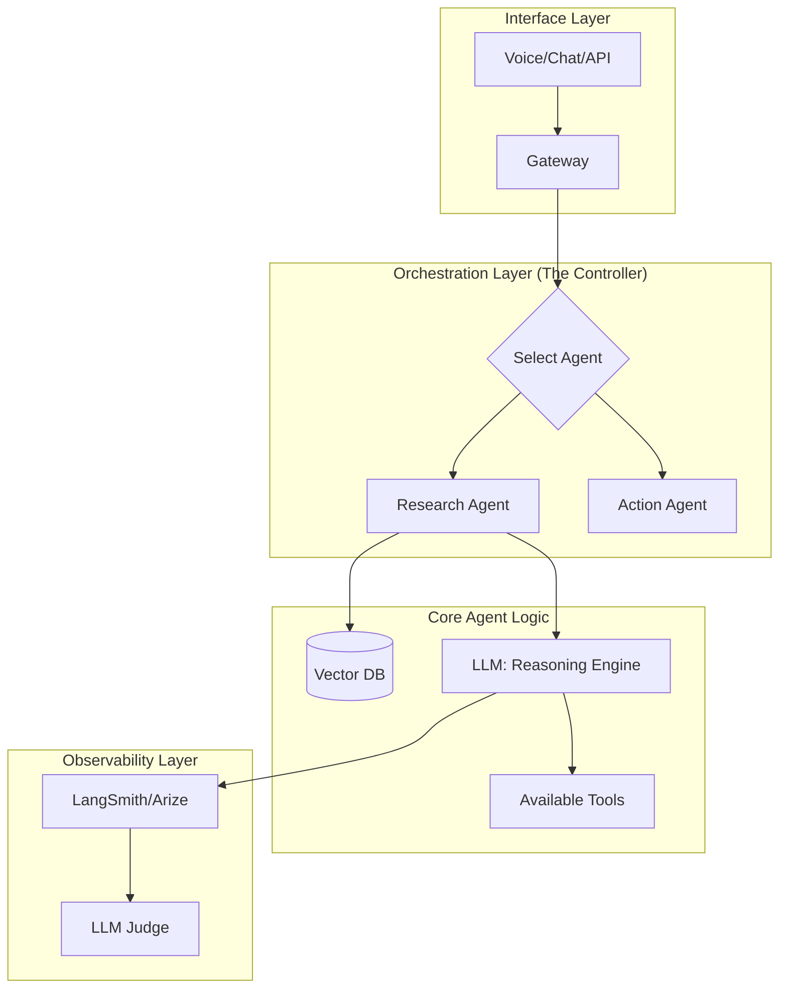

# 🏆 AI Agent Mastery Guide: From Builder to Architect
> **Level:** Advanced | **Language:** Hinglish | **Goal:** The ultimate reference for designing, debugging, and scaling elite AI agent systems.

---

## 🧭 1. Beginner-Friendly Hinglish Explanation
Mastery ka matlab hai "Control". 

- Ek beginner agent banata hai aur ummeed karta hai ki wo chal jaye.
- Ek **Master** agent ko design karta hai, unki "Galtiyon" ko anticipate karta hai, aur unke liye "Guardrails" banata hai.
- Sochiye aap ek "Director" hain aur agents aapke "Actors" hain. Aapko script (Prompt) likhni hai, resources (Tools) dene hain, aur har scene (Step) ko monitor karna hai.

---

## 🧠 2. Deep Technical Principles
Mastering agents requires moving beyond "Prompting" into **Cognitive Architecture**.

### 1. Planning Strategies:
- **Zero-shot:** Direct instruction (Risky for complex tasks).
- **Few-shot:** Providing examples of successful agent runs.
- **Dynamic Decompositon:** Agent breaks goal into sub-tasks (The current gold standard).

### 2. State Management (The Soul of the Agent):
- **Short-term:** Context window management.
- **Long-term:** External storage.
- **Shared State:** In multi-agent systems, how agents synchronize information without "Colliding".

### 3. Error Recovery (Self-Correction):
- **Syntactic Correction:** Fix JSON/Code errors automatically.
- **Logical Correction:** Agent realizes the output doesn't match the goal and re-runs the step.

---

## 🏗️ 3. The Mastery Architecture (The Modern Stack)


---

## 💻 4. Production-Ready Code Example (Advanced Reflection Pattern)
```python
# 2026 Standard: Agent with Built-in Reflection/Critique Loop

class MasterAgent:
    def execute_with_reflection(self, task):
        # 1. Generate Initial Draft
        draft = self.llm.generate(f"Complete this task: {task}")
        
        # 2. Critique the Draft
        critique = self.llm.generate(f"Critique this draft for errors: {draft}")
        
        if "ERROR" in critique:
            # 3. Refine based on Critique
            final = self.llm.generate(f"Refine this draft: {draft} using these notes: {critique}")
            return final
        
        return draft

# Mastery Insight: Reflection doubles accuracy but doubles latency. 
# Use it only for high-stakes tasks.
```

---

## 🌍 5. Real-World Use Cases
- **Autonomous Financial Audit:** Agent scans thousands of transactions, flags anomalies, and writes the audit report.
- **Automated Customer Success:** Agent proactive reach out to users based on "Product Usage Logs" to help them before they ask.

---

## ❌ 6. Failure Cases (The "Master" Level)
- **Recursive Hallucination:** The agent makes a mistake, then reflects on that mistake but produces *another* mistake as the fix.
- **Token Overflow:** In deep loops, the agent loses the "System Prompt" (The Rules) because of too much history.

---

## 🛠️ 7. Debugging Guide
| Problem | Master's Fix |
| :--- | :--- |
| **Agent is hallucinating tools** | Use **Strict JSON Schema** or Pydantic validation. |
| **Agent is too slow** | Implement **Streaming** and **Parallel Execution** for sub-tasks. |
| **Agent cost is skyrocketing** | Implement a **Cost Guardrail** that kills the process if it exceeds $X. |

---

## ⚖️ 8. Tradeoffs
- **LLM Intelligence vs. Speed:** Using GPT-4o for every reasoning step is overkill. Use a "Router" to send easy tasks to small models.
- **Memory Depth:** Keeping every token of history vs. Summarizing. Summarization saves tokens but can lose fine details.

---

## 🛡️ 9. Security Concerns (Mastery)
- **Data Exfiltration:** Agent mistakenly sends sensitive database rows to an external API during a search. **Fix: Data Masking/Redaction layer.**
- **Autonomous Spend:** Agent tries to "Hire" other agents or cloud resources without limit. **Fix: Hard Budgets at the API level.**

---

## 📈 10. Scaling Challenges
- **Latency at Scale:** When 10,000 agents are thinking, the API rate limits will hit you. **Solution: Multi-Region deployments and Batching.**

---

## 💸 11. Cost Considerations
Master the art of **Prompt Compression**. Removing "Please" and "Thank you" and using concise instructions can save thousands of dollars at scale.

---

## 📝 12. Interview Questions (Expert Level)
1. How do you prevent "Cycle Loops" in multi-agent collaboration?
2. Explain the difference between **Semantic Memory** and **Episodic Memory** in agents.
3. Design a "Self-Healing" agentic pipeline.

---

## ⚠️ 13. Common Mistakes
- **Vague Goals:** Giving the agent a goal like "Make me money". The goal must be **S.M.A.R.T** (Specific, Measurable, Achievable, Relevant, Time-bound).
- **Over-reliance on Auto-Pilot:** Not having a "Big Red Button" to stop the agent manually.

---

## ✅ 14. Best Practices
- **Deterministic Wrappers:** Wrap non-deterministic agent calls in deterministic code (e.g., validation logic).
- **Telemetry everywhere:** If you can't see the "Thought Process" (Logs), you can't fix it.

---

## 🚀 15. Latest 2026 Industry Patterns
- **Agentic OS:** Operating systems where the file manager and browser are agents themselves.
- **LLM-as-a-Compiler:** Agents that compile natural language requirements into optimized, executable system graphs.
