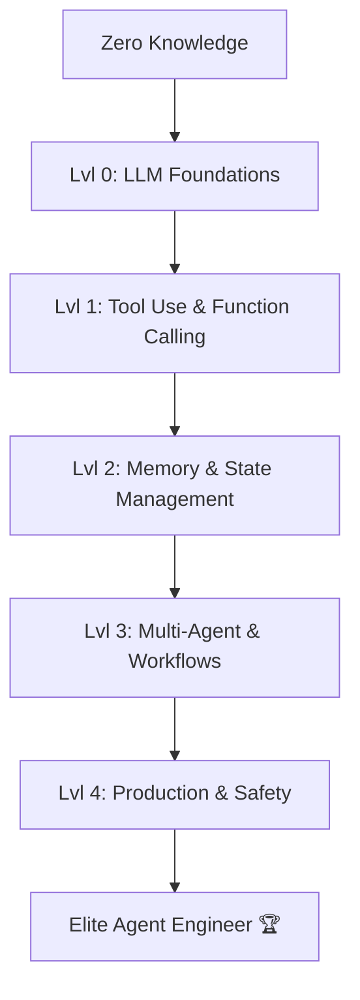

# 🗺️ AI Agent Roadmap 2026: The Path to Agentic Mastery
> **Level:** Beginner to Advanced | **Language:** Hinglish | **Goal:** A structured curriculum to go from "Zero" to "Production-Grade AI Agent Engineer".

---

## 🧭 1. Beginner-Friendly Hinglish Explanation
2026 mein AI Engineer banna matlab sirf "API call" karna nahi hai. Aapko ek "Orchestrator" banna hoga.

- **Phase 1:** Pehle "Reasoning" ko samjho (LLMs kaise sochte hain).
- **Phase 2:** Phir "Tools" ko connect karo (Python, APIs).
- **Phase 3:** Phir "Memory" aur "State" manage karo (Vector DBs, LangGraph).
- **Phase 4:** End mein "Production" aur "Safety" seekho (Monitoring, Guardrails).

Ye roadmap aapko ek step-by-step rasta dikhayega taaki aap complex "Multi-Agent Systems" bana sakein.

---

## 🧠 2. The 5 Pillars of Mastery
To become a top 1% Agent Engineer, you must master these five areas:

### Pillar 1: The Reasoning Engine (LLM Optimization)
- Mastering **Prompt Engineering** (CoT, Few-shot, ReAct).
- Understanding **Context Windows** and **Tokenization**.
- **Model Selection:** Knowing when to use GPT-4o vs. Llama-3 vs. Claude-3.5-Sonnet.

### Pillar 2: Tool-Use & Connectivity
- **Function Calling:** Standardizing JSON schemas for tool calls.
- **MCP (Model Context Protocol):** Integrating local data and desktop tools.
- **Sandboxing:** Executing code safely in isolated environments.

### Pillar 3: Memory & Persistence
- **Short-term Memory:** Managing the conversation buffer.
- **Long-term Memory:** Implementing **RAG** and **Vector Databases** (Pinecone, Qdrant).
- **Semantic Cache:** Storing previous reasoning paths to save costs.

### Pillar 4: Orchestration & State
- **LangChain & LangGraph:** Building complex DAGs (Directed Acyclic Graphs).
- **State Machines:** Tracking what the agent "knows" at every step.
- **Multi-Agent Systems:** CrewAI, AutoGen, and Swarm architectures.

### Pillar 5: Production & Ops (AgentOps)
- **Monitoring:** Arize Phoenix, LangSmith, and Weights & Biases.
- **Evaluation:** Using **LLM-as-a-Judge** to score agent performance.
- **Guardrails:** NeMo Guardrails and Llama Guard to prevent toxic actions.

---

## 🏗️ 3. Mastery Roadmap Diagram

---

## 💻 4. Project-Based Learning Path
| Level | Project | Key Tech |
| :--- | :--- | :--- |
| **Beginner** | Personal Email Summarizer | OpenAI API, Gmail API |
| **Intermediate** | Autonomous Research Agent | LangChain, Tavily Search |
| **Advanced** | Multi-Agent Coding Team | LangGraph, Docker Sandbox |
| **Expert** | Production-Grade Customer Support | Kubernetes, Datadog, Guardrails |

---

## 🌍 5. Real-World Use Cases (2026 Trends)
- **Decentralized Agents:** Agents running on local NPUs (Neural Processing Units).
- **Vertical AI Agents:** Specialized agents for Law, Medicine, and Civil Engineering.

---

## ❌ 6. Failure Cases (Why people quit)
- **Over-engineering:** Trying to use a "Multi-agent swarm" for a task that needs a simple script.
- **Ignoring Latency:** Building an agent that takes 2 minutes to reply to a simple "Hello".

---

## 🛠️ 7. Debugging Your Learning
- **Symptom:** "I understand the theory but can't build."
- **Fix:** Start with **Pure Python**. Don't use frameworks like LangChain until you understand how to write a basic `while` loop with an LLM call.

---

## ⚖️ 8. Tradeoffs
- **Frameworks vs. Custom Code:** Frameworks are fast to start but hard to debug in production. Custom code is slow to build but gives $100\%$ control.

---

## 🛡️ 9. Security Concerns (Mastery Topic)
Mastering **Prompt Injection** prevention is a must for 2026. You should know how to use "Dual-LLM" architectures (one to act, one to monitor).

---

## 📈 10. Scaling Challenges
The biggest jump is from "1 Agent" to "10,000 Agents". Learn **Asynchronous Programming** (`asyncio` in Python) to handle many agents at once.

---

## 💸 11. Cost Considerations
Learn **Small Language Models (SLMs)** like Phi-3 or Gemma. Running a 70B model for every agent step will bankrupt your startup.

---

## 📝 12. Interview Questions
1. How do you manage "State" in a long-running agentic workflow?
2. When would you choose a "Hierarchical" multi-agent system over a "Collaborative" one?
3. What are the 3 main components of the **Agentic Loop**?

---

## ⚠️ 13. Common Mistakes
- **No Evaluation:** Building an agent and "testing" it only with 2-3 prompts. Use a **Test Suite** of 100+ cases.

---

## ✅ 14. Best Practices
- **Version Control everything:** Not just code, but also your **Prompts** and **System Instructions**.
- **Keep it Simple:** Use an agent only when the task is "Unpredictable". For everything else, use standard software logic.

---

## 🚀 15. Latest 2026 Industry Patterns
- **LLM-as-a-Service (LMS):** Deep integration with enterprise tools via **MCP**.
- **Agentic Evaluation (Eval-as-a-Service):** Automated pipelines that try to "Break" your agent before release.
