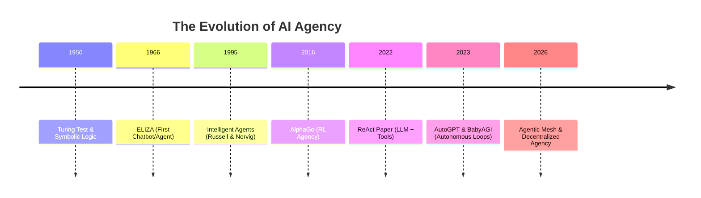

# 📜 History of AI Agents: From Symbolic Logic to Autonomous LLMs
> **Level:** Beginner | **Language:** Hinglish | **Goal:** Trace the evolution of agency—from 1950s rules to 2026's decentralized agentic meshes.

---

## 🧭 1. Beginner-Friendly Hinglish Explanation
AI Agents ka concept naya nahi hai, par unka "Dimaag" (LLM) naya hai.

- **Old Era (1950-2010):** Pehle agents "Rule-based" hote the. Agar ye hua (`if`), toh ye karo (`then`). Inhe **GOFAI** (Good Old Fashioned AI) kaha jata tha. Ye rigid the aur zara si nayi situation mein fail ho jate the.
- **Modern Era (2022-Present):** Transformers aur LLMs ke aane se agents ko "Reasoning" mil gayi. Ab unhe har situation ke liye `if-else` nahi chahiye, wo insaan ki tarah "Common Sense" use karke decision le sakte hain.

---

## 🧠 2. Deep Technical Evolution
The history of agency can be divided into four distinct waves:

### Wave 1: Symbolic Agents (1950s - 1980s)
- **Concept:** Agents as logical inference engines.
- **Example:** **ELIZA** (Psychotherapist chatbot) and **Expert Systems**.
- **Limitation:** They lacked actual understanding; they just matched patterns.

### Wave 2: Reactive & BDI Agents (1990s - 2010s)
- **Concept:** **BDI** (Belief-Desire-Intention) architecture.
- **Tech:** Agents had a "Belief" (state of world), a "Desire" (goal), and an "Intention" (plan).
- **Limitation:** Hard to scale in complex, messy real-world data.

### Wave 3: RL-based Agents (2010s - 2021)
- **Concept:** Agents that learn from trial and error (**Reinforcement Learning**).
- **Milestone:** **AlphaGo** and **OpenAI Five**.
- **Limitation:** Great for games, but extremely hard to define "Rewards" for general tasks like "Write an email".

### Wave 4: LLM-Agentic Revolution (2022 - 2026)
- **Concept:** LLM as the **Reasoning Kernel**.
- **Trigger:** ChatGPT and later the **ReAct** paper (2022).
- **Status:** Agents can now use tools, browse the web, and correct their own mistakes.

---

## 🏗️ 3. The Evolution Timeline


---

## 💻 4. Comparison: Old vs. New Agency
```python
# --- OLD WAY: Rule-Based Agent ---
def handle_customer(query):
    if "refund" in query:
        return "Checking refund status..."
    elif "shipping" in query:
        return "Fetching tracking info..."
    # Rigid and fails if user says "Paisa wapas chahiye"

# --- NEW WAY: LLM Agentic Reasoning ---
def handle_customer_agentic(query):
    # LLM understands that "Paisa wapas" = Refund
    thought = llm.reason(f"User said: {query}. What intent is this?")
    action = llm.call_tool("refund_api" if "Refund" in thought else "general_help")
    return action
```

---

## 🌍 5. Real-World Use Cases (Historical context)
- **Deep Blue (1997):** An agent specialized in one environment (Chess).
- **Siri/Alexa (2011):** Voice-activated agents with limited tool-use (timers, music).
- **AutoGPT (2023):** The first viral attempt at a fully self-directed general agent.

---

## ❌ 6. Failure Cases (Why old agents failed)
- **The "State Explosion" Problem:** Har possible situation ke liye logic likhna impossible tha.
- **Brittleness:** Agar user input thoda sa badal jata, toh agent "I don't understand" bol deta tha.

---

## 🛠️ 7. Debugging the History (Common Myths)
| Myth | Reality |
| :--- | :--- |
| **"Agents were invented with ChatGPT"** | No, agency theory is 70+ years old. LLMs just solved the 'Reasoning' part. |
| **"RL is dead for agents"** | No, RL is used to train the "Reasoning" capability (e.g., OpenAI o1). |

---

## ⚖️ 8. Tradeoffs: Symbolic vs. Connectionist
- **Symbolic (Old):** $100\%$ Predictable but $0\%$ Flexible.
- **Connectionist/LLM (New):** $100\%$ Flexible but $0\%$ Predictable (Stochastic).

---

## 🛡️ 9. Security Concerns (Historical Evolution)
Earlier, security was about "Input Sanitization". Now, security is about "Agency Alignment"—ensuring the agent doesn't overstep its boundaries while trying to be "helpful".

---

## 📈 10. Scaling Challenges
The biggest historical challenge was **Generalization**. LLMs solved this by being trained on the "Entire Internet", giving them a broad world model.

---

## 💸 11. Cost Considerations
Old agents were free to run (logic is cheap). LLM agents are expensive (tokens are costly). This is driving the move towards **Inference Optimization** and **Small Models**.

---

## 📝 12. Interview Questions
1. What was the "BDI" architecture?
2. Why did symbolic AI fail to produce general-purpose agents?
3. How did the "ReAct" paper change the trajectory of AI agents?

---

## ⚠️ 13. Common Mistakes
- **Underestimating RL:** Thinking that agents only need prompting. The "Brains" are often fine-tuned using Reinforcement Learning from Human Feedback (RLHF).

---

## ✅ 14. Best Practices (Lessons from History)
- **Don't hardcode logic:** Use LLMs for decision-making and standard code for deterministic execution.
- **Keep it modular:** Historically, "Monolithic" agents failed. Modern successful agents are collections of specialized tools.

---

## 🚀 15. Latest 2026 Industry Patterns
- **Neuro-symbolic AI:** Combining the reasoning of LLMs with the precise logical constraints of the 1980s.
- **Self-Evolving Agents:** Agents that read their own history and "patch" their own system prompts for better performance.
