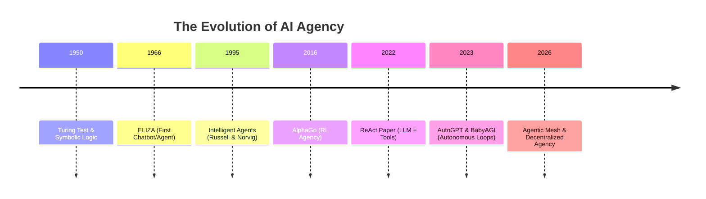

# 📜 History of AI Agents: From Symbolic Logic to Autonomous LLMs (Hinglish Guide)
> **Level:** Beginner | **Language:** Hinglish | **Goal:** Agency ke evolution ko trace karna—1950s ke rules se lekar 2026 ke decentralized agentic meshes tak.

---

## 🧭 1. Beginner-Friendly Hinglish Explanation
AI Agents ka concept naya nahi hai, par unka "Dimaag" (LLM) naya hai.

- **Old Era (1950-2010):** Pehle agents "Rule-based" hote the. Agar ye hua (`if`), toh ye karo (`then`). Inhe **GOFAI** (Good Old Fashioned AI) kaha jata tha. Ye rigid the aur zara si nayi situation mein fail ho jate the.
- **Modern Era (2022-Present):** Transformers aur LLMs ke aane se agents ko "Reasoning" mil gayi. Ab unhe har situation ke liye `if-else` nahi chahiye, wo insaan ki tarah "Common Sense" use karke decision le sakte hain.

---

## 🧠 2. Deep Technical Evolution (Gehra Technical Evolution)
Agency ke itihaas ko chaar alag-alag waves mein divide kiya ja sakta hai:

### Wave 1: Symbolic Agents (1950s - 1980s)
- **Concept:** Agents ko logical inference engines ki tarah use kiya jata tha.
- **Example:** **ELIZA** (Psychotherapist chatbot) aur **Expert Systems**.
- **Limitation:** Inmein actual understanding (samajh) ki kami thi; ye sirf pre-defined patterns ko match karte the.

### Wave 2: Reactive & BDI Agents (1990s - 2010s)
- **Concept:** **BDI** (Belief-Desire-Intention) architecture par based agents.
- **Tech:** Agents ke paas "Belief" (duniya ki state), "Desire" (goal), aur "Intention" (plan) hote the.
- **Limitation:** Complex aur messy real-world data ke saath scale karna bahut mushkil tha.

### Wave 3: RL-based Agents (2010s - 2021)
- **Concept:** Aise agents jo trial aur error (**Reinforcement Learning**) se seekhte hain.
- **Milestone:** **AlphaGo** aur **OpenAI Five**.
- **Limitation:** Games ke liye toh behtareen the, par general tasks (jaise "email likhna") ke liye "Rewards" define karna extremely difficult tha.

### Wave 4: LLM-Agentic Revolution (2022 - 2026)
- **Concept:** LLM ko **Reasoning Kernel** ki tarah use kiya jata hai.
- **Trigger:** ChatGPT aur uske baad **ReAct** paper (2022) ka aana.
- **Status:** Agents ab tools use kar sakte hain, web browse kar sakte hain, aur apni galatiyon ko khud sudhaar (self-correct) sakte hain.

---

## 🏗️ 3. The Evolution Timeline (Evolution ka Timeline)

```mermaid
timeline
    title The Evolution of AI Agency
    1950 : Turing Test & Symbolic Logic
    1966 : ELIZA (First Chatbot/Agent)
    1995 : Intelligent Agents (Russell & Norvig)
    2016 : AlphaGo (RL Agency)
    2022 : ReAct Paper (LLM + Tools)
    2023 : AutoGPT & BabyAGI (Autonomous Loops)
    2026 : Agentic Mesh & Decentralized Agency
```

---

## 💻 4. Comparison: Old vs. New Agency (Puraani vs Nayi Agency ka Comparison)
```python
# --- OLD WAY: Rule-Based Agent ---
def handle_customer(query):
    if "refund" in query:
        return "Checking refund status..."
    elif "shipping" in query:
        return "Fetching tracking info..."
    # Rigid and fails if user says "Paisa wapas chahiye"

# --- NEW WAY: LLM Agentic Reasoning ---
def handle_customer_agentic(query):
    # LLM understands that "Paisa wapas" = Refund
    thought = llm.reason(f"User said: {query}. What intent is this?")
    action = llm.call_tool("refund_api" if "Refund" in thought else "general_help")
    return action
```

---

## 🌍 5. Real-World Use Cases (Vastavik Use Cases)
- **Deep Blue (1997):** Ek aisa agent jo sirf ek single environment (Chess) ke liye specialized tha.
- **Siri/Alexa (2011):** Voice-activated agents jinmein tool-use bahut limited tha (jaise timers lagana, music chalana).
- **AutoGPT (2023):** Ek fully self-directed general agent banane ki pehli viral koshish.

---

## ❌ 6. Failure Cases (Puraene agents kyun fail hue)
- **The "State Explosion" Problem:** Har possible situation ke liye logic likhna bilkul impossible tha.
- **Brittleness:** Agar user input thoda sa bhi badal jata tha, toh agent seedhe "I don't understand" bol deta tha.

---

## 🛠️ 7. Debugging the History (Common Myths aur Reality)
| Myth (Bhram) | Reality (Sachai) |
| :--- | :--- |
| **"Agents ChatGPT ke saath invent hue the"** | Nahi, agency theory 70+ saal puraani hai. LLMs ne toh bas 'Reasoning' (sochne ki capability) wale part ko solve kiya hai. |
| **"RL agents ke liye khatam ho chuka hai"** | Bilkul nahi, RL ka use "Reasoning" capability ko train karne ke liye kiya jata hai (jaise OpenAI o1). |

---

## ⚖️ 8. Tradeoffs: Symbolic vs. Connectionist (Fayde aur Nuksaan)
- **Symbolic (Old - Puraana):** $100\%$ Predictable hota hai par $0\%$ Flexible.
- **Connectionist/LLM (New - Naya):** $100\%$ Flexible hota hai par $0\%$ Predictable (Stochastic) hota hai.

---

## 🛡️ 9. Security Concerns (Suraksha Chintaein)
Pehle, security ka matlab sirf "Input Sanitization" hota tha. Par ab, security ka matlab "Agency Alignment" hai—ye ensure karna ki agent "helpful" banne ke chakkar mein apni limits aur boundaries cross na kare.

---

## 📈 10. Scaling Challenges (Scale Karne ki Chunautiyaan)
Itihaas ki sabse badi scaling challenge **Generalization** thi. LLMs ne ise solve kiya pure "Entire Internet" par train hokar, jisne unhe ek broad world model diya.

---

## 💸 11. Cost Considerations (Kharcha)
Puraane agents ko chalana free tha (rules aur logic saste hote hain). Lekin LLM agents expensive hain (tokens bohot cost karte hain). Is wajah se log ab **Inference Optimization** aur **Small Models** ki taraf badh rahe hain.

---

## 📝 12. Interview Questions (Interview ke Sawaal)
1. "BDI" architecture kya thi?
2. Symbolic AI general-purpose agents banane mein fail kyun hui?
3. "ReAct" paper ne AI agents ki development trajectory ko kaise badal diya?

---

## ⚠️ 13. Common Mistakes (Aam Galtiyaan)
- **RL ko kam samajhna:** Ye sochna ki agents ko sirf prompting ki zaroorat hoti hai. Unke "Brains" ko aksar Reinforcement Learning from Human Feedback (RLHF) ke zariye fine-tune kiya jata hai.

---

## ✅ 14. Best Practices (Itihaas se Seekh)
- **Logic ko hardcode mat karo:** Decision-making ke liye LLMs ka use karein aur deterministic execution ke liye standard code ka.
- **Isse modular rakhein:** Itihaas gawah hai ki "Monolithic" (bade ek-tukde wale) agents fail ho gaye. Modern successful agents specialized tools ke collections hote hain.

---

## 🚀 15. Latest 2026 Industry Patterns (2026 ke Naye Patterns)
- **Neuro-symbolic AI:** LLMs ki reasoning capability ko 1980s ke precise logical constraints ke saath combine karna.
- **Self-Evolving Agents:** Aise agents jo apni khud ki history ko read karte hain aur behtar performance ke liye apne system prompts ko khud "patch" karte hain.
