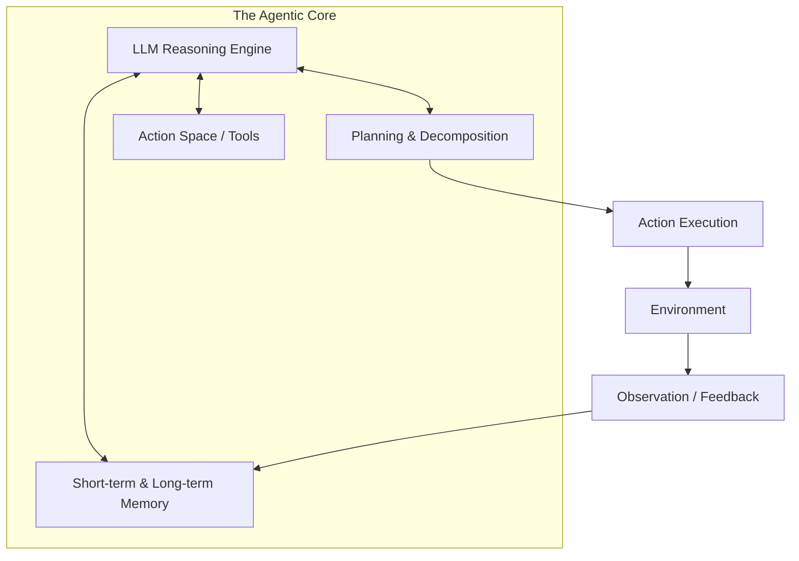

# 🧠 Agent Core Concepts: The Building Blocks of Agency
> **Level:** Fundamentals | **Language:** Hinglish | **Goal:** Master the primary components that transform an LLM into an autonomous agent.

---

## 🧭 1. Beginner-Friendly Hinglish Explanation
Agent ke 4 pillars hote hain jiske bina wo "Lule-Langde" (Handicapped) hain.

1.  **Brain (LLM):** Sabse bada pillar. Bina reasoning ke agent sirf ek script hai.
2.  **Memory (Yaaddasht):** Agent ko pata hona chahiye ki usne 2 minute pehle kya kiya tha.
3.  **Planning (Sochna):** Bada goal milne par use chote tasks mein todna.
4.  **Tools (Hathiyaar):** Duniya se interact karne ke liye (Google search, Calculator, DB access).

Agar ye chaaro mil jayein, toh ek "Asli Agent" banta hai.

---

## 🧠 2. Deep Technical Explanation
Core agency is built on the interaction between these four modules:

### 1. The Reasoning Brain (The LLM Kernel)
The LLM acts as the "Prefrontal Cortex". It parses the goal, identifies the current state, and predicts the next action. It must be capable of **Chain-of-Thought** reasoning to be effective.

### 2. The Planning Module
- **Task Decomposition:** Breaking a complex goal into a directed sequence of steps.
- **Reflection:** Analyzing previous attempts to adjust the plan.
- **Sub-goal Generation:** Creating intermediate milestones to track progress.

### 3. The Memory Module
- **Short-term Memory:** The current context window (In-context learning).
- **Long-term Memory:** External knowledge retrieval (RAG) and episodic memory (past user interactions).

### 4. The Tool Space (Action Space)
The set of all possible actions an agent can take. This is defined by a **Tool Schema** (JSON descriptions) that the LLM understands and can invoke.

---

## 🏗️ 3. Architecture Diagrams (The 4 Pillars)


---

## 💻 4. Production-Ready Code Example (Defining Core Components)
```python
# 2026 Standard: Defining the 'Schema' of a Core Agent

from typing import List, Dict

class AgentCore:
    def __init__(self, model_id: str, tools: List[callable]):
        self.brain = model_id
        self.planning_strategy = "ReAct"
        self.memory = [] # Episodic Memory
        self.tools = {t.__name__: t for t in tools} # Action Space
        
    def perceive(self, observation: str):
        # Update internal state based on what happened in the world
        self.memory.append({"role": "observation", "content": observation})
        
    def reason_and_act(self, goal: str):
        # The core loop where Brain + Planning + Tools meet
        pass
```

---

## 🌍 5. Real-World Use Cases
- **Support Agents:** Using "Knowledge Memory" to answer and "Action Tools" to issue refunds.
- **Data Analysts:** Using "Planning" to decide which SQL query to run first and "Observation" to interpret the results.

---

## ❌ 6. Failure Cases
- **Memory Decay:** As the conversation gets long, the agent "Forgets" the initial goal. **Fix: Use 'Sliding Window' or 'Summarization'.**
- **Incoherent Planning:** The agent plans to "Buy a car" before "Checking the budget". **Fix: Better prompt templates.**

---

## 🛠️ 7. Debugging Guide
| Symptom | Cause | Fix |
| :--- | :--- | :--- |
| **Agent doesn't use tools** | Tool description is vague | Improve the natural language description in the Tool Schema. |
| **Agent repeats mistakes** | No 'Reflective' memory | Add a step where the agent critiques its own previous failure. |

---

## ⚖️ 8. Tradeoffs
- **Model Size vs. Reasoning:** A 70B model reasons better but is $10x$ slower than an 8B model. Use **Model Cascading**.
- **Memory Density:** Storing every detail (High token cost) vs. Sparse memory (Loss of detail).

---

## 🛡️ 9. Security Concerns
- **Tool Exploitation:** If an agent has a "Delete User" tool, an attacker might trick the agent into using it via **Prompt Injection**. **Fix: Enforce 'Least Privilege' and 'Human-in-the-loop' for destructive tools.**

---

## 📈 10. Scaling Challenges
- **State Serialization:** Saving and loading the agent's memory for millions of users without crashing the database.

---

## 💸 11. Cost Considerations
- **Reasoning Overhead:** "Thinking" steps cost tokens but don't provide output to the user. Optimize prompts to be concise.

---

## 📝 12. Interview Questions
1. What are the four main components of an AI Agent?
2. Explain the concept of "Action Space".
3. How does "Observation" feed back into the "Reasoning" engine?

---

## ⚠️ 13. Common Mistakes
- **Hardcoding the Plan:** Don't write the steps yourself; let the LLM generate them, or it won't be an "Agent".
- **Infinite Loops:** Not checking if the agent is just spinning its wheels.

---

## ✅ 14. Best Practices
- **Atomic Tools:** Tools should do one thing and do it well.
- **Traceability:** Log every "Thought" and "Action" for audit trails.

---

## 🚀 15. Latest 2026 Industry Patterns
- **Agentic OS:** The "Concept" of agency is moving into the kernel level of operating systems.
- **Cognitive Architectures:** Moving beyond simple loops to complex, human-like mental models.
