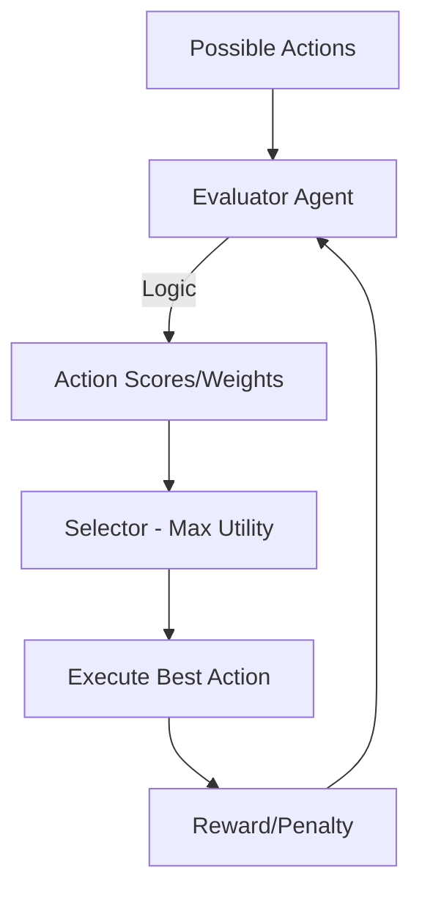

# ⚖️ Agent Decision Making: The Logic of Choice
> **Level:** Intermediate | **Language:** Hinglish | **Goal:** Master how AI agents choose between multiple actions and handle uncertainty in production.

---

## 🧭 1. Beginner-friendly Hinglish Explanation
Decision Making ka matlab hai "Sahi Option Chunna". Sochiye aapka agent ek raste par hai jahan teen darwaze hain. Ek mein "Khazana" hai, ek mein "Sher", aur ek "Khali" hai. Agent kaise decide karega? Decision making wo process hai jahan agent apne knowledge, risk, aur goal ko tolta (weigh) hai aur sabse best action chunta hai. Bina iske, agent sirf ek random machine ban kar reh jayega.

---

## 🧠 2. Deep Technical Explanation
Decision making incorporates several frameworks:
1. **Utility-Based:** Sabse zyada reward wala action chunna.
2. **Probability-Based:** Har action ke success hone ke chance ko calculate karna (Bayesian logic).
3. **Reasoning-Based:** LLM ka use karke pros aur cons ko natural language mein discuss karna (The "System 2" thinking).
**Implementation:** In 2026, we use **Monte Carlo Tree Search (MCTS)** or **Multi-objective Optimization** to help agents decide when the answer isn't black and white.

---

## 🏗️ 3. Real-world Analogies
Decision making ek **Investor** ki tarah hai.
- **Goal:** Paisa kamana.
- **Decision:** Kaunsa stock khareedu? (Risk vs Reward ka calculation).

---

## 📊 4. Architecture Diagrams (The Decision Flow)


---

## 💻 5. Production-ready Examples (Weighted Choice Logic)
```python
# 2026 Standard: Simple Decision Logic
actions = {
    "search_web": {"utility": 0.8, "risk": 0.1},
    "delete_db": {"utility": 0.2, "risk": 0.9}
}

def make_decision(options):
    # Score = Utility - Risk
    best_action = max(options, key=lambda x: options[x]['utility'] - options[x]['risk'])
    return best_action

print(f"Decided Action: {make_decision(actions)}")
```

---

## ❌ 6. Failure Cases
- **Analysis Paralysis:** Agent decision hi nahi le pa raha kyunki data bahut zyada hai.
- **Impulsive Decision:** Agent ne bina poori baat sune dangerous action le liya (Risk ignore kiya).

---

## 🛠️ 7. Debugging Section
- **Symptom:** Agent hamesha "Safe" par "Useless" option chunta hai.
- **Fix:** Reward function ko update karein. Shayad "Risk Penalty" bahut zyada hai. Agent ko "Exploration" ke liye encourage karein.

---

## ⚖️ 8. Tradeoffs
- **Exploitation vs Exploration:** Purani knowledge use karna (Exploitation) vs kuch naya try karna (Exploration). Balance is key.

---

## 🛡️ 9. Security Concerns
- **Decision Manipulation:** Agar koi agent ki "Evaluation logic" ko hack kar de, toh wo use galat decision lene par majboor kar sakta hai.

---

## 📈 10. Scaling Challenges
- Complex decision-making algorithms (MCTS) compute-heavy hote hain. Thousands of agents ke liye ye scale karna mushkil hai.

---

## 💸 11. Cost Considerations
- Har decision ke piche LLM "Discussion" (pros/cons) tokens kharch karta hai. Use logic-based filters before LLM calls.

---

## ⚠️ 12. Common Mistakes
- Uncertainty ko ignore karna. Agent ko "I don't know" bolne ka option hamesha dena chahiye.

---

## 📝 13. Interview Questions
1. How does an agent handle conflicting objectives during decision making?
2. What is the role of 'Entropy' in agent exploration?

---

## ✅ 14. Best Practices
- Use **Ensembles**: Teen alag agents se pucho aur "Majority Vote" lo critical decisions ke liye.
- Always include a **"No Action"** option.

---

## 🚀 15. Latest 2026 Industry Patterns
- **Differentiable Decision Making:** Models jo mathematically predict karte hain ki decision ka impact kya hoga.
- **Ethics-First Decision Layers:** Decision lene se pehle ek separate safety agent jo sirf "Moral and Legal" check karta hai.
