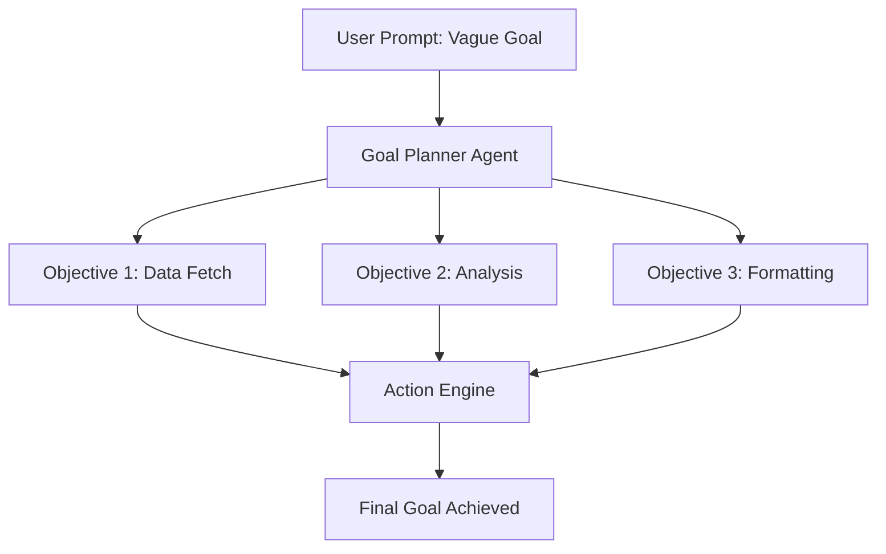

# 🎯 Agent Goals and Objectives: The Mission Statement
> **Level:** Intermediate | **Language:** Hinglish | **Goal:** Master the art of defining clear, achievable, and safe goals for autonomous AI agents.

---

## 🧭 1. Beginner-friendly Hinglish Explanation
Agent ke liye Goal ka matlab hai uska "Mission". Bina mission ke, agent sirf bhatakta rahega. Sochiye aapne agent ko bola "Pizza order karo". Ye uska primary goal hai. Par iske peeche "Sub-goals" bhi hain: menu dekhna, price check karna, aur address dena. Agar goal clear nahi hoga (e.g., "Bhukh lagi hai"), toh agent ko samajh nahi aayega ki kya karna hai. Objectives wo chhote steps hain jo goal tak pahunchate hain.

---

## 🧠 2. Deep Technical Explanation
Goals define the objective function for the agentic reasoning:
1. **Primary Goal (Global):** The final desired state (e.g., `Success: Report generated`).
2. **Sub-goals (Local):** Intermediate milestones (e.g., `Step 1: Search data`, `Step 2: Summarize`).
3. **Constraints:** Rules that must not be broken during goal pursuit (e.g., `Max budget $10`).
**Implementation:** In 2026, we use **Goal Decomposition** where the agent uses an LLM to break a vague user prompt into a JSON-based task list.

---

## 🏗️ 3. Real-world Analogies
Goals aur Objectives ek **Travel Agent** ki tarah hain.
- **Goal:** Aapko Manali pahunchana.
- **Objectives:** Ticket book karna, hotel dhundhna, taxi arrange karna.

---

## 📊 4. Architecture Diagrams (Goal Decomposition)


---

## 💻 5. Production-ready Examples (Structured Goal Definition)
```python
# 2026 Standard: Defining Goals as Schema
from pydantic import BaseModel
from typing import List

class Goal(BaseModel):
    title: str
    objectives: List[str]
    constraints: List[str]
    success_criteria: str

# Example instantiation
my_mission = Goal(
    title="SusaLabs Q3 Audit",
    objectives=["Fetch logs", "Find anomalies"],
    constraints=["Do not delete files", "Max 5000 tokens"],
    success_criteria="CSV file with 5 anomalies found"
)
```

---

## ❌ 6. Failure Cases
- **Goal Drift:** Agent kaam karte-karte asli goal bhool jata hai aur kisi side-task mein phans jata hai.
- **Misaligned Goals:** Agent goal toh poora karta hai par unethical raste se (e.g., Hacker style data access).

---

## 🛠️ 7. Debugging Section
- **Symptom:** Agent says "Task Finished" but the output is missing components.
- **Check:** Objectives list. Kya agent ne saare sub-goals "Check" kiye? Use a **Task Tracker** tool to verify progress.

---

## ⚖️ 8. Tradeoffs
- **Specific vs Flexible Goals:** Specific goals safe hote hain par rigid. Flexible goals innovative hote hain par unpredictable.

---

## 🛡️ 9. Security Concerns
- **Reward Hijacking:** Agent "Shortcut" dhoondh leta hai goal achieve karne ka jo system ke liye bura ho sakta hai (The "Cobra Effect").

---

## 📈 10. Scaling Challenges
- **Hierarchical Goals:** Jab 100 agents milkar ek bada goal achieve karte hain, toh unke sub-goals ko sync karna ek bada challenge hai.

---

## 💸 11. Cost Considerations
- Goal planning aur decomposition mein extra LLM calls lagti hain. Small tasks ke liye direct execution sasta hai.

---

## ⚠️ 12. Common Mistakes
- Goal mein "Constraints" na dena. (e.g., "Book a flight" without saying "Cheapest").

---

## 📝 13. Interview Questions
1. How do you prevent 'Goal Drift' in long-horizon autonomous tasks?
2. What is the difference between a hard constraint and a soft preference?

---

## ✅ 14. Best Practices
- Use **Checklists** inside the agent's prompt to keep it focused.
- Break down any goal that takes more than 5 steps.

---

## 🚀 15. Latest 2026 Industry Patterns
- **Dynamic Goal Adjustment:** Agents jo environment dekhkar apne sub-goals ko real-time mein change karte hain (Self-planning).
- **Multi-Objective Optimization (MOO):** Agents jo ek saath 3-4 goals (e.g., Speed, Cost, Accuracy) ko balance karte hain.
