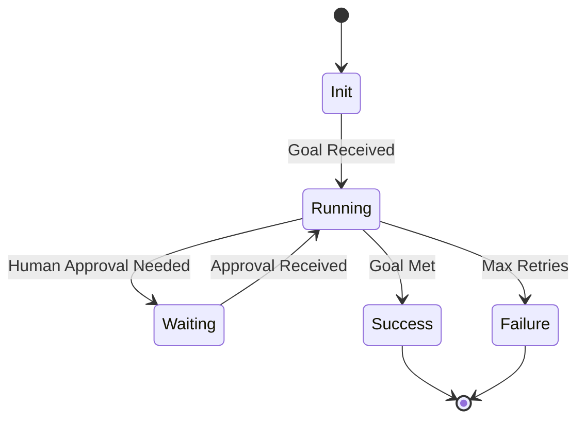

# 🔄 Agent Lifecycle: The Journey of an Autonomous Task
> **Level:** Beginner | **Language:** Hinglish | **Goal:** Master the end-to-end lifecycle of an AI agent from initialization to termination.

---

## 🧭 1. Beginner-friendly Hinglish Explanation
Agent Lifecycle ka matlab hai ek agent ki "Zindagi ka Safar". Jab aap use koi kaam dete hain, toh wo pehle apna setup karta hai (Initialization), fir duniya ko dekhta hai (Perception), sochta hai (Reasoning), kaam karta hai (Action), aur agar kaam ho gaya toh khatam hota hai (Termination). Ye bilkul ek project ki tarah hai jo shuru hota hai, execute hota hai, aur end mein report dekar finish hota hai.

---

## 🧠 2. Deep Technical Explanation
The lifecycle consists of several distinct states:
1. **Bootstrap/Init:** Environment setup, memory loading, and tool registration.
2. **Execution Loop (The Core):**
   - **Perceive:** Observing state changes or user input.
   - **Evaluate:** Comparing current state with the Goal.
   - **Act:** Invoking tools or generating responses.
3. **Sleep/Suspend:** Waiting for human input or external triggers.
4. **Finalization:** Summarizing logs, clearing cache, and returning final output.

---

## 🏗️ 3. Real-world Analogies
Agent Lifecycle ek **Office Meeting** ki tarah hai.
- **Init:** Agenda set karna.
- **Execution:** Discussion aur actions lena.
- **Termination:** Meeting minutes share karna aur room khali karna.

---

## 📊 4. Architecture Diagrams (State Machine)


---

## 💻 5. Production-ready Examples (Lifecycle Management)
```python
# 2026 Standard: Managing Agent State
class AgentLifecycle:
    def __init__(self, agent_id):
        self.state = "INIT"
        self.agent_id = agent_id

    def start(self):
        self.state = "RUNNING"
        print(f"Agent {self.agent_id} is now {self.state}")

    def pause_for_human(self):
        self.state = "WAITING"
        # Logic to notify UI

    def terminate(self, status):
        self.state = status
        print(f"Agent finished with status: {status}")

# Usage
lifecycle = AgentLifecycle("Susa-1")
lifecycle.start()
```

---

## ❌ 6. Failure Cases
- **Zombie State:** Agent khatam nahi ho raha par kuch kaam bhi nahi kar raha (Infinite loop).
- **Abrupt Termination:** Crash hone par data lose ho jana bina "Finalization" ke.

---

## 🛠️ 7. Debugging Section
- **Symptom:** Agent stuck in "INIT" state.
- **Check:** Tools ya Memory load hone mein delay ho raha hai? Check network timeouts.

---

## ⚖️ 8. Tradeoffs
- **Long-lived vs Ephemeral Agents:** Poore mahine chalne wale agents (Long-lived) history maintain rakhte hain par memory bhari ho jati hai. Ephemeral agents clean hote hain par context bhool jate hain.

---

## 🛡️ 9. Security Concerns
- **State Hijacking:** Agar koi agent ki lifecycle state manually "Success" kar de bina kaam kiye (e.g., in a financial agent).

---

## 📈 10. Scaling Challenges
- **Concurrent Lifecycles:** 10,000 agents ko ek saath manage karna requires an "Orchestrator" (like LangGraph Cloud).

---

## 💸 11. Cost Considerations
- Idle time cost: Agar agent "WAITING" state mein hai par GPU resources hold karke baitha hai, toh paise waste honge. Use serverless architectures.

---

## ⚠️ 12. Common Mistakes
- Forget to set a **Max Steps/Timeout**. Agent ko hamesha pata hona chahiye kab haar maan-ni hai.

---

## 📝 13. Interview Questions
1. How do you handle an agent that enters a non-terminating state?
2. What are the benefits of 'Checkpointing' in an agent's lifecycle?

---

## ✅ 14. Best Practices
- Use **Checkpointing** after every major action taaki failure par agent wahin se resume kar sake.
- Implement **Graceful Shutdown** to save logs.

---

## 🚀 15. Latest 2026 Industry Patterns
- **Stateless Agent Loops:** Har step ke baad state ko database mein save karna taaki compute environment ko release kiya ja sake (Cost efficiency).
- **Multi-Lifecycle Coordination:** Ek agent ka termination dusre agent ka initialization trigger karta hai.
