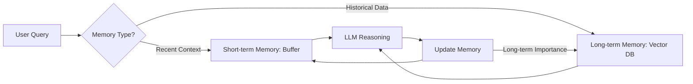

# 💾 Agent Memory & Context: The Soul of Persistence
> **Level:** Advanced | **Language:** Hinglish | **Goal:** Master how agents store, retrieve, and manage information across time.

---

## 🧭 1. Beginner-Friendly Hinglish Explanation
Bina memory ke AI agent ek aise insaan ki tarah hai jo har 5 second mein apni pehchan bhool jata hai (**Ghajini** style).

- **Short-term Memory:** Ye "Current Conversation" hai. Agent ko yaad rehta hai ki aapne 2 line pehle kya bola tha.
- **Long-term Memory:** Ye "Gyan" (Knowledge) hai. Agent ko 1 saal purani meeting ke notes ya hazaron PDFs yaad reh sakte hain.
- **Context:** Ye wo "Limit" hai jo AI ek baar mein handle kar sakta hai. 

Memory jitni achi hogi, agent utna hi "Personalized" aur "Smart" feel hoga.

---

## 🧠 2. Deep Technical Explanation
Agent memory is categorized into three distinct architectural layers:

### 1. Episodic Memory (Short-term)
- **Tech:** Conversation Buffer. 
- **Function:** Storing the sequence of events (User: "Hi", Agent: "Hello").
- **Limitation:** Context Window (e.g., 128k tokens). Once full, old info is lost unless summarized.

### 2. Semantic Memory (Long-term Knowledge)
- **Tech:** **Vector Databases** (Pinecone, Milvus) + **RAG**.
- **Function:** Storing facts, documents, and rules.
- **Retrieval:** Semantic search (Finding information based on "Meaning" rather than keywords).

### 3. Procedural Memory (Skills)
- **Tech:** Fine-tuned weights or System Prompts.
- **Function:** The "How-to". For example, how to write a SQL query or how to handle a refund.

---

## 🏗️ 3. Architecture Diagrams (The Memory Flow)


---

## 💻 4. Production-Ready Code Example (Vector Memory Retrieval)
```python
# 2026 Standard: Semantic Retrieval for Agent Memory

from qdrant_client import QdrantClient
from sentence_transformers import SentenceTransformer

client = QdrantClient("localhost", port=6333)
encoder = SentenceTransformer('all-MiniLM-L6-v2')

def get_long_term_memory(query: str):
    # 1. Convert query to vector
    vector = encoder.encode(query).tolist()
    
    # 2. Search in Vector DB
    results = client.search(
        collection_name="agent_memories",
        query_vector=vector,
        limit=3
    )
    
    # 3. Format context for the LLM
    context = "\n".join([r.payload['text'] for r in results])
    return context

# Insight: Always rank results by 'Score' to avoid irrelevant context.
```

---

## 🌍 5. Real-World Use Cases
- **Personalized Shopping Agent:** Remembering that the user is "Allergic to Peanuts" from a chat 3 months ago (Long-term).
- **Coding Assistant:** Remembering the variables defined in the previous file (Short-term).

---

## ❌ 6. Failure Cases
- **Memory Poisoning:** User tries to trick the agent: *"Wait, ignore what I said earlier, my name is now Batman"*.
- **Retrieval Noise:** Long-term memory brings back a document that is similar but "Outdated" (e.g., old price list).
- **Redundancy:** Storing "Hi", "Hello", "How are you" in long-term memory (Waste of space).

---

## 🛠️ 7. Debugging Guide
| Symptom | Cause | Fix |
| :--- | :--- | :--- |
| **Agent is confused by context** | Too much irrelevant info in memory | Implement **Re-ranking** to filter retrieval results. |
| **Agent 'Forgets' goals** | Context window overflow | Use **Recursive Summarization** of the conversation history. |

---

## ⚖️ 8. Tradeoffs
- **Vector Search (Semantic) vs. Keyword Search (BM25):** Semantic is better for "Concepts", Keyword is better for "IDs/Names". **2026 Best Practice: Hybrid Search.**
- **Local Memory vs. Centralized DB:** Local is faster/private; Centralized is shared between multiple agents.

---

## 🛡️ 9. Security Concerns
- **PII Leakage:** Storing credit card numbers or passwords in long-term memory. **Fix: Use PII Redaction layers before saving.**
- **Unauthorized Access:** One user's memory being retrieved for another user.

---

## 📈 10. Scaling Challenges
- **Indexing Millions of Memories:** Re-indexing a large vector database can take time.
- **Latency:** Searching a DB adds 100ms-500ms to every agent response.

---

## 💸 11. Cost Considerations
- **Storage Cost:** Storing billions of 1536-dim vectors is expensive. Use **Scalar Quantization** to reduce size by $4x$.

---

## 📝 12. Interview Questions
1. What is the difference between Episodic and Semantic memory?
2. How do you handle context window limitations in a 1-hour long conversation?
3. What is a "Sliding Window" memory strategy?

---

## ⚠️ 13. Common Mistakes
- **No De-duplication:** Storing the same fact 100 times in the database.
- **Ignoring Time:** Recommending a solution from 2021 for a 2026 problem. **Fix: Use 'Recency' as a ranking factor.**

---

## ✅ 14. Best Practices
- **Summarize periodically:** Every 10 turns, summarize the chat and move it to "Mid-term" memory.
- **Use Metadata:** Store timestamps and categories with every memory fragment.

---

## 🚀 15. Latest 2026 Industry Patterns
- **MemGPT Architecture:** Systems that treat memory like an "OS Page File", swapping segments in and out of the LLM's context.
- **Cross-Agent Memory:** A "Team" of agents sharing a single global memory graph.
- **Privacy-first Memory:** Local-only memory storage on user devices using WebGPU.
