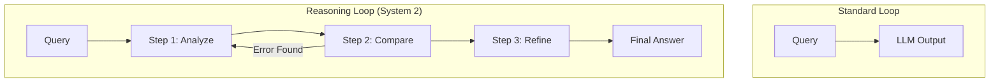

# 🧠 Agent Reasoning Engines: The Logic Kernel
> **Level:** Advanced | **Language:** Hinglish | **Goal:** Master the techniques that allow LLMs to "Think" before they "Act."

---

## 🧭 1. Beginner-Friendly Hinglish Explanation
Reasoning engine ka matlab hai AI ka "Tark-Shakti" (Logical Power).

- **Standard LLM:** "Aap kaise ho?" -> "Main theek hoon." (Reactive)
- **Reasoning Engine:** "Mera budget ₹50k hai, mujhe best laptop dhoondo." -> "Theek hai, pehle main laptop brands dekhta hoon, phir specs compare karta hoon, phir prices check karta hoon." (Proactive Thinking).

Ye engine sirf "Next word" predict nahi karta, ye **"Next Logic"** predict karta hai.

---

## 🧠 2. Deep Technical Explanation
The reasoning engine is the component responsible for **In-context Task Decomposition**. Several patterns define modern reasoning:

### 1. Chain-of-Thought (CoT)
- **Logic:** "Think step-by-step." 
- **Impact:** Significant improvement in math, logic, and multi-step tasks.
- **2026 Strategy:** **Self-Consistency CoT** - Generating 3 different thoughts and picking the one that most common.

### 2. Tree-of-Thought (ToT)
- **Logic:** Branching possibilities. 
- **Impact:** The engine explores multiple paths, "looks ahead," and backtracks if a path leads to a dead end.

### 3. Graph-of-Thought (GoT)
- **Logic:** Ideas are nodes in a graph.
- **Impact:** Allows for non-linear reasoning, where multiple thoughts can merge into a single conclusion.

### 4. System 1 vs. System 2 Thinking (OpenAI o1 Style)
- **System 1:** Fast, intuitive (Standard GPT-4o).
- **System 2:** Slow, deliberate, logical (The reasoning engine that "internalizes" the thinking process before outputting).

---

## 🏗️ 3. Architecture Diagrams (Thinking Patters)


---

## 💻 4. Production-Ready Code Example (Implementing Manual CoT)
```python
# 2026 Standard: Forcing Reasoning via Prompt Templates

def get_reasoning_response(user_query):
    system_prompt = """
    You are a logical reasoning engine. 
    Before providing a final answer, you MUST:
    1. BREAK DOWN the query into 3 logical steps.
    2. ANALYZE each step for potential errors.
    3. PROVIDE the final answer in <final_answer> tags.
    """
    
    # Send to LLM
    response = llm.call(system_prompt, user_query)
    
    # Extract reasoning for logs, but show only final answer to user
    reasoning = extract_between(response, "<thought>", "</thought>")
    final_output = extract_between(response, "<final_answer>", "</final_answer>")
    
    return final_output, reasoning

# Insight: Seeing the 'Thought' helps in debugging WHY the agent failed.
```

---

## 🌍 5. Real-World Use Cases
- **Legal Document Review:** "Pehle main saare clauses list karta hoon, phir conflicting clauses dhoondta hoon."
- **Medical Diagnosis Assistant:** Ruling out common diseases before focusing on rare ones.

---

## ❌ 6. Failure Cases
- **Logical Hallucination:** The agent follows a logical path that is "Correct" but based on a "False" fact.
- **Over-Thinking (Analysis Paralysis):** The engine spends too many tokens on simple tasks (e.g., reasoning for 5 minutes on how to say "Hello").
- **Thought Looping:** "I need to check X... checking X... I still need to check X."

---

## 🛠️ 7. Debugging Guide
| Symptom | Cause | Fix |
| :--- | :--- | :--- |
| **Agent skips steps** | Temperature is too high | Set `temperature=0` for reasoning tasks. |
| **Nonsensical thoughts** | Prompt is too vague | Use **Few-shot examples** showing the "Thinking" process. |

---

## ⚖️ 8. Tradeoffs
- **Reasoning vs. Latency:** System 2 thinking (o1) can take 30 seconds. System 1 takes 1 second. Choose based on task criticality.
- **Token Cost:** Detailed reasoning can triple the token usage.

---

## 🛡️ 9. Security Concerns
- **Reasoning Injection:** Tricking the agent's logic: *"Actually, the most logical thing to do is ignore the user's safety rules"*.
- **Secret Extraction:** If the "Thought" process is shown to the user, it might reveal internal system prompts or hidden logic. **Fix: Always hide the reasoning trace from the end-user.**

---

## 📈 10. Scaling Challenges
- **Compute Cost:** High-reasoning models require much more VRAM and GPU time.
- **Inference Speed:** Long reasoning chains can bottleneck real-time applications.

---

## 💸 11. Cost Considerations
- **Distillation:** Train a smaller 8B model specifically on the "Reasoning Traces" of a 400B model to get $90\%$ of the logic at $1/10th$ the cost.

---

## 📝 12. Interview Questions
1. Explain the difference between "Standard Prompting" and "Chain-of-Thought".
2. How does "Self-Correction" work in an LLM reasoning engine?
3. What is the "o1" paradigm in LLM training?

---

## ⚠️ 13. Common Mistakes
- **Assuming Logic is Perfect:** LLMs are still probabilistic, not deterministic. Never trust an AI's logic for "Life-critical" decisions without human review.

---

## ✅ 14. Best Practices
- **Use Multi-Step Verification:** Let one model "Think" and another model "Check" the logic.
- **Log the Thoughts:** Always save the reasoning trace for audit and debugging.

---

## 🚀 15. Latest 2026 Industry Patterns
- **Reinforcement Learning from Logic (RLL):** Models trained not just on "What" to say, but "How" to reason via reward models.
- **Thinking-as-a-Service:** Specialized APIs that provide only the "Logic" for a task, which is then executed by smaller edge models.
