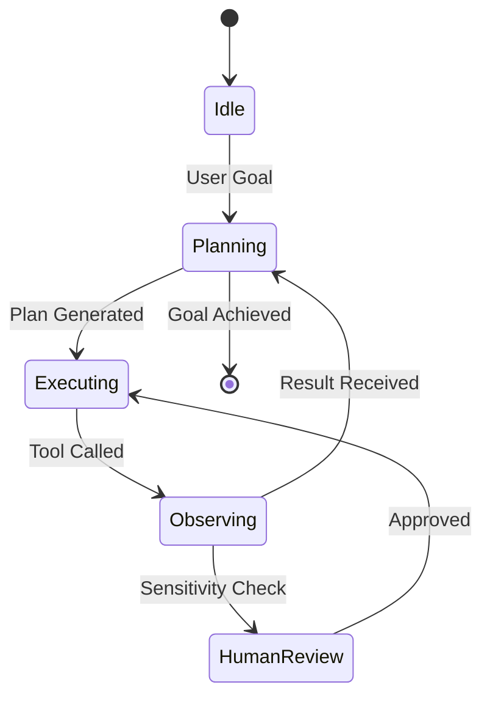

# 🔄 Agent State Management: The Pulse of Execution
> **Level:** Advanced | **Language:** Hinglish | **Goal:** Master how to track, save, and resume an agent's progress across complex workflows.

---

## 🧭 1. Beginner-Friendly Hinglish Explanation
State management ka matlab hai "Agent ka current status" save karna.

- **Stateless AI:** Aapne sawal pucha, usne jawab diya, aur wo sab bhool gaya. (Like a gold-fish).
- **Stateful Agent:** Agent ko yaad hai ki:
  - "Goal kya hai?"
  - "Abhi tak kya ho chuka hai?"
  - "Agla step kya hai?"
  - "Kaun si files open hain?"

Sochiye aap ek lamba game khel rahe hain. Agar light chali jaye, toh aap chahoge ki game wahi se start ho jahan "Save" kiya tha. **State** wahi "Save Game" file hai.

---

## 🧠 2. Deep Technical Explanation
In agentic systems, state is a structured object (often a JSON or Pydantic model) that evolves over time.

### 1. What's inside the State?
- **Plan:** The remaining tasks to be completed.
- **History:** The list of previous tool calls and their outputs.
- **Variables:** Intermediate data (e.g., a list of scraped URLs).
- **Status:** `Thinking`, `Acting`, `Waiting_for_Human`, `Completed`.

### 2. State Persistence (Checkpointing)
To handle long-running tasks, the state must be written to a database (Redis, Postgres, or MongoDB) after every "Node" execution. This allows for:
- **Resiliency:** If the server crashes, the agent resumes from the last checkpoint.
- **Time-Travel:** Debugging by looking at exactly what the state was 5 steps ago.

### 3. State Consistency
In multi-agent systems, "State" must be synchronized. If two agents update the same variable simultaneously, it leads to **State Corruption**.

---

## 🏗️ 3. Architecture Diagrams (State Transition)


---

## 💻 4. Production-Ready Code Example (Defining State with LangGraph style)
```python
# 2026 Standard: Using TypedDict for State Management

from typing import Annotated, TypedDict, List
import operator

class AgentState(TypedDict):
    # 'operator.add' ensures new messages are APPENDED, not replaced
    messages: Annotated[List[str], operator.add]
    current_step: int
    is_authorized: bool
    plan: List[str]

# Initial State
initial_state = {
    "messages": ["User: Hello Agent!"],
    "current_step": 0,
    "is_authorized": False,
    "plan": []
}

# Node function that updates state
def planning_node(state: AgentState):
    # Logic to update state
    return {"plan": ["Step 1", "Step 2"], "current_step": 1}
```

---

## 🌍 5. Real-World Use Cases
- **Multi-day Research:** An agent that researches a topic over 3 days, saving its progress every night.
- **Human-Approval Workflows:** An agent that prepares a bank transfer, saves the "State", waits for the manager to click "Approve" (maybe hours later), and then resumes.

---

## ❌ 6. Failure Cases
- **State Bloat:** Storing too much junk in the state, causing the LLM to get confused by the context size.
- **Divergent State:** The agent "Thinks" it has completed a task (State says `Done`), but the external tool actually failed (Environment says `Error`).
- **Race Conditions:** Two agents updating the `plan` at the same time.

---

## 🛠️ 7. Debugging Guide
| Symptom | Cause | Fix |
| :--- | :--- | :--- |
| **Agent repeats the same step** | State is not being updated | Ensure the return value of your node function is correctly merging with the global state. |
| **State is lost on restart** | No persistence layer | Connect your agent to a **Checkpointer** (e.g., Redis or SQL-based). |

---

## ⚖️ 8. Tradeoffs
- **Full History vs. Summary State:** Full history is great for accuracy but expensive; Summary is efficient but might lose nuance.
- **Centralized vs. Local State:** Centralized is better for scalability; Local is faster for single-agent runs.

---

## 🛡️ 9. Security Concerns
- **State Injection:** If an attacker can modify the `is_authorized` flag in your database, they can hijack the agent. **Fix: Use signed/encrypted state objects.**
- **Privacy:** State often contains PII (User emails, secrets). Ensure the state database is encrypted at rest.

---

## 📈 10. Scaling Challenges
- **Serialization Latency:** Converting a massive state object to JSON and saving it to DB every step can add significant latency.
- **Concurrent Access:** Managing state locks for thousands of parallel agents.

---

## 💸 11. Cost Considerations
- **Context Management:** Every turn, the "State" is passed to the LLM. If the state is $10k$ tokens, every message costs significantly more. **Keep state lean!**

---

## 📝 12. Interview Questions
1. Why is persistence important for autonomous agents?
2. How do you handle a "State Divergence" where the agent's internal state doesn't match the real world?
3. What is a "Checkpoint" in a LangGraph-style workflow?

---

## ⚠️ 13. Common Mistakes
- **Storing Large Objects:** Don't store a $10MB$ PDF in the state. Store the **Path** or the **Vector ID** instead.
- **Implicit State:** Relying on the LLM's conversation history as the "Only" state. Always have a structured state outside the prompt.

---

## ✅ 14. Best Practices
- **Use Pydantic:** Force your state to follow a strict schema to prevent "Hidden Bugs".
- **Version your State:** If you update your agent's code, ensure it can still read "Old" state files from the database.

---

## 🚀 15. Latest 2026 Industry Patterns
- **Time-Travel Debugging:** UIs that allow engineers to "Slide" through the agent's history and see the state changes visually.
- **Stateless-Core / Stateful-Edge:** The LLM stays stateless (efficient), while a specialized "State Engine" manages the complexity.
- **Shared Graphs:** Agents that live in a shared state environment (like a "Multi-player" game) where their states interact dynamically.
