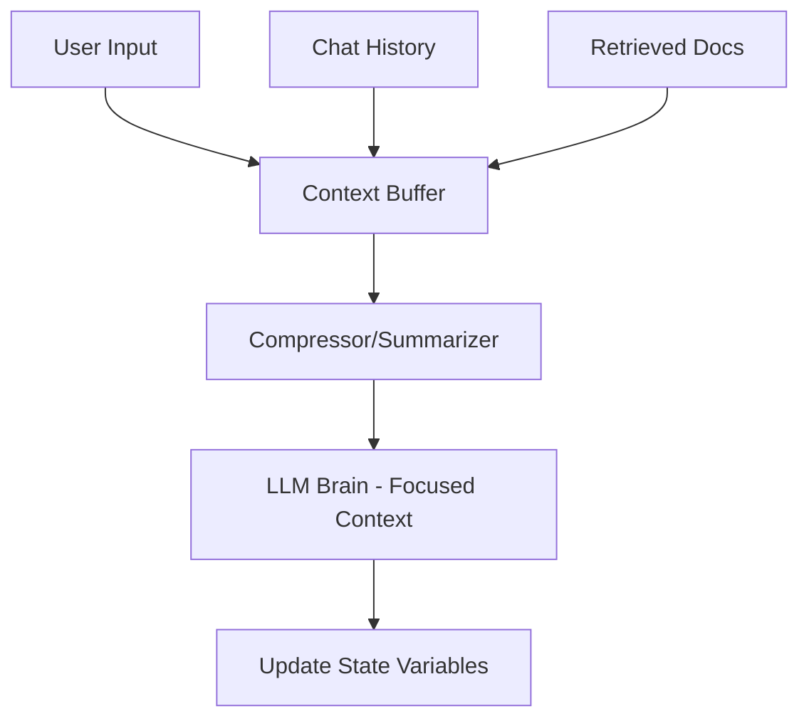

# 🧠 Agent State and Context: The Agent's Working Memory
> **Level:** Intermediate | **Language:** Hinglish | **Goal:** Master the management of dynamic state and context in autonomous agentic workflows.

---

## 🧭 1. Beginner-friendly Hinglish Explanation
Agent State aur Context ka matlab hai agent ka "Current Status". Sochiye aap ek kahani likh rahe hain. Aapko yaad rakhna hota hai ki pichle page par kya hua (Context) aur abhi kaunse characters scene mein hain (State). AI Agent ke liye bhi ye zaroori hai. Bina state ke, agent har baar ek naya insaan ban jayega aur pichli baatein bhool jayega. Context wo "Mahol" hai jisme agent kaam karta hai.

---

## 🧠 2. Deep Technical Explanation
State and Context represent the data the agent carries across loops:
1. **State:** Discrete values (e.g., `status: "searching"`, `budget_left: 50`). It determines the agent's next logic branch.
2. **Context:** Narrative and data history (e.g., chat history, retrieved documents, tool outputs). It provides the "Substance" for reasoning.
**Management:** In 2026, we use **Checkpointers** to persist state in Redis/Postgres and **Summarizers** to compress long context into a manageable window.

---

## 🏗️ 3. Real-world Analogies
State aur Context ek **Chef** ki tarah hai.
- **State:** Gas on hai ya off? Sabzi kat gayi ya nahi?
- **Context:** Recipe kya hai? Customer ne kya instructions diye the?

---

## 📊 4. Architecture Diagrams (Context Window Management)


---

## 💻 5. Production-ready Examples (State Management with TypedDict)
```python
# 2026 Standard: Defining a Structured State
from typing import TypedDict, List

class AgentState(TypedDict):
    messages: List[str]      # Conversation History (Context)
    current_step: int        # Current Progress (State)
    inventory: List[str]     # Found data (State)
    is_finished: bool        # Termination flag

# Example initialization
state: AgentState = {
    "messages": ["User: Find stocks"],
    "current_step": 0,
    "inventory": [],
    "is_finished": False
}
```

---

## ❌ 6. Failure Cases
- **Context Overload:** Context itna bada ho gaya ki agent important instructions bhool gaya (Recency bias).
- **State Inconsistency:** Agent ko lagta hai usne email bhej diya par system mein email fail ho gaya tha.

---

## 🛠️ 7. Debugging Section
- **Symptom:** Agent repeats the same question.
- **Fix:** Check if the previous answer is actually in the "Context". Kabhi-kabhi context purge hone par agent bhool jata hai ki usne pehle kya pucha tha.

---

## ⚖️ 8. Tradeoffs
- **Full History vs Summarization:** Full history accurate hoti hai par tokens mehenge padte hain. Summarization sasti hai par nuances kho deti hai.

---

## 🛡️ 9. Security Concerns
- **Context Poisoning:** Agar koi malicious document context mein aa jaye, toh wo agent ke decisions ko hijack kar sakta hai.

---

## 📈 10. Scaling Challenges
- **State Synchronization:** Jab multiple agents ek hi shared state ko update karte hain, toh "Race conditions" ho sakti hain.

---

## 💸 11. Cost Considerations
- Large context windows (e.g., 128k) are expensive. Use **Token Pruning** to remove irrelevant metadata from tool outputs.

---

## ⚠️ 12. Common Mistakes
- Purane context ko kabhi "Cleanup" na karna.
- State variables ko unstructured rakhna (Hamesha schemas use karein).

---

## 📝 13. Interview Questions
1. How do you handle a context window that exceeds the LLM's limit?
2. What is the difference between persistent state and ephemeral context?

---

## ✅ 14. Best Practices
- Use **Sliding Windows** for chat history.
- Store critical state variables in a database, not just in memory.

---

## 🚀 15. Latest 2026 Industry Patterns
- **Agentic Memory Graphs:** Context ko list ki jagah "Graph" mein store karna (Entities and Relationships).
- **Self-Cleaning Context:** AI agents jo har step ke baad apna hi context audit karke "Trash" remove karte hain.
