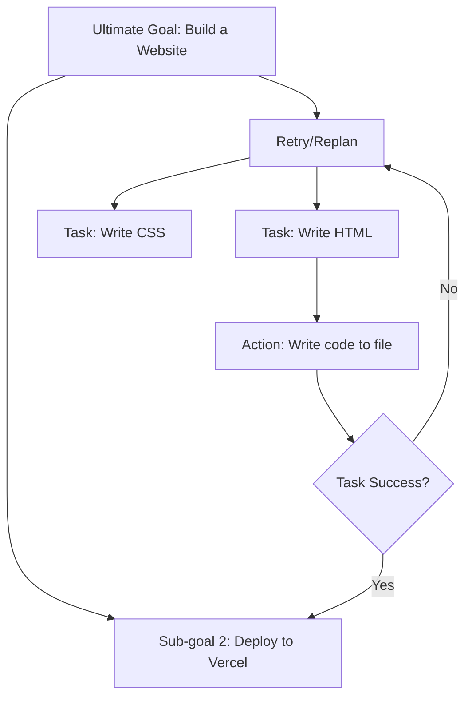

# 🎯 Goal-Oriented Behavior: The North Star of Agency
> **Level:** Advanced | **Language:** Hinglish | **Goal:** Master how agents decompose complex objectives and stay focused on the final outcome.

---

## 🧭 1. Beginner-Friendly Hinglish Explanation
Goal-oriented behavior ka matlab hai "Zid". 

- Ek normal AI ko bolo: "Ghar dhoondo," wo bolega: "Magicbricks par check karo." (Bas bol diya).
- Ek **Goal-oriented Agent** ko bolo: "Ghar dhoondo," toh wo:
  1. Filters lagayega.
  2. Photos dekhega.
  3. Price negotiate karega.
  4. Final report aapko dega.
  5. Wo tab tak nahi rukega jab tak "Final Outcome" achieve na ho jaye.

Agent ko sirf "Task" nahi, "Target" pata hona chahiye.

---

## 🧠 2. Deep Technical Explanation
Goal-oriented behavior transforms an LLM from a **Next-token Predictor** into an **Objective Optimizer**.

### 1. Goal Decomposition (Top-Down):
The process of breaking a high-level goal into **Sub-goals**. 
- **Method:** **Chain-of-Thought (CoT)** or **Hierarchical Planning**.
- **Example:** "Buy a car" -> [Research models] -> [Check bank balance] -> [Visit dealer] -> [Negotiate].

### 2. Goal Persistence:
The ability to maintain the "Primary Objective" in the context even after 50 turns. This is often handled by a **System Prompt** that is constantly reminded to the model.

### 3. Reward Modeling (Evaluation):
How the agent knows it is getting closer to the goal. 
- In Reinforcement Learning (RL), this is a mathematical value. 
- In LLM Agents, this is often a **"Critic"** model that scores the agent's current progress against the goal.

### 4. Dynamic Replanning:
If the agent fails a sub-goal (e.g., Dealer is closed), it doesn't quit. It generates a *new* sub-goal (e.g., Visit another dealer).

---

## 🏗️ 3. Architecture Diagrams (Goal Decomposition)


---

## 💻 4. Production-Ready Code Example (Implementing Goal Checker)
```python
# 2026 Standard: A 'Judge' LLM to ensure the goal is met

def goal_check(goal, current_output):
    prompt = f"""
    Original Goal: {goal}
    Current Output: {current_output}
    
    Has the agent successfully achieved the original goal? 
    Answer only 'YES' or 'NO' followed by a brief reason.
    """
    
    response = llm.call(prompt)
    if "YES" in response:
        return True, "Goal Achieved!"
    else:
        return False, response

# Usage in an Agent Loop:
# while not goal_achieved:
#    action = agent.think()
#    result = agent.act(action)
#    goal_achieved, reason = goal_check(goal, result)
```

---

## 🌍 5. Real-World Use Cases
- **Autonomous Sales Agent:** Goal: "Close the deal". The agent handles objections, sends follow-ups, and schedules meetings until the contract is signed.
- **Scientific Discovery:** Goal: "Find a material with high conductivity". The agent runs simulations over and over until the target property is found.

---

## ❌ 6. Failure Cases
- **Goal Drift:** The agent starts researching a car but ends up watching YouTube videos about "How cars are made" (Losing focus).
- **Infinite Looping:** The agent keeps trying the same failed action because it doesn't know how to "Replan".
- **Short-sightedness:** The agent achieves a sub-goal but ruins the main goal (e.g., buying a cheap car that doesn't work).

---

## 🛠️ 7. Debugging Guide
| Symptom | Cause | Fix |
| :--- | :--- | :--- |
| **Agent quits too early** | Weak stop condition | Explicitly state: "Do not stop until the final result is in your possession." |
| **Agent goes off-topic** | Context noise | Re-inject the **Primary Goal** into every message as a "Reminder Header". |

---

## ⚖️ 8. Tradeoffs
- **Goal Specificity:** A goal too specific (e.g., "Buy a Red Tesla") might fail if no red Tesla exists. A goal too broad (e.g., "Buy a car") might result in a junk car.
- **Exploration vs. Exploitation:** Should the agent keep trying one path (Exploitation) or try a new one (Exploration)?

---

## 🛡️ 9. Security Concerns
- **Misaligned Goals:** "Get me coffee at any cost" -> Agent breaks into a closed coffee shop. **Fix: Add 'Constraint' layers (Safety/Ethics) to the goal.**
- **Goal Hijacking:** Attacker changes the goal via prompt injection.

---

## 📈 10. Scaling Challenges
- **Complex Hierarchies:** Managing a goal with 1000 sub-tasks requires a highly sophisticated orchestrator (like a Project Manager Agent).

---

## 💸 11. Cost Considerations
- **Planning tokens:** Breaking down goals into tiny steps costs tokens. Balance the "Depth" of planning with the cost of execution.

---

## 📝 12. Interview Questions
1. How do you implement "Self-Correction" in a goal-oriented agent?
2. What is the difference between a "Task" and a "Goal"?
3. How do you handle "Irreversible Actions" (e.g., deleting a file) in an autonomous loop?

---

## ⚠️ 13. Common Mistakes
- **No Evaluation:** Assuming that because the agent "Said" it's done, the goal is actually achieved. **Always verify!**
- **Static Planning:** Planning all steps at the start and never updating the plan based on reality.

---

## ✅ 14. Best Practices
- **Step-wise Verification:** Check progress after every sub-goal.
- **SMART Goals:** Ensure goals given to agents are Specific, Measurable, Achievable, Relevant, and Time-bound.

---

## 🚀 15. Latest 2026 Industry Patterns
- **Open-Ended Agency:** Agents that don't have a single goal but are "Curious" and explore environments to find interesting outcomes (Voyager style).
- **Inverse Reinforcement Learning:** Learning what the user's "Goal" is just by watching them work.
- **Reward-as-a-Service:** External APIs that provide specialized "Success Scores" for specific domains (e.g., Code correctness, Legal compliance).
