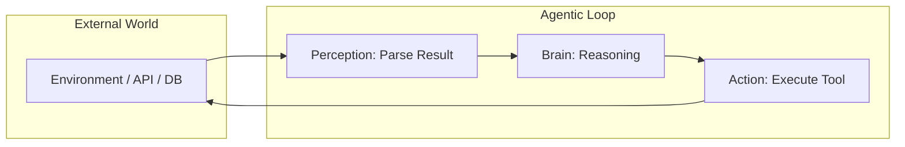

# 🔄 Perception-Action Loop: The heartbeat of Agency
> **Level:** Advanced | **Language:** Hinglish | **Goal:** Master the fundamental cycle that allows an agent to live, learn, and act in an environment.

---

## 🧭 1. Beginner-Friendly Hinglish Explanation
Perception-Action loop ek "Insaan" ki tarah kaam karta hai. 

1.  **Perception (Dekhna):** Aap dekhte hain ki raste mein gaddha (hole) hai.
2.  **Action (Karna):** Aap side se nikal jate hain.
3.  **Observation (Feedback):** Aap dekhte hain ki aap safe hain aur aage badh sakte hain.

AI Agents ke liye bhi yahi hai. Wo "Perceive" karte hain (Data/Logs/API response read karna), phir "Act" karte hain (Tool call karna), aur phir "Result" ko dekh kar agla decision lete hain. Ye loop tab tak chalta hai jab tak kaam khatam na ho jaye.

---

## 🧠 2. Deep Technical Explanation
The Perception-Action loop is a **Stateful Feedback Loop** that connects the Agent's internal reasoning with the external world.

### 1. Perception (Input)
- **Modality:** Text, Code, JSON, Images, or Sensor data.
- **Processing:** The agent parses the environment's current state. This is more than just reading; it's **Interpretation**.
- **Contextualization:** Integrating the new observation with existing memory.

### 2. Cognition (Thinking/Reasoning)
- The "Brain" (LLM) decides what to do based on the perception.
- It asks: *"Does the current state match my goal? If not, what's the next delta I need to change?"*

### 3. Action (Output)
- The agent invokes a tool or performs a side effect (e.g., writing a file).
- This changes the **Environment**.

### 4. The Delta (Update)
- The environment sends back a result (Success/Error/Data).
- The agent **Perceives** this change, and the loop restarts.

---

## 🏗️ 3. Architecture Diagrams (The Loop)


---

## 💻 4. Production-Ready Code Example (The `while` Loop)
```python
# 2026 Standard: The core of every autonomous agent

def agent_loop(goal):
    state = "INITIAL"
    while state != "SUCCESS":
        # 1. PERCEIVE
        observation = environment.get_current_view()
        
        # 2. THINK & ACT
        # LLM decides based on Goal + Observation
        thought, action = llm.decide(goal, observation)
        
        # 3. EXECUTE
        if action == "DONE":
            state = "SUCCESS"
            break
            
        result = tools.execute(action)
        
        # 4. UPDATE ENVIRONMENT (Implicitly handled by tool execution)
        print(f"Thought: {thought} | Result: {result}")

# Insight: Always add a 'Max Loops' count to prevent infinite loops.
```

---

## 🌍 5. Real-World Use Cases
- **Web Browsing Agents:** Perceive (Read HTML) -> Action (Click Button) -> Perceive (New Page loaded).
- **Game AI:** Perceive (Enemy position) -> Action (Move/Shoot) -> Perceive (Enemy health dropped).

---

## ❌ 6. Failure Cases
- **Feedback Delay:** The agent acts, but the environment takes 10 seconds to update. The agent might "Act again" before the first one finishes (Race condition).
- **Perception Blindness:** The tool failed but returned "Success: True" (even though it didn't work). The agent thinks it's done. **Fix: Verification steps.**
- **Infinite Loops:** The environment doesn't change, and the agent doesn't realize its action is failing.

---

## 🛠️ 7. Debugging Guide
| Symptom | Cause | Fix |
| :--- | :--- | :--- |
| **Agent is stuck** | Environment state is static | Check if the tool actually has permission to change the environment. |
| **Agent repeats actions** | Observation is not updated | Ensure `environment.get_current_view()` is called *inside* the loop. |

---

## ⚖️ 8. Tradeoffs
- **High Frequency Loop:** Fast but expensive and prone to jitter.
- **Low Frequency Loop:** Cheaper but might miss critical environment changes.

---

## 🛡️ 9. Security Concerns
- **Environment Hijacking:** An attacker changes the environment (e.g., changes a file the agent is reading) to trick the agent's next action.
- **Action Flooding:** The agent enters a loop and calls a paid API 10,000 times in 1 minute. **Fix: Implement 'Rate Limiting' at the agent level.**

---

## 📈 10. Scaling Challenges
- **Latency:** Every loop requires an LLM call (1-5 seconds). A 10-step loop takes 50 seconds.
- **State Serialization:** Managing the loop state across distributed servers.

---

## 💸 11. Cost Considerations
- **Token Usage:** Every loop cycle sends the entire history back to the LLM. **Strategy: Use 'Sliding Window' memory to keep only the last 5 observations.**

---

## 📝 12. Interview Questions
1. What is the "Perception-Action Loop" in the context of autonomous agents?
2. How do you handle a "Partially Observable" environment?
3. What happens if the 'Action' fails but the agent 'Perceives' it as a success?

---

## ⚠️ 13. Common Mistakes
- **No Loop Break:** Forgetting to define a clear exit strategy (Max iterations or Goal Met).
- **Ignoring Tool Errors:** Not feeding the "Traceback" or "Error Message" back into the Perception phase.

---

## ✅ 14. Best Practices
- **Verify after Action:** Always add an "Observation" step to confirm the action had the intended effect.
- **Async Loops:** Run perception and action asynchronously if the environment allows.

---

## 🚀 15. Latest 2026 Industry Patterns
- **Continuous Perception:** Agents that don't wait for a loop; they "Listen" to an event stream and act only when needed (Event-driven agency).
- **On-device Loops:** Running the loop entirely on a local NPU for sub-100ms latency.
- **Sim-to-Real Loops:** Agents trained in a simulator loop (Perceive/Act) before being deployed in the real world.
