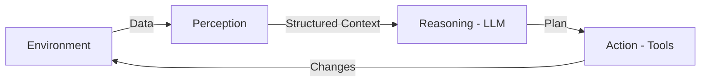

# 👁️ Perception, Reasoning, Action: The Cognitive Loop
> **Level:** Intermediate | **Language:** Hinglish | **Goal:** Master the triadic cycle that powers autonomous decision-making in AI agents.

---

## 🧭 1. Beginner-friendly Hinglish Explanation
Insaan kaise kaam karta hai? Pehle hum dekhte hain (Perception), fir dimaag chalate hain (Reasoning), aur fir hath-pair hilate hain (Action). AI Agents ke liye bhi yahi 3 steps sab kuch hain. Agent duniya se data leta hai, LLM ke zariye uska matlab nikalta hai, aur fir kisi tool ko call karta hai. Ye cycle tab tak chalta hai jab tak kaam poora na ho jaye.

---

## 🧠 2. Deep Technical Explanation
The cycle is technically defined as:
1. **Perception (The Input):** Converting raw signals (Text, JSON, Images) into structured embeddings or narrative context.
2. **Reasoning (The Processor):** The LLM analyzes the perception against the Goal. Patterns like **ReAct** (Reason + Act) or **Chain-of-Thought** are used here to prevent shortcuts.
3. **Action (The Output):** The agent generates a "Tool Call" or "Message". This action then changes the environment, which is again "Perceived" in the next loop.

---

## 🏗️ 3. Real-world Analogies
Ye cycle ek **Cricket Batsman** ki tarah hai.
- **Perception:** Ball ki speed aur trajectory dekhna.
- **Reasoning:** Sochna ki kaunsa shot khelna hai (Six ya Single?).
- **Action:** Balla ghumana.

---

## 📊 4. Architecture Diagrams (The Triadic Cycle)


---

## 💻 5. Production-ready Examples (The Reasoning Logic)
```python
# 2026 Standard: A simple PRA loop
def pra_loop(goal):
    while True:
        # 1. Perception
        state = get_system_logs() 
        
        # 2. Reasoning
        prompt = f"Goal: {goal}. Current State: {state}. What is next?"
        reasoning = llm.think(prompt) 
        
        # 3. Action
        if "COMPLETE" in reasoning: break
        action = extract_tool(reasoning)
        execute(action)
```

---

## ❌ 6. Failure Cases
- **Perception Blindness:** Agent ignore kar deta hai ki database connection fail ho gaya hai.
- **Reasoning Loop:** Agent sirf "Reason" kar raha hai par "Action" nahi le raha (Analysis Paralysis).

---

## 🛠️ 7. Debugging Section
- **Symptom:** Agent is taking the wrong action.
- **Check:** Perception data. Kya agent ko sahi inputs mil rahe hain? Agar inputs sahi hain, toh "System Prompt" (Reasoning) ko theek karein.

---

## ⚖️ 8. Tradeoffs
- **Reactive vs Proactive:** Reactive agents perception ka wait karte hain (Safe). Proactive agents predict karte hain (Fast but risky).

---

## 🛡️ 9. Security Concerns
- **Sensor Spoofing:** Agar perception layer mein galat data (Fake logs) feed kiya jaye, toh reasoning aur action dono dangerous ho sakte hain.

---

## 📈 10. Scaling Challenges
- **High-Frequency Loops:** Real-time applications mein ye loop millisecond mein chalna chahiye, jisme current LLM latency ek rukawat hai.

---

## 💸 11. Cost Considerations
- Har loop ek API call hai. Optimize by merging multiple perception data into one reasoning step.

---

## ⚠️ 12. Common Mistakes
- Perception layer ko bypass karke seedha "Action" generate karna (No reasoning).
- Ignoring the "Observation" after an Action.

---

## 📝 13. Interview Questions
1. Why is the 'Perception' layer critical for agents in dynamic environments?
2. How does the 'ReAct' framework implement the Reasoning-Action link?

---

## ✅ 14. Best Practices
- Define clear **Schemas** for the perception data.
- Use **Checkpoints** between reasoning and action for human validation.

---

## 🚀 15. Latest 2026 Industry Patterns
- **Active Perception:** Agents jo khud decide karte hain ki unhe kaunsa data "Observe" karna hai (Filtering noise).
- **Multi-modal Perception:** Agents jo camera stream aur text logs ko ek saath perceive karte hain.
