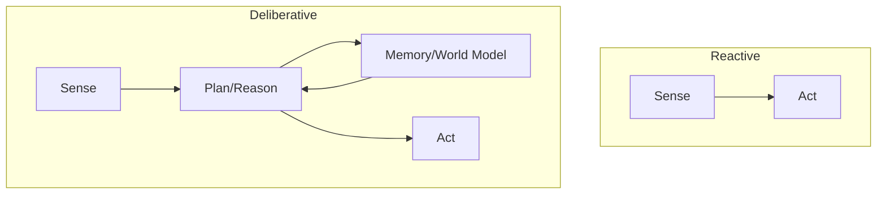

# ⚡ Reactive vs Deliberative Agents: Speed vs Thinking
> **Level:** Intermediate | **Language:** Hinglish | **Goal:** Understand the two fundamental types of agent architectures and when to use which.

---

## 🧭 1. Beginner-friendly Hinglish Explanation
Reactive Agent wo hai jo "Turant Response" deta hai bina zyada soche (jaise ek automatic door sensor). Deliberative Agent wo hai jo kaam karne se pehle "Poora Plan" banata hai (jaise ek chess player). Reactive agents fast hote hain par complex kaam nahi kar sakte. Deliberative agents smart hote hain par unhe time aur compute zyada lagta hai. 2026 mein, hum "Hybrid" agents banate hain jo dono ka fayda lete hain.

---

## 🧠 2. Deep Technical Explanation
1. **Reactive Agents (Stateless/Simple):** These operate on a direct mapping from `Observation -> Action`. They use `If-Then` rules or simple neural networks. No internal model of the world.
2. **Deliberative Agents (Stateful/Cognitive):** These maintain an internal "World Model". They use search, planning, and reasoning (like Tree-of-Thought) to simulate future outcomes before acting.
**Modern Shift:** LLMs allow us to build "Pseudo-Deliberative" agents that reason in natural language, but we must use **Memory** to make them truly deliberative.

---

## 🏗️ 3. Real-world Analogies
- **Reactive:** Aapka hath garam tave par lage toh aap turant hata lete hain (Reflex).
- **Deliberative:** Aap sochte hain ki tave par kya pakaun aur kitni gas rakhun (Planning).

---

## 📊 4. Architecture Diagrams (Reactive vs Deliberative)


---

## 💻 5. Production-ready Examples (Hybrid Logic)
```python
# 2026 Standard: Hybrid Agent Controller
def agent_controller(input_type):
    if input_type == "emergency_stop":
        # Reactive Path (Fast)
        return execute_immediate_stop()
    else:
        # Deliberative Path (Thoughtful)
        plan = llm.plan_long_term_strategy()
        return execute_plan(plan)
```

---

## ❌ 6. Failure Cases
- **Reactive Failure:** Agent trap mein phans jata hai kyunki use "Badi Picture" nahi dikhti.
- **Deliberative Failure:** System crash ho jata hai jab tak agent "Sochta" hai (Latency issue in real-time).

---

## 🛠️ 7. Debugging Section
- **Symptom:** Agent is too slow for simple tasks.
- **Fix:** Move simple tasks to a "Reactive" rule-based layer. Har cheez ke liye LLM reasoning ki zaroorat nahi hoti.

---

## ⚖️ 8. Tradeoffs
- **Reactive:** Low Latency, Low Cost, Low Intelligence.
- **Deliberative:** High Intelligence, High Cost, High Latency.

---

## 🛡️ 9. Security Concerns
- **Exploiting Reactive Rules:** Hackers reactive agents ki fixed rules ko "Predict" karke unhe ullu bana sakte hain.

---

## 📈 10. Scaling Challenges
- Deliberative agents scale nahi hote jab 1 million requests handle karni hon (Too expensive). Use **Tiered Architectures**.

---

## 💸 11. Cost Considerations
- Reactive agents (Small models or logic) are 100x cheaper than Deliberative LLM agents.

---

## ⚠️ 12. Common Mistakes
- Har simple action ke liye "Chain-of-Thought" (Deliberation) use karna.
- Reactive system mein complex goals dalne ki koshish karna.

---

## 📝 13. Interview Questions
1. When should you use a Reactive architecture over a Deliberative one?
2. How does 'State' differentiate these two types of agents?

---

## ✅ 14. Best Practices
- Use **Reactive** for safety and immediate responses.
- Use **Deliberative** for high-stakes planning and strategy.

---

## 🚀 15. Latest 2026 Industry Patterns
- **Edge-Cloud Hybrid:** Reactive logic browser/edge par chalti hai, aur Deliberative logic cloud par.
- **Fast and Slow Thinking (Dual Process):** Agents jo dono modes ke beech mein dynamically switch karte hain based on task complexity.
