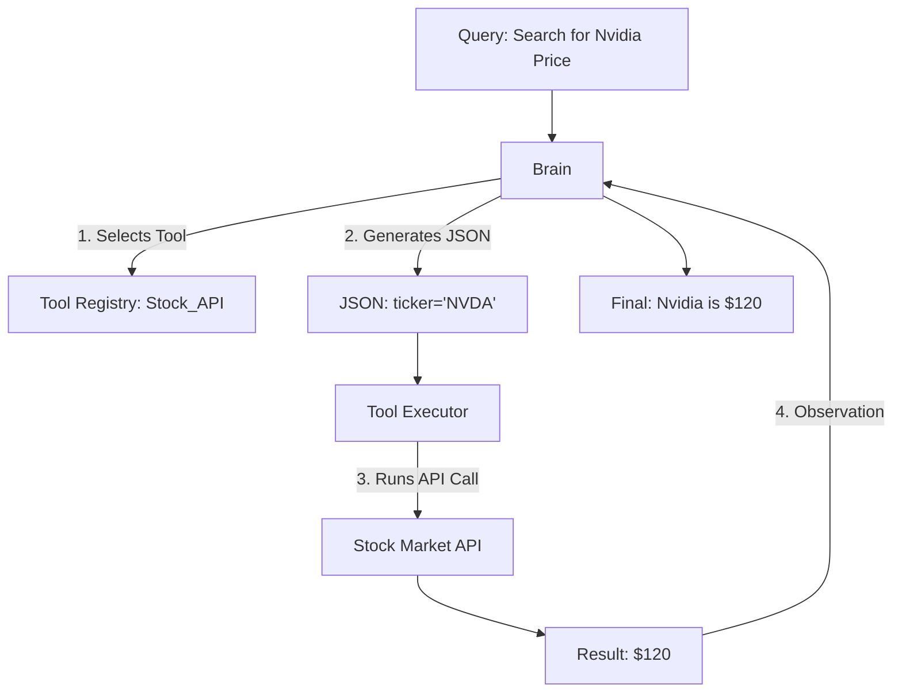

# 🛠️ Tool Usage & Action Spaces: The Agent's Hands
> **Level:** Advanced | **Language:** Hinglish | **Goal:** Master how agents interact with the digital world through function calling and API integration.

---

## 🧭 1. Beginner-Friendly Hinglish Explanation
Tool Usage ka matlab hai AI ko "Shakti" dena.

- **Standard AI:** "Mausam kya hai?" -> "Main nahi bata sakta kyunki mere paas internet nahi hai."
- **AI Agent with Tools:** "Mausam kya hai?" -> AI "Weather Tool" (API) call karta hai -> Results padhta hai -> "Mumbai mein dhoop hai."

**Action Space** ka matlab hai un sabhi kaamo ki "List" jo AI kar sakta hai. Agar AI ke paas sirf "Search" aur "Email" tools hain, toh uska action space wahi dono hain.

---

## 🧠 2. Deep Technical Explanation
Agents interact with environments via **Function Calling** (also known as Tool Use).

### 1. Tool Definition (The Schema)
The agent doesn't just "Guess" how to use a tool. We provide a **JSON Schema** (standardized by OpenAI/Anthropic) that defines:
- **Name:** e.g., `get_weather`.
- **Description:** What the tool does.
- **Parameters:** What inputs it needs (e.g., `city: string`).

### 2. Action Space
- **Discrete Action Space:** A fixed set of tools (e.g., [Search, Calculate, Save]).
- **Continuous/Large Action Space:** When an agent can write and execute arbitrary code (e.g., a **Code Interpreter**). This is the most powerful form of action space.

### 3. Tool Invocation Sequence
1.  **Selection:** LLM identifies the tool needed.
2.  **Argument Generation:** LLM creates the JSON payload for the tool.
3.  **Execution:** The system (not the LLM) runs the actual code.
4.  **Observation:** The result is fed back into the LLM.

---

## 🏗️ 3. Architecture Diagrams (Tool Execution Flow)


---

## 💻 4. Production-Ready Code Example (Defining a Tool with Pydantic)
```python
# 2026 Standard: Using Pydantic for strict tool definitions

from pydantic import BaseModel, Field

class WeatherInput(BaseModel):
    city: str = Field(description="The name of the city, e.g. London")

def get_weather(city: str) -> str:
    # Actual API logic here
    return f"The weather in {city} is 25°C."

# Tool Definition for the Agent
weather_tool = {
    "name": "get_weather",
    "description": "Get current weather for a city",
    "parameters": WeatherInput.schema()
}

# Insight: Always validate tool outputs before giving them back to the LLM.
```

---

## 🌍 5. Real-World Use Cases
- **Customer Support:** Tools to "Lookup Order", "Reset Password", "Send Email".
- **Financial Research:** Tools to "Search SEC Filings", "Calculate Ratios", "Plot Graphs".
- **Smart Home:** Tools to "Turn on Lights", "Set Temperature".

---

## ❌ 6. Failure Cases
- **Parameter Hallucination:** LLM invents a parameter that doesn't exist (e.g., passing `country` to a tool that only accepts `city`).
- **Malformed JSON:** LLM forgets a closing bracket in the tool call. **Fix: Use 'JsonOutputParser' with retries.**
- **Tool Timeout:** External API is slow, causing the agent loop to hang.

---

## 🛠️ 7. Debugging Guide
| Symptom | Cause | Fix |
| :--- | :--- | :--- |
| **Agent calls the wrong tool** | Descriptions are too similar | Make tool names and descriptions distinct and unique. |
| **Invalid JSON in tool call** | Weak Model (e.g., 7B) | Use **Few-shot examples** showing the exact JSON format required. |

---

## ⚖️ 8. Tradeoffs
- **Too many tools:** LLM gets confused (Context noise). Limit to < 10 tools per agent.
- **Generic vs. Specific Tools:** One `run_script` tool (Flexible but dangerous) vs. ten specific `get_user`, `update_user` tools (Safe but rigid).

---

## 🛡️ 9. Security Concerns
- **Remote Code Execution (RCE):** If an agent has a `run_python` tool, it can delete files or steal environment variables. **Fix: Use Sandboxed environments (Docker/E2B).**
- **Data Exfiltration:** Agent uses a tool to read sensitive data and another to "Post to Public Webhook".

---

## 📈 10. Scaling Challenges
- **Latency:** Tool execution (especially web search) adds seconds to the response.
- **Concurrent Tool Use:** Multiple agents trying to "Edit the same file" simultaneously.

---

## 💸 11. Cost Considerations
- **Excessive Tooling:** Every tool definition adds to the system prompt (token cost). Use **Dynamic Tool Selection** (only show relevant tools).

---

## 📝 12. Interview Questions
1. How does "Function Calling" work in modern LLMs?
2. What is the difference between an "Action Space" and a "Reasoning Space"?
3. How do you handle errors returned by a tool?

---

## ⚠️ 13. Common Mistakes
- **Vague Descriptions:** Writing "Search tool" instead of "Tool to search for technical documentation only".
- **No Error Handling:** If a tool fails, the agent shouldn't crash; it should get the error message as an observation.

---

## ✅ 14. Best Practices
- **Strict Typing:** Use Pydantic/TypeScript for tool inputs.
- **Human-in-the-loop:** Always require approval for "Destructive" tools (Delete, Send Money).
- **Dry Runs:** Have a "Simulation" mode for tools.

---

## 🚀 15. Latest 2026 Industry Patterns
- **MCP (Model Context Protocol):** Standardized way to define tools so they work across OpenAI, Anthropic, and Local models.
- **Tool-use Specialization:** Fine-tuning small models (7B) specifically to excel at using tools with $99.9\%$ accuracy.
- **Zero-shot Tool Use:** Models that can "Read a documentation page" and use a new tool they've never seen before.
