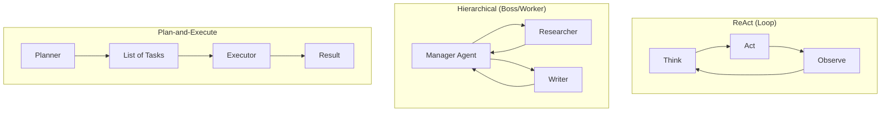

# 🏛️ Agent Architectures: The Blueprints of Intelligence
> **Level:** Advanced | **Language:** Hinglish | **Goal:** Master the different ways to structure AI agents for complex, real-world tasks.

---

## 🧭 1. Beginner-Friendly Hinglish Explanation
Architecture ka matlab hai "Agent ko kaise set kiya gaya hai". 

Jaise har kaam ke liye alag building design hoti hai (School vs Hospital), waise hi har agent ke liye alag architecture hoti hai:
- **Simple Loop (ReAct):** Ek hi agent jo baar-baar sochta aur kaam karta hai.
- **Team (Multi-Agent):** Alag-alag agents jo ek dusre se baat karke bada kaam karte hain.
- **Boss & Workers (Hierarchical):** Ek master agent jo kaam "Assign" karta hai aur chote agents use "Execute" karte hain.

Sahi architecture choose karna hi ek AI Engineer ka sabse bada kaam hai.

---

## 🧠 2. Deep Technical Explanation
Agent architectures define the **Flow of Control** and **Information Exchange** within an agentic system.

### 1. Single-Agent Architectures
- **Linear/Chain:** Fixed sequence of steps.
- **Cyclic (ReAct):** The agent loops until a termination condition is met. Good for exploratory tasks.
- **Reflective:** The agent has a "Self-critique" phase to improve its own output.

### 2. Multi-Agent Architectures
- **Collaborative:** Agents work together on a shared state.
- **Competitive:** Agents challenge each other to find the best solution (e.g., Debate-style).
- **Hierarchical:** A "Manager" agent oversees "Worker" agents, reducing the cognitive load on each individual model.

### 3. State Management
Architectures can be **Stateless** (every turn is fresh) or **Stateful** (progress is tracked in a graph). Modern frameworks like **LangGraph** treat architectures as **Directed Acyclic Graphs (DAGs)**.

---

## 🏗️ 3. Architecture Diagrams (The Big Three)


---

## 💻 4. Production-Ready Code Example (A Simple Router Architecture)
```python
# 2026 Standard: Routing tasks to specialized agents

def router_architecture(query):
    # LLM decides which specialized agent to use
    intent = llm.classify(query, ["coding", "billing", "general"])
    
    if intent == "coding":
        return coding_agent.run(query)
    elif intent == "billing":
        return billing_agent.run(query)
    else:
        return general_agent.run(query)

# Insight: Routers reduce latency by not sending everything to the 'Big' model.
```

---

## 🌍 5. Real-World Use Cases
- **Software Development:** A "Coder" agent writes code, a "Reviewer" agent critiques it (Collaborative).
- **Travel Booking:** A "Researcher" agent finds hotels, a "Planner" agent builds the itinerary (Hierarchical).

---

## ❌ 6. Failure Cases
- **Infinite Delegation:** Two agents keep passing the task back and forth: "You do it" -> "No, you do it".
- **Lost in Translation:** The Manager gives vague instructions to the Worker, leading to wrong results.
- **Architecture Bloat:** Using a multi-agent system for a task that could be done with a single prompt.

---

## 🛠️ 7. Debugging Guide
| Symptom | Cause | Fix |
| :--- | :--- | :--- |
| **Agents are arguing** | Conflicting system prompts | Harmonize the "Personas" and "Goals" of collaborating agents. |
| **System is extremely slow** | Too many sequential agent calls | Parallelize agent tasks where possible using `asyncio`. |

---

## ⚖️ 8. Tradeoffs
- **Single vs Multi-Agent:** Single is cheaper and faster; Multi is more accurate for complex, specialized tasks.
- **Autonomous vs Hardcoded Workflows:** Autonomous is flexible; Hardcoded is reliable.

---

## 🛡️ 9. Security Concerns
- **Orchestration Hijacking:** If an attacker can inject instructions into the "Manager" agent, they control the whole team.
- **Data Leaks:** Workers might pass sensitive data to other agents that don't have the same security clearance.

---

## 📈 10. Scaling Challenges
- **Token Usage:** Multi-agent systems can consume $10x$ more tokens due to agent-to-agent communication.
- **Latency:** Every agent "Handoff" adds significant wait time.

---

## 💸 11. Cost Considerations
- **Model Tiering:** Use high-end models (Claude 3.5 Opus) for the "Manager" and low-end models (Haiku/Gemma) for "Workers".

---

## 📝 12. Interview Questions
1. When would you choose a Multi-Agent architecture over a Single-Agent one?
2. What is the role of a "Router" in agentic systems?
3. Explain the "Plan-and-Execute" pattern.

---

## ⚠️ 13. Common Mistakes
- **No Clear Exit:** Forgetting to tell the agents how to "End" the collaboration.
- **Circular Dependencies:** Agent A waiting for B, and B waiting for A.

---

## ✅ 14. Best Practices
- **Define Clear Roles:** Give each agent a specific, non-overlapping responsibility.
- **Use Shared Memory:** Ensure all agents in a team have access to the same "Truth" (Vector DB).

---

## 🚀 15. Latest 2026 Industry Patterns
- **Agentic Swarms:** Hundreds of tiny agents solving massive problems in parallel.
- **Dynamic Architectures:** The system "Builds" the architecture on the fly based on the user's query.
- **Stateful Graph Orchestration:** Moving away from linear chains to complex state-machines (LangGraph).
