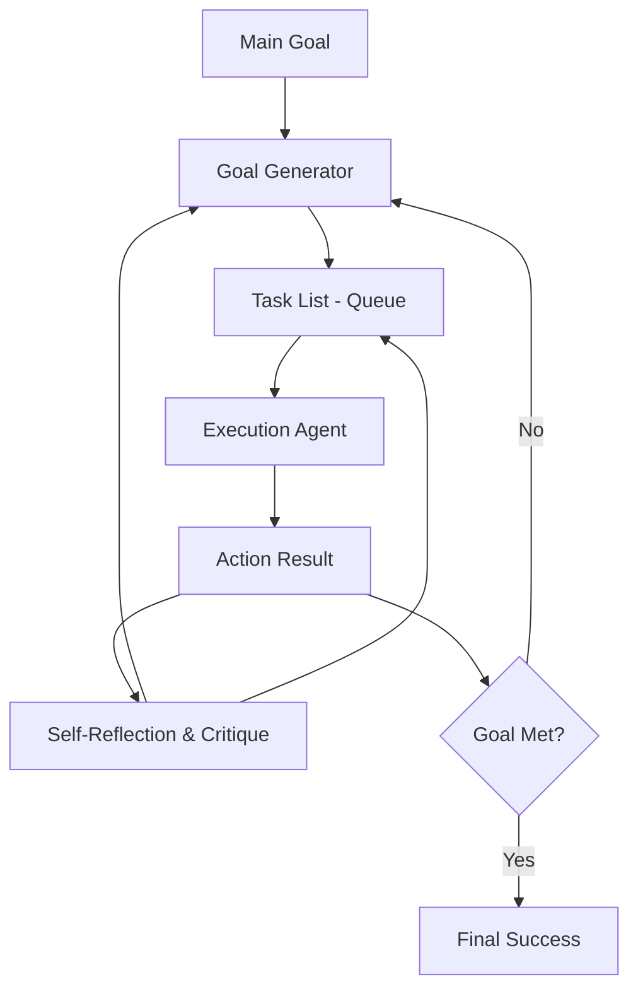

# 🤖 Autonomous Agent Architectures: The Independent Thinkers
> **Level:** Advanced | **Language:** Hinglish | **Goal:** Master the architectures that allow agents to set their own goals and work without human intervention.

---

## 🧭 1. Beginner-friendly Hinglish Explanation
Autonomous Agent ka matlab hai wo AI jo "Self-Driven" hai. Sochiye aapne agent ko bola "Ek profitable niche dhoondo aur ek blog post likho". Wo aapse dubara nahi puchega. Wo khud goals banayega, khud research karega, khud errors theek karega aur end mein aapko result dega. Ye architectures "Goal-Oriented" hoti hain, "Task-Oriented" nahi. Ye ek aisa robot hai jise aap rasta nahi, sirf "Manzil" batate hain.

---

## 🧠 2. Deep Technical Explanation
Autonomous agents operate in a continuous loop:
1. **Self-Goal Generation:** LLM generates a list of sub-tasks based on a broad objective.
2. **Prioritization:** Sorting tasks based on importance and dependencies.
3. **Task Execution:** Using tools (ReAct/Plan-and-Execute) to finish a sub-task.
4. **Self-Reflection:** Reviewing the result and updating the goal list (removing finished tasks, adding new ones).
**Examples:** AutoGPT (2023), BabyAGI, and modern **Self-Evolving Agents**.

---

## 🏗️ 3. Real-world Analogies
Autonomous Agent ek **Entrepreneur** ki tarah hai.
- **Goal:** Ek business shuru karna.
- **Autonomy:** Wo khud decide karta hai ki kab marketing karni hai aur kab product banana hai. Use kisi boss (User) ki constant instructions ki zarurat nahi hai.

---

## 📊 4. Architecture Diagrams (The Autonomous Loop)


---

## 💻 5. Production-ready Examples (The Autonomous Loop Logic)
```python
# 2026 Standard: Autonomous Task Management
task_list = ["Research market"]
while task_list:
    current_task = task_list.pop(0)
    result = agent.execute(current_task)
    
    # Critical Step: Self-Goal Generation
    new_tasks = agent.generate_next_tasks(result)
    task_list.extend(new_tasks)
    
    # Terminate if goal reached
    if agent.check_goal_met(result): break
```

---

## ❌ 6. Failure Cases
- **Hallucinated Progress:** Agent ko lagta hai usne kaam kar liya par actually kuch nahi hua.
- **Infinite Loop:** Agent baar-baar wahi tasks list mein add kar raha hai (Recursive loop).

---

## 🛠️ 7. Debugging Section
- **Symptom:** Agent is drifting away from the main goal.
- **Fix:** System prompt mein "Global Objective" ko har loop mein remind karwayein. Use a **Goal Auditor** agent to keep it on track.

---

## ⚖️ 8. Tradeoffs
- **High Autonomy vs Predictability:** Bahut autonomous agents unpredictable hote hain aur kabhi-kabhi mehenge (high token use) padte hain.

---

## 🛡️ 9. Security Concerns
- **Runaway Costs:** Ek autonomous agent agar "Infinite task creation" mode mein chala jaye, toh wo $1000s ka bill 1 ghante mein bana sakta hai. Always set **Token Budgets**.

---

## 📈 10. Scaling Challenges
- Managing long-term memory across 100 loops. Memory summarize na karne par context window crash ho jayegi.

---

## 💸 11. Cost Considerations
- Use **Checkpoints** taaki aap agent ko stop kar sakein aur kal wahin se resume karein without re-running the whole loop.

---

## ⚠️ 12. Common Mistakes
- **No Stop Sequence:** Agent ko ye batana bhool jana ki "Stop when goal achieved".
- Tool errors par fallback na dena.

---

## 📝 13. Interview Questions
1. How does an Autonomous Agent maintain its 'Focus' over long-horizon tasks?
2. What is the role of a 'Critic' in autonomous architectures?

---

## ✅ 14. Best Practices
- Implement **Max Step Limits** (e.g., max 25 iterations).
- Use **Hierarchical Memory** to store only high-level task summaries.

---

## 🚀 15. Latest 2026 Industry Patterns
- **Sovereign Agents:** Agents jo apni hi memory aur crypto-wallets manage karte hain to pay for their own compute.
- **Self-Healing Code Agents:** Agents jo autonomously bug dhundhte hain aur fix deploy karte hain.
