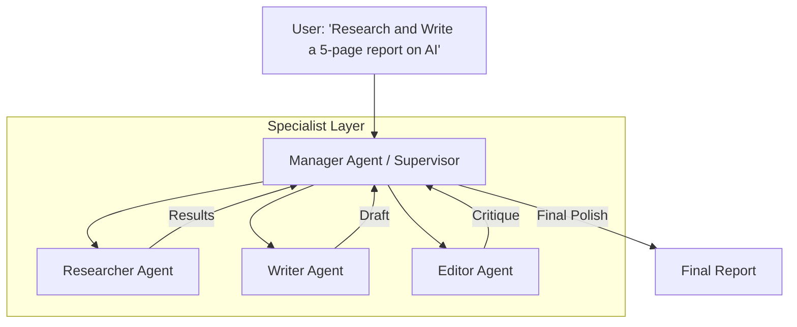

# 👑 Hierarchical Agent Architecture: The Manager-Worker Pattern
> **Level:** Advanced | **Language:** Hinglish | **Goal:** Master the "Divide and Conquer" strategy for orchestrating multiple specialized agents.

---

## 🧭 1. Beginner-Friendly Hinglish Explanation
Hierarchical architecture ka matlab hai **"Boss aur Mazdoor"** ka setup.

- **The Problem:** Agar ek hi agent ko sab kuch karne ko bologe (Searching, Coding, Summarizing, Reporting), toh uska dimaag "Khichdi" (confused) ban jayega.
- **The Solution:** Ek **Manager Agent** rakho (The Boss). 
  - Boss khud kaam nahi karta, wo sirf kaam "Assign" karta hai.
  - Wo "Researcher" agent ko bolta hai: "Data dhoondo."
  - Wo "Writer" agent ko bolta hai: "Report likho."
  - Wo "Reviewer" agent ko bolta hai: "Galti check karo."

Isse har agent apne kaam mein "Expert" rehta hai aur system bahut reliable ho jata hai.

---

## 🧠 2. Deep Technical Explanation
In a Hierarchical architecture, the **Central Orchestrator** (Manager) manages a **Static or Dynamic set of Sub-agents**.

### 1. The Manager (The Dispatcher)
- **Responsibility:** Decomposing the user query into high-level sub-tasks.
- **Decision Logic:** Routing sub-tasks to the correct agent based on its description (Action space).
- **Consolidation:** Collecting the results from workers and synthesizing the final answer.

### 2. The Worker Agents (Specialists)
- **Responsibility:** Executing a specific domain-level task.
- **Cognitive Load:** Workers have smaller context and fewer tools, making them faster and more accurate.

### 3. Communication Protocol
- Typically happens via a **"Supervisor Node"** in graphs (e.g., LangGraph). The supervisor maintains the state and decides "Who's next?".

---

## 🏗️ 3. Architecture Diagrams (The Hierarchy)


---

## 💻 4. Production-Ready Code Example (Using a Supervisor Pattern)
```python
# 2026 Standard: Conceptual Supervisor Logic

def supervisor_run(task):
    members = ["Researcher", "Writer", "Coder"]
    state = {"history": [], "next_member": None}
    
    while True:
        # Manager decides who should work next
        decision = manager_llm.generate(f"Task: {task}\nMembers: {members}\nStatus: {state['history']}\nWho is next?")
        
        if decision == "FINISH":
            break
            
        # Dispatch to worker
        worker_output = call_agent(decision, task, state['history'])
        
        # Update state
        state['history'].append({"agent": decision, "output": worker_output})

# Insight: Supervisor architecture is much more scalable than 'Linear Chains'.
```

---

## 🌍 5. Real-World Use Cases
- **Enterprise Report Generation:** Finance team agents research data, while the writing team formats the PDF.
- **Autonomous Coding Teams:** One agent writes the frontend, one writes the backend, and one writes the tests.
- **Complex Customer Support:** A "Triage" agent decides if the query is Technical, Billing, or Sales, and routes it to the expert agent.

---

## ❌ 6. Failure Cases
- **The "Lazy Boss" Problem:** The Manager keeps assigning tasks but never checks if they are done correctly.
- **Infinite Loop of Handoffs:** Researcher sends data to Writer -> Writer says "I need more data" -> Manager sends back to Researcher -> (Repeat).
- **Context Loss:** The Manager loses the "Big Picture" because it is too busy managing the details of every worker.

---

## 🛠️ 7. Debugging Guide
| Symptom | Cause | Fix |
| :--- | :--- | :--- |
| **Workers don't know the goal** | Manager isn't passing the 'Context' | Ensure the Manager passes a "Sub-task Instruction" along with the "Full Goal". |
| **System is stuck** | No 'Final Answer' condition | Explicitly prompt the Manager: "If the goal is met, output 'FINISH'." |

---

## ⚖️ 8. Tradeoffs
- **Reliability vs. Latency:** Very reliable because of separation of concerns, but very slow due to multiple sequential calls.
- **Cost:** High (Manager call + Worker calls).

---

## 🛡️ 9. Security Concerns
- **Privilege Mismanagement:** Manager has full access, but workers should have **Least Privilege**. A "Researcher" agent shouldn't have access to the "Payment" API.
- **Instruction Injection:** A worker agent returning a "Malicious Result" that tricks the Manager into taking a bad action.

---

## 📈 10. Scaling Challenges
- **The "Manager Bottleneck":** If you have 50 workers, one Manager LLM will get overwhelmed. **Solution: Hierarchical managers (Manager of Managers).**

---

## 💸 11. Cost Considerations
- **Use Small Models for Workers:** Workers are specialists; they don't need to be "Brilliant". Use **Llama-3-8B** for workers and **GPT-4o** for the Manager.

---

## 📝 12. Interview Questions
1. Why is a Hierarchical architecture better than a single-agent architecture for complex tasks?
2. What is a "Supervisor Node" in an agentic graph?
3. How do you handle communication between two worker agents?

---

## ⚠️ 13. Common Mistakes
- **No Shared State:** Workers not knowing what other workers have already done.
- **Over-management:** Manager micro-managing every single line of a worker's task.

---

## ✅ 14. Best Practices
- **Clear Descriptions:** Give each worker a very clear "Role" in the system prompt.
- **Verification:** The Manager should "Audit" a worker's output before moving to the next task.

---

## 🚀 15. Latest 2026 Industry Patterns
- **Dynamic Worker Spawning:** The Manager creates (spawns) new agents on the fly based on the problem.
- **Agentic Mesh:** Workers that can "Self-organize" without a Manager for simple tasks.
- **Recursive Hierarchy:** An agent that realizes it's overwhelmed and spawns its *own* Manager to help.
