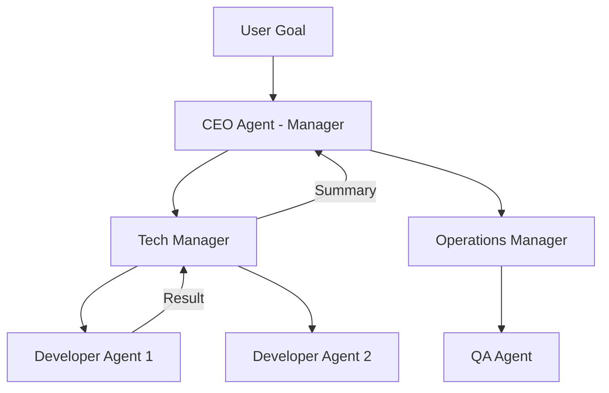

# 🏰 Hierarchical Agents: Command and Control
> **Level:** Advanced | **Language:** Hinglish | **Goal:** Master the design of multi-layer agentic systems where high-level goals are managed by a "Manager" and executed by "Workers".

---

## 🧭 1. Beginner-friendly Hinglish Explanation
Hierarchical Agents ka matlab hai ek "Hierarchy" (Company structure) banana. Sochiye ek CEO hai (Manager Agent). CEO ko code likhna nahi aata, par use pata hai ki project kaise finish karna hai. Wo Managers ko orders deta hai, aur Managers niche Developers (Worker Agents) se kaam karwate hain. Ye architecture bahut bade aur complex projects ke liye zaroori hai kyunki ye kaam ko "Layers" mein divide kar deta hai.

---

## 🧠 2. Deep Technical Explanation
Hierarchical architectures use a "Divide and Conquer" strategy:
1. **The Manager (Top-level):** Interprets the main goal, maintains global state, and decomposes tasks.
2. **Sub-Managers (Mid-level):** Handle specific domains (e.g., Finance, Tech).
3. **Workers (Bottom-level):** Atomic agents that perform specific tasks using tools.
4. **Information Flow:** Goals flow down (top-to-bottom), and results/summaries flow up (bottom-to-top).
**Benefit:** It reduces the context burden on any single agent.

---

## 🏗️ 3. Real-world Analogies
Hierarchical Agents ek **Army** ki tarah hain.
- **General:** Poori war strategy banata hai.
- **Captains:** Specific boundaries aur squads ko lead karte hain.
- **Soldiers:** Actually field par action lete hain.

---

## 📊 4. Architecture Diagrams (The Command Structure)


---

## 💻 5. Production-ready Examples (Manager-Worker Pattern)
```python
# 2026 Standard: Defining a Hierarchical Team
class TeamManager:
    def __init__(self, workers):
        self.workers = workers # List of specialized agents

    def coordinate(self, goal):
        plan = llm.decompose(goal)
        results = []
        for task in plan:
            worker = self.select_worker(task)
            res = worker.execute(task)
            results.append(res)
        return llm.summarize(results)

# Worker specializes in only one tool
search_worker = Agent(role="Searcher", tool=google_search)
```

---

## ❌ 6. Failure Cases
- **Information Silos:** Worker 1 ko nahi pata Worker 2 ne kya kiya, aur Manager ne unhe coordinate nahi kiya.
- **Micromanagement:** Manager har step par worker se details maang raha hai, jisse tokens waste ho rahe hain.

---

## 🛠️ 7. Debugging Section
- **Symptom:** The final result is missing data from one of the workers.
- **Check:** The "Upward Communication". Kya worker ne sahi "Success Signal" bheja? Manager ko hamesha "Status Code" check karna chahiye.

---

## ⚖️ 8. Tradeoffs
- **Complexity vs Efficiency:** Setup bahut mushkil hai par bada kaam bina iske nahi ho sakta.
- **Latency:** Multiple layers ka matlab hai bahut saari internal communication latency.

---

## 🛡️ 9. Security Concerns
- **Privilege Management:** CEO agent ke paas sabka access hona chahiye, par Worker agents ke paas sirf unke tool ka. Never give a Worker access to the Manager's API keys.

---

## 📈 10. Scaling Challenges
- 10-layer hierarchy handle karna "Orchestration Hell" ban sakta hai. Use **LangGraph** to manage the state at each level.

---

## 💸 11. Cost Considerations
- Use **Cheaper Models** for Workers (atomic tasks) and **Expensive Models** only for the Top Manager (reasoning).

---

## ⚠️ 12. Common Mistakes
- Manager aur Workers ko same context window dena (Redundancy).
- Clear reporting format define na karna.

---

## 📝 13. Interview Questions
1. How does a Hierarchical architecture prevent 'Context Overload'?
2. What is the role of a 'Router' in a hierarchical system?

---

## ✅ 14. Best Practices
- Every agent should have a **Specific Persona**.
- Implement **Reporting Templates** for workers to ensure the Manager gets clean data.

---

## 🚀 15. Latest 2026 Industry Patterns
- **Dynamic Hierarchy:** Agents jo khud decide karte hain ki unhe kab naya "Worker" spawn karna hai (Self-organization).
- **Swarm-Hierarchy Hybrid:** Tasks ke liye swarm use karna aur decision making ke liye hierarchy.
