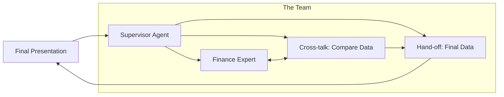

# 🤝 Multi-Agent Architecture: The Power of Collaboration
> **Level:** Extreme Advanced | **Language:** Hinglish | **Goal:** Master the coordination of multiple AI agents working together as a team or a swarm.

---

## 🧭 1. Beginner-Friendly Hinglish Explanation
Multi-Agent Architecture ka matlab hai **"AI ki Paltan"** (A team of AIs).

- **The Idea:** Ek "Akela" agent sab kuch nahi kar sakta. Agar aapko ek movie banani hai, toh aapko Director, Scriptwriter, aur Editor chahiye. 
- **The Execution:** Multi-agent systems mein hum alag-alag AIs ko alag "Roles" dete hain. 
  - Agent A (Researcher) data lata hai.
  - Agent B (Analyst) use check karta hai.
  - Agent C (Writer) report likhta hai.
  - Wo ek dusre se "Chat" karte hain aur galthiyan pakadte hain.

Ye bilkul ek "Corporate Office" ki tarah kaam karta hai jahan har employee ek specialist hota hai.

---

## 🧠 2. Deep Technical Explanation
Multi-agent systems (MAS) distribute the cognitive load and specialized tool access across multiple LLM instances.

### 1. Inter-Agent Communication
Agents talk to each other via **Message Passing**. This can be:
- **Sequential:** A -> B -> C.
- **Broadcast:** A talks to everyone.
- **Bilateral:** A and B debate until they agree.

### 2. Coordination Strategies
- **Consensus:** All agents must agree before an action is taken.
- **Auction-based:** The agent that is most "Confident" takes the task.
- **Hierarchical:** A "Supervisor" node routes tasks (as seen in Folder 02.4).

### 3. State Synchronization
All agents usually share a **Common State** (like a shared document or a Vector DB) so they don't repeat each other's work.

---

## 🏗️ 3. Architecture Diagrams (The Team Flow)


---

## 💻 4. Production-Ready Code Example (Conceptual CrewAI/AutoGen Logic)
```python
# 2026 Standard: Multi-Agent Team Orchestration

class AgentTeam:
    def __init__(self, agents):
        self.agents = agents # List of specialized agents
        self.shared_state = {}

    def run_collaboration(self, task):
        # Step 1: Research
        research = self.agents['researcher'].execute(task)
        self.shared_state['data'] = research
        
        # Step 2: Critique
        critique = self.agents['critic'].execute(research)
        
        # Step 3: Rewrite if needed
        if "Bad" in critique:
            final = self.agents['researcher'].execute(f"Fix this: {research} based on {critique}")
            return final
        
        return research

# Insight: MAS (Multi-agent systems) reduce 'Reasoning Bias' by having multiple perspectives.
```

---

## 🌍 5. Real-World Use Cases
- **Software Development Teams:** Agent-1 (Architect), Agent-2 (Coder), Agent-3 (QA). They build the whole app by talking to each other.
- **Medical Consultation:** One agent checks symptoms, another checks drug interactions, and a third cross-checks with historical patient data.
- **Financial Trading:** Different agents monitoring different markets (Crypto, Stocks, Forex) and coordinating a "Hedged" trade.

---

## ❌ 6. Failure Cases
- **Agent Echo-Chamber:** One agent makes a mistake, and the other agents "Agree" with it instead of correcting it.
- **Communication Overhead:** The agents spend more tokens talking to each other than actually working on the task.
- **Infinite Debate:** Two agents disagree and keep arguing forever in a loop.

---

## 🛠️ 7. Debugging Guide
| Symptom | Cause | Fix |
| :--- | :--- | :--- |
| **Conflicting Outputs** | Agents have overlapping roles | Narrow down the **Persona** of each agent. |
| **System is too slow** | Sequential communication | Use **Parallel Communication** for independent sub-tasks. |

---

## ⚖️ 8. Tradeoffs
- **Team Size:** More agents = Higher accuracy but Higher cost and Latency.
- **Collaborative vs. Competitive:** Competitive (Debate) is more accurate but uses much more tokens.

---

## 🛡️ 9. Security Concerns
- **Sybil Attack (Internal):** A malicious agent in the team tricks the others into revealing secrets.
- **Data Privacy:** Sensitive data from one agent's "Private Memory" being shared with others.

---

## 📈 10. Scaling Challenges
- **State Serialization for Teams:** Saving the conversation history of 5 agents is $5x$ more complex than 1 agent.
- **Token Usage:** Multi-agent systems can easily burn through $\$100$ in an hour of testing.

---

## 💸 11. Cost Considerations
- **Hierarchical Token Savings:** Only send the "Summary" of Worker A's work to Worker B, not the whole log.

---

## 📝 12. Interview Questions
1. What is the benefit of a Multi-Agent system over a single large LLM?
2. Explain "Inter-agent Communication Protocols".
3. How do you handle "Consensus" in a team of 3 agents?

---

## ⚠️ 13. Common Mistakes
- **No Leader:** Not having a "Final Decision Maker" leading to indecision.
- **Oversharing:** Sending every agent's full history to every other agent. (Context clutter).

---

## ✅ 14. Best Practices
- **Assign Personas:** Give agents names and distinct personalities (e.g., "The Skeptical Auditor").
- **Limit Communication Turns:** Set a maximum of 3 "Talk-back" rounds between agents.

---

## 🚀 15. Latest 2026 Industry Patterns
- **Agentic Swarms:** Using thousands of "Tiny" agents (like insects) to solve distributed problems.
- **Cross-Framework MAS:** A CrewAI agent talking to an AutoGen agent via a standardized protocol (**MCP**).
- **Human-as-an-Agent:** The human is treated as just another node in the agentic graph, receiving "Tasks" from the AI.
