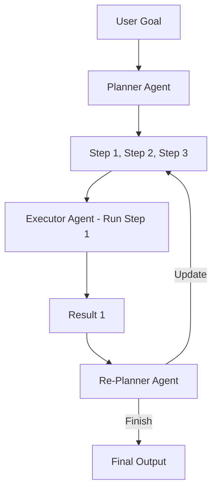

# 🗺️ Plan and Execute: The Strategic Architecture
> **Level:** Intermediate | **Language:** Hinglish | **Goal:** Master the architecture that separates long-term planning from short-term task execution.

---

## 🧭 1. Beginner-friendly Hinglish Explanation
Plan and Execute ka matlab hai pehle "Naksha" banana aur fir "Kaam" karna. Sochiye aapko ek bada event organize karna hai. Aap pehle hi step par phool kharidne nahi jayenge. Pehle aap ek list banayenge (Planning): 1. Venue book karo, 2. Guest list banao, 3. Khana order karo. Uske baad aap ek-ek karke kaam karenge (Execution). Ye architecture complex tasks ke liye best hai kyunki ye agent ko "Main Goal" se bhatakne nahi deti.

---

## 🧠 2. Deep Technical Explanation
This architecture decouples the brain into two roles:
1. **The Planner:** Takes the user goal and breaks it into a DAG (Directed Acyclic Graph) or a sequential list of steps.
2. **The Executor:** Takes one step at a time and uses a ReAct loop to complete it.
3. **The Re-Planner:** Every few steps, the planner reviews the progress and updates the remaining plan based on new information.
**Benefit:** It reduces token usage for long tasks because the whole "Reasoning" doesn't need to happen in every loop.

---

## 🏗️ 3. Real-world Analogies
Plan and Execute ek **Construction Project** ki tarah hai.
- **Planner:** Architect jo blueprint banata hai.
- **Executor:** Labors jo deewar khadi karte hain.
- **Re-planner:** Manager jo dekhta hai ki barish ho gayi toh schedule kaise badalna hai.

---

## 📊 4. Architecture Diagrams (The Planning Workflow)


---

## 💻 5. Production-ready Examples (Plan Schema)
```python
# 2026 Standard: Structured Planning
from pydantic import BaseModel
from typing import List

class Plan(BaseModel):
    steps: List[str]

def create_plan(task):
    # LLM call to generate a list of steps
    return llm.with_structured_output(Plan).invoke(task)

def execute_step(step):
    # Specialized agent for single step execution
    return step_agent.run(step)
```

---

## ❌ 6. Failure Cases
- **Stale Plans:** Planner ne plan bana diya par Step 1 mein kuch aisa hua ki Step 2 ab possible hi nahi hai (e.g., Ticket sold out). Bina Re-planning ke system fail ho jayega.
- **Over-Planning:** Har chhoti cheez ke liye 10 steps ka plan banana.

---

## 🛠️ 7. Debugging Section
- **Symptom:** Agent completes Step 1 and stops.
- **Check:** Re-planner logic. Kya re-planner ko pata hai ki Step 1 finish ho gaya hai? Check the state transfer between Executor and Re-planner.

---

## ⚖️ 8. Tradeoffs
- **Reliability vs Speed:** Planning accurate hoti hai par plan banane mein extra time lagta hai.
- **Cost:** Do alag agents (Planner + Executor) mean multiple LLM calls.

---

## 🛡️ 9. Security Concerns
- **Step Hijacking:** Agar koi bich ke step ka result manipulate kar de, toh baaki poora plan galat direction mein ja sakta hai.

---

## 📈 10. Scaling Challenges
- Complex tasks mein plan 20-30 steps ka ho sakta hai. Inhe manage karne ke liye efficient state-sharing (Redis/Postgres) zaroori hai.

---

## 💸 11. Cost Considerations
- Use a **High-tier Model** (GPT-4o) for Planning and a **Lower-tier Model** (GPT-4o-mini) for Execution to optimize costs.

---

## ⚠️ 12. Common Mistakes
- Bina Re-planning ke "Static Plan" use karna.
- Plan ke steps ko bahut zyada vague rakhna (e.g., "Do research" is a bad step).

---

## 📝 13. Interview Questions
1. How does 'Plan and Execute' handle unexpected errors during a step?
2. Why is this architecture better for 'Long-Horizon' tasks than simple ReAct?

---

## ✅ 14. Best Practices
- Keep steps **Atomic**. Ek step ka result dusre par clear depend hona chahiye.
- Implement **Human Approval** after the initial plan is made for high-stakes tasks.

---

## 🚀 15. Latest 2026 Industry Patterns
- **Parallel Execution:** Planner aise steps identify karta hai jo ek saath (parallel) ho sakte hain to save time.
- **Hierarchical Planning:** Sub-plans for each main step for massive projects.
