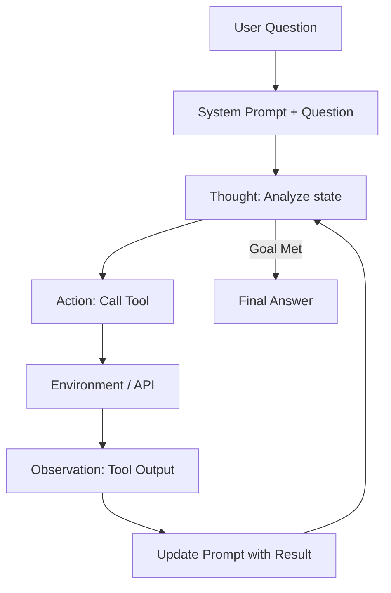

# 🔄 ReAct Architecture: Reason + Act
> **Level:** Advanced | **Language:** Hinglish | **Goal:** Master the most popular agentic pattern—interleaving thought traces with tool execution.

---

## 🧭 1. Beginner-Friendly Hinglish Explanation
ReAct ka matlab hai **"Socho aur Karo"**.

- **Normal AI (Reasoning only):** "Mujhe batao kal baarish hogi?" -> AI guess karta hai (Hallucination chance high).
- **ReAct AI:**
  1. **Thought:** "Mujhe internet check karna chahiye."
  2. **Action:** Internet par "Weather" search karna.
  3. **Observation:** "Kal baarish hone wali hai."
  4. **Thought:** "Ab mujhe user ko answer dena chahiye."
  5. **Final Answer:** "Haan, kal baarish hogi."

Ye loop AI ko "Grounding" deta hai (Real world se connect karta hai).

---

## 🧠 2. Deep Technical Explanation
The **ReAct** (Reason + Act) paradigm was introduced in 2022 to solve the gap between "Reasoning" and "Action".

### 1. The Synergistic Loop:
ReAct combines **Chain-of-Thought (CoT)** with **Action Execution**. 
- Without "Act", CoT might hallucinate facts.
- Without "Reason", Action might be random or inefficient.

### 2. The Prompt Structure:
A ReAct prompt usually follows a strict pattern:
- **Question:** The user's input.
- **Thought:** The model's internal reasoning about what to do next.
- **Action:** The tool name and arguments to call.
- **Observation:** The result returned by the system/environment.
- **... (Repeat)**
- **Final Answer:** The goal reached.

### 3. State Maintenance:
The agent must keep the *entire* trace of Thoughts, Actions, and Observations in its context window to maintain coherence.

---

## 🏗️ 3. Architecture Diagrams (The ReAct Loop)


---

## 💻 4. Production-Ready Code Example (Implementing a ReAct Loop)
```python
# 2026 Standard: ReAct Logic implementation

def react_loop(question):
    context = f"Question: {question}\n"
    for i in range(MAX_STEPS):
        # 1. Generate Thought + Action
        response = llm.generate(context + "Thought:")
        
        if "Final Answer:" in response:
            return response.split("Final Answer:")[-1]
            
        # 2. Extract and Execute Action
        action_json = extract_json(response)
        observation = tools.execute(action_json)
        
        # 3. Feed Observation back
        context += f"Thought: {response}\nObservation: {observation}\n"

# Insight: Always handle 'Tool Errors' as Observations so the agent can fix them.
```

---

## 🌍 5. Real-World Use Cases
- **Interactive Search:** Agent searches one term, finds a new keyword, and searches again to refine.
- **Automated Debugging:** Agent reads a log, thinks about the cause, tries a fix, observes the result, and iterates.

---

## ❌ 6. Failure Cases
- **Reasoning Drift:** After 5 loops, the agent's "Thoughts" become irrelevant to the original question.
- **Observation Ignorance:** The tool returns "Error 404", but the agent's next "Thought" is: "Great, I found the data!".
- **Early Exit:** Agent says "Final Answer" without actually solving the problem.

---

## 🛠️ 7. Debugging Guide
| Symptom | Cause | Fix |
| :--- | :--- | :--- |
| **Infinite Loop** | Agent doesn't recognize it has the answer | Add "If you have the answer, output 'Final Answer'" to the prompt. |
| **Hallucinated Actions** | Model is too small (e.g., 8B) | Use **Few-shot examples** showing the exact format. |

---

## ⚖️ 8. Tradeoffs
- **Accuracy vs. Cost:** ReAct is highly accurate but uses a lot of tokens because it repeats the whole history every turn.
- **Flexibility vs. Speed:** It can solve anything but is sequential and slow.

---

## 🛡️ 9. Security Concerns
- **Tool Injection:** Attacker-controlled data in an "Observation" might trick the agent's next "Thought" into doing something malicious. **Fix: Sanitize all tool outputs.**

---

## 📈 10. Scaling Challenges
- **Context Limit:** Long ReAct loops can hit the $128k$ token limit.
- **Multi-step Latency:** A 10-step ReAct chain takes $\sim 30-60$ seconds.

---

## 💸 11. Cost Considerations
- **Stop early:** Implement a "Maximum Iterations" (e.g., 5) to prevent infinite billing loops.

---

## 📝 12. Interview Questions
1. How does ReAct improve over simple Chain-of-Thought?
2. What happens if an "Observation" is missing in a ReAct loop?
3. Design a ReAct prompt for a Calculator tool.

---

## ⚠️ 13. Common Mistakes
- **Hiding Observations:** Not showing the *exact* tool output to the LLM.
- **Messy Parsing:** Not using a structured format like JSON for the "Action" part.

---

## ✅ 14. Best Practices
- **Use Clear Delimiters:** Use `Thought:`, `Action:`, `Observation:` tags clearly.
- **Self-Correction:** If a tool fails, prompt the agent: "That didn't work. Think of another way."

---

## 🚀 15. Latest 2026 Industry Patterns
- **ReAct-o1:** Using reasoning-optimized models (like OpenAI o1) to generate much deeper thoughts between actions.
- **Speculative Action:** Predicting the observation to save time (Active research).
- **Asynchronous ReAct:** Multiple ReAct loops running in parallel for sub-tasks.
