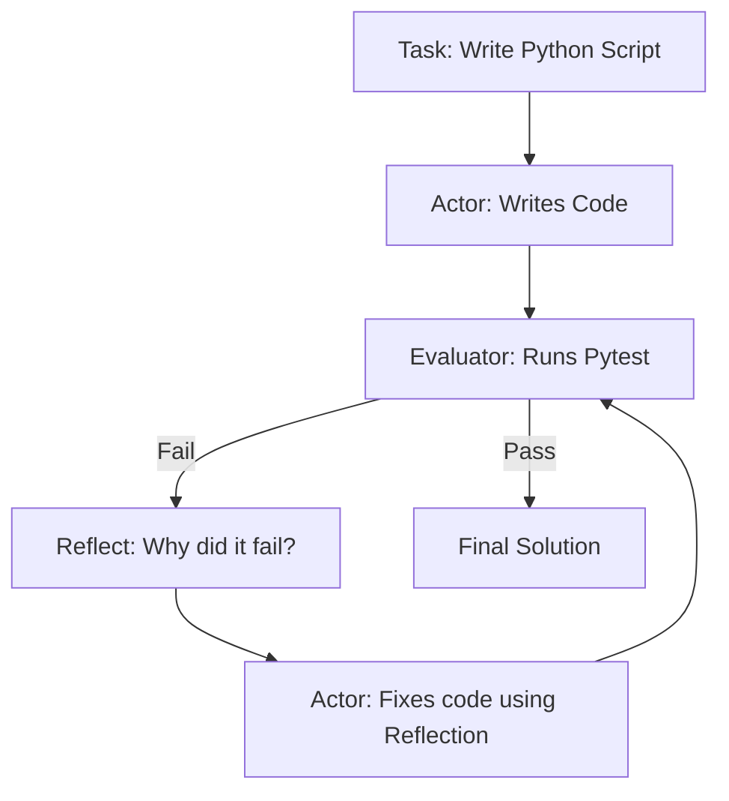

# 🔄 Reflexion Architecture: The Self-Correcting Agent
> **Level:** Extreme Advanced | **Language:** Hinglish | **Goal:** Master the "Self-Feedback Loop" that allows agents to learn from their own mistakes in real-time.

---

## 🧭 1. Beginner-Friendly Hinglish Explanation
Reflexion ka matlab hai **"Apni galtiyon se seekhna"**.

- **Normal Agent:** Kaam kiya, error aaya, aur wahi ruk gaya.
- **Reflexion Agent:**
  1. Kaam kiya.
  2. Error aaya.
  3. **Reflect:** Agent khud se puchta hai: "Maine kya galti ki? Shayad mera regex galat tha."
  4. **Retry:** Wo us galti ko fix karta hai aur dobara try karta hai.

Ye bilkul waisa hai jaise aap ek difficult question solve kar rahe ho, fail hote ho, aur phir check karte ho ki solution mein kya kami thi.

---

## 🧠 2. Deep Technical Explanation
Reflexion is a design pattern that adds a **Linguistic Feedback Loop** to autonomous agents. It consists of three main components:

### 1. The Actor (Reasoning Engine)
Generates the initial action/output (typically using ReAct or CoT).

### 2. The Evaluator (The Judge)
Scores the Actor's performance. This can be:
- **Internal:** The same LLM judging itself.
- **External:** Unit tests, a compiler, or a "Judge" LLM.

### 3. The Self-Reflection (Learning)
If the score is low, the agent generates a verbal "Self-reflection" (e.g., *"I missed the corner case where the input is empty"*). This reflection is stored in the **Short-term Memory** and used as a "Critique" for the next attempt.

---

## 🏗️ 3. Architecture Diagrams (The Reflexion Loop)


---

## 💻 4. Production-Ready Code Example (Implementing a Reflection Loop)
```python
# 2026 Standard: Reflexion Loop for Code Generation

def reflexion_loop(task):
    code = actor.generate_initial(task)
    
    for i in range(MAX_RETRIES):
        test_result = evaluator.run_tests(code)
        
        if test_result == "PASSED":
            return code
        
        # REFLECT: LLM analyzes the error logs
        reflection = llm.generate(f"Task: {task}\nCode: {code}\nError: {test_result}\nReflect on why this failed.")
        
        # REGENERATE: Use the reflection to fix the code
        code = actor.refine(task, code, reflection)

# Insight: Always pass the 'Error Log' to the Reflection step.
```

---

## 🌍 5. Real-World Use Cases
- **Autonomous Coding (SWE-Agent):** Writing code, running it, seeing the stack trace, reflecting on the bug, and patching it.
- **Creative Writing:** Writing a story, critiquing the "Tone", and rewriting for better impact.
- **Complex Planning:** Building a travel plan, realizing the flight times don't match, and reflecting on how to reschedule.

---

## ❌ 6. Failure Cases
- **Infinite Self-Critique:** The agent keeps "Reflecting" on tiny details but never produces a final result.
- **Refinement Drift:** Each retry moves the agent *further* away from the original goal.
- **Ego Hallucination:** The agent "Reflects" that it is correct even when the tests are failing.

---

## 🛠️ 7. Debugging Guide
| Symptom | Cause | Fix |
| :--- | :--- | :--- |
| **Agent repeats the same error** | Reflection is too vague | Force the agent to output: "The specific line that failed is X, because of Y." |
| **Reflection loop is too long** | Max retries too high | Limit retries to 3-5. If it doesn't work by then, it's a model-intelligence issue. |

---

## ⚖️ 8. Tradeoffs
- **Accuracy vs. Cost:** Reflexion can reach $95\%+$ accuracy but can cost $5x$ more in tokens due to multiple re-runs.
- **Latency:** It is much slower than a single-pass agent.

---

## 🛡️ 9. Security Concerns
- **Reflection Injection:** An attacker providing fake error messages to trick the agent into "Reflecting" a malicious patch.

---

## 📈 10. Scaling Challenges
- **Token Usage:** Each reflection cycle adds to the history. Use **Context Pruning** to remove old, failed code attempts.

---

## 💸 11. Cost Considerations
- **Cheap Evaluators:** Use a Python compiler or a small model (8B) to check for basic errors, and use the big model (Claude 3.5 Opus) only for the "Reflection" and "Fix" steps.

---

## 📝 12. Interview Questions
1. How is Reflexion different from standard ReAct?
2. What are the three components of a Reflexion system?
3. How do you prevent an agent from getting stuck in a reflection loop?

---

## ⚠️ 13. Common Mistakes
- **No External Feedback:** Relying *only* on the LLM to judge itself. (Internal reflection is weak; external feedback like "Compiler Errors" is strong).
- **Ignoring History:** Not passing the *previous* reflections to the current loop.

---

## ✅ 14. Best Practices
- **Verbal Reinforcement:** Tell the agent to "be harsh" on its own mistakes.
- **Log reflections:** Save the reflections as a dataset to fine-tune future models (DPO).

---

## 🚀 15. Latest 2026 Industry Patterns
- **Memory-Augmented Reflexion:** Using a long-term vector DB to remember *past reflections* on *similar tasks*.
- **Multi-Agent Reflexion:** Agent A works, Agent B critiques.
- **On-the-fly DPO:** Using the results of successful Reflexion loops to improve the base model's performance in real-time.
