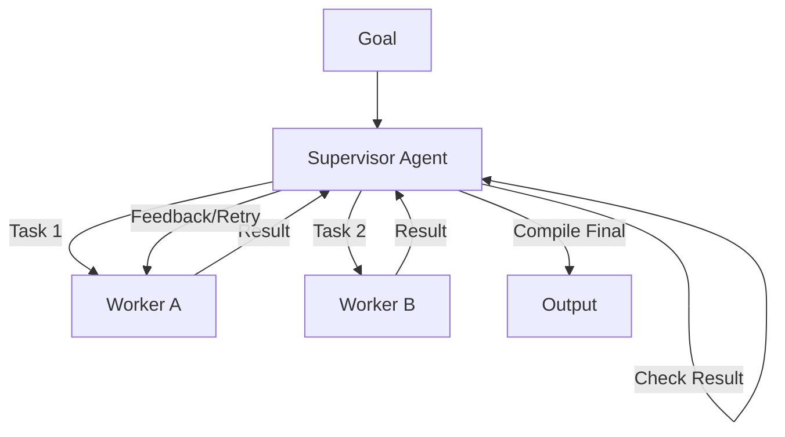

# 👮 Supervisor-Worker Architecture: The Taskmaster Pattern
> **Level:** Advanced | **Language:** Hinglish | **Goal:** Master the pattern where a central supervisor delegates tasks and reviews results for maximum reliability.

---

## 🧭 1. Beginner-friendly Hinglish Explanation
Supervisor-Worker architecture ka matlab hai ek "Boss" (Supervisor) aur uske "Workers". Sochiye ek construction site hai. Supervisor workers ko bolta hai "Tum deewar banao", "Tum painting karo". Workers kaam karke supervisor ko report dete hain. Supervisor check karta hai galti toh nahi hui. Agar galti hai, toh wo worker ko bolta hai "Dubara theek karo". Ye pattern high-quality output ke liye best hai kyunki yahan har kaam "Double-check" hota hai.

---

## 🧠 2. Deep Technical Explanation
In this pattern, the Supervisor acts as the "Central Controller":
1. **Delegation:** Supervisor breaks the main task and assigns it to a specific worker agent.
2. **Execution:** Worker performs the task (usually a single-tool or atomic task).
3. **Review:** Worker returns the result to the Supervisor. The Supervisor evaluates the result.
4. **Iterate:** If the result is poor, the Supervisor provides feedback and sends the worker back to work (Reflexion loop).
5. **Consolidation:** Once all workers finish, the Supervisor compiles the final answer.

---

## 🏗️ 3. Real-world Analogies
Supervisor-Worker ek **Restaurant Kitchen** ki tarah hai.
- **Head Chef (Supervisor):** Orders receive karta hai aur chefs ko kaam baant-ta hai.
- **Chefs (Workers):** Subzi kaatna, soup banana.
- **Head Chef:** Final dish serve karne se pehle taste karta hai.

---

## 📊 4. Architecture Diagrams (The Review Loop)


---

## 💻 5. Production-ready Examples (Supervisor Logic)
```python
# 2026 Standard: LangGraph style Supervisor
from langgraph.graph import StateGraph

def supervisor_node(state):
    # Logic to select next worker or finish
    decision = llm.decide_next_step(state)
    return {"next": decision}

def worker_node(state):
    # Atomic worker logic
    res = worker_llm.execute(state['current_task'])
    return {"results": res}

# Building the graph with conditional edges back to supervisor
```

---

## ❌ 6. Failure Cases
- **Supervisor Bottleneck:** Agar supervisor itna complex ho jaye ki wo decision lene mein hi 30 sec le raha hai.
- **Worker Rebellions:** Worker galat format bhej raha hai aur supervisor use "Infinte Retry" mein phansaye ja raha hai.

---

## 🛠️ 7. Debugging Section
- **Symptom:** The loop between supervisor and worker never ends.
- **Fix:** Set a `max_retries` per task. Check if the worker's prompt needs more constraints or examples (Few-shot).

---

## ⚖️ 8. Tradeoffs
- **Quality vs Speed:** Output bahut refined hota hai par multiple rounds ki wajah se slow hai.
- **Reliability:** Sabse zyada reliable architecture hai for complex enterprise tasks.

---

## 🛡️ 9. Security Concerns
- **Supervisor Over-reliance:** Agar supervisor ki logic compromised ho, toh wo saare workers ko galat instructions de sakta hai.

---

## 📈 10. Scaling Challenges
- 10 workers ke liye supervisor ka context window (Chat history) bahut jaldi bhar jayega. Use **State Persistence** to keep only relevant data.

---

## 💸 11. Cost Considerations
- Multiple review rounds matlab multiple LLM calls. Har review step ka $ cost monitor karein.

---

## ⚠️ 12. Common Mistakes
- Supervisor ko worker ke tools ka access dena (Keep roles separate).
- Feedback ko vague rakhna (e.g., "The output is bad" is useless feedback).

---

## 📝 13. Interview Questions
1. How does Supervisor-Worker architecture improve task success rates?
2. When would you prefer a 'Router' over a 'Supervisor'?

---

## ✅ 14. Best Practices
- Supervisor should use **Strict Output Schemas** (JSON).
- Keep workers **Single-Purpose** for better accuracy.

---

## 🚀 15. Latest 2026 Industry Patterns
- **Multi-Supervisor Teams:** Chhote groups ke liye apne supervisors jo ek "Main Supervisor" ko report karte hain.
- **Autonomous Peer Review:** Workers jo ek dusre ka kaam check karte hain before sending to supervisor.
