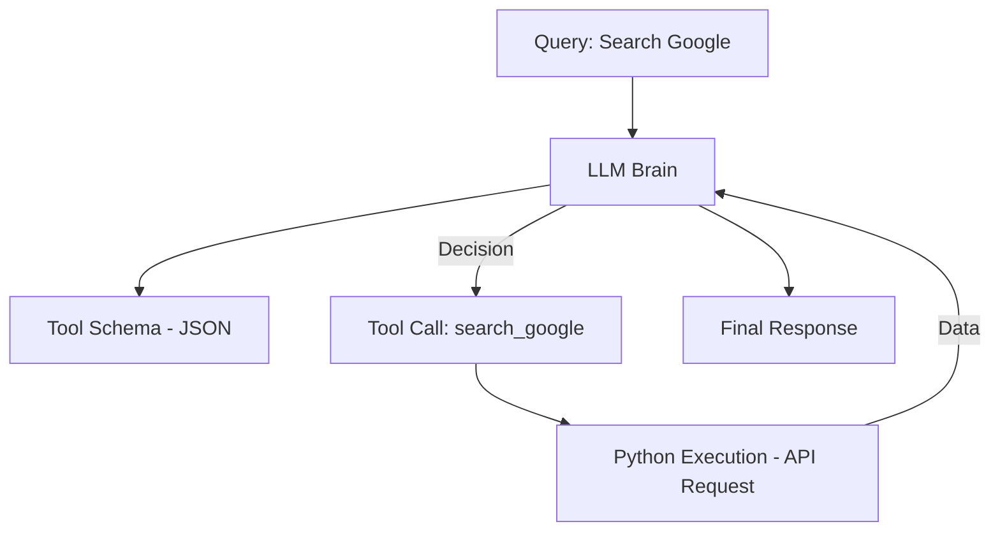

# 🛠️ Tool-Using Agents: The Handymen of AI
> **Level:** Beginner | **Language:** Hinglish | **Goal:** Master how agents interact with external APIs, databases, and local scripts using Function Calling.

---

## 🧭 1. Beginner-friendly Hinglish Explanation
Tool-Using Agent ka matlab hai ek AI jiske paas "Hath-pair" hain. Sochiye ChatGPT ek brain hai jo band kamre mein hai. Tool-using agent wo brain hai jiske paas ek calculator, ek browser, aur ek database ka access hai. Jab use koi math ka sawal milta hai, wo dimaag se solve karne ki jagah calculator (Tool) uthata hai. Isse accuracy 100% ho jati hai. Ye agents sirf "Baatein" nahi karte, ye actually "Kaam" karte hain (e.g., Send email, Fetch stock price).

---

## 🧠 2. Deep Technical Explanation
The core of tool-use is **Function Calling**:
1. **Tool Definition:** You define a function in your code (e.g., `get_weather`) and describe it in a JSON schema that the LLM understands.
2. **The Invitation:** You pass this schema to the LLM.
3. **The Call:** If the LLM decides a tool is needed, it outputs a "Tool Call" object (function name + arguments).
4. **The Execution:** Your code runs the actual function and sends the result back to the LLM.
5. **The Final Answer:** LLM uses the tool output to give the final response.

---

## 🏗️ 3. Real-world Analogies
Tool-Using Agent ek **Smart Home system** ki tarah hai.
- **Agent:** "Aapne AC on karne ko bola."
- **Tool:** AC ka switch (Hardware API).
- **Result:** Kamra thanda ho gaya.

---

## 📊 4. Architecture Diagrams (The Tool Cycle)


---

## 💻 5. Production-ready Examples (Tool Definition)
```python
# 2026 Standard: Defining a Tool for an Agent
from langchain.tools import tool

@tool
def get_stock_price(ticker: str):
    """Fetches the real-time stock price for a given ticker."""
    # Logic to call Yahoo Finance or Alpha Vantage
    return 150.25 # Mock result

# Giving the tool to the agent
tools = [get_stock_price]
agent = create_react_agent(model, tools)
```

---

## ❌ 6. Failure Cases
- **Argument Hallucination:** Agent ne tool call toh sahi kiya par ticker mein "XYZ_INVALID" bhej diya.
- **Missing Tool:** Agent ne aise tool ko call kiya jo aapne use diya hi nahi tha.

---

## 🛠️ 7. Debugging Section
- **Symptom:** Agent outputting the code of the tool instead of calling it.
- **Fix:** Check the "System Prompt". Make sure the model knows it should ONLY output the tool call format, not the implementation.

---

## ⚖️ 8. Tradeoffs
- **Accuracy vs Latency:** Tool call accurately result deta hai par external API call time leti hai.
- **Context Size:** 50 tools ke schemas dena context window ko bhar deta hai.

---

## 🛡️ 9. Security Concerns
- **Remote Code Execution (RCE):** Kabhi bhi agent ko `eval()` ya `exec()` jaise tools bina sandbox ke na dein.
- **API Key Leakage:** Tool output mein sensitive headers hide karein.

---

## 📈 10. Scaling Challenges
- **Rate Limits:** External tools (like Google Search) ki apni rate limits hoti hain. System mein queuing zaroori hai.

---

## 💸 11. Cost Considerations
- Tool outputs agar bahut bade hain (e.g., a whole PDF content), toh token cost badh jayega. Use **Summarization** on tool outputs.

---

## ⚠️ 12. Common Mistakes
- Tool ka "Description" khali chhod dena. LLM description se hi seekhta hai ki tool kab use karna hai.
- Parallel tool calling support na karna (Slow performance).

---

## 📝 13. Interview Questions
1. How does the LLM know which tool to call for a given query?
2. What is the 'Structured Output' mode in function calling?

---

## ✅ 14. Best Practices
- Use **Strict Types** (Pydantic) for tool arguments.
- Always include **Error Messages** in the tool output so the agent can retry.

---

## 🚀 15. Latest 2026 Industry Patterns
- **Native Tool Integration:** Models (like GPT-4o) jo natively tools ko optimize tarike se handle karte hain bina extra prompting ke.
- **Agentic MCP Servers:** Using MCP to connect tools across different platforms instantly.
